# CH.11 Tempus Fugit

이번 챕터에서는 스케줄링에 초점을 맞춘다. 

* **Scheduling Primitives:** task와 thread, 그리고 그들이 제공하는 APIs 
* **Scheduling:** 알고리즘과 같은 높은 수준의 scheduling 개념 
* **Asynchronous Software Traps\(AST\):** scheduling에 중요한 Mach의 AST 개념 
* **Exception Handling:** 하드웨어 trap에 대한 Mach의 고유한 접근 방식 
* **Scheduling Algorithms:** Mach의 default scheduler뿐만 아니라 다른 알고리즘 구현방식을 가진 scheduler로의 확장 및 교체가 가능한 scheduling framework

## SCHEDULING PRIMITIVES

다른 모든 modern OS와 마찬가지로 Mach도 process가 아닌 thread를 본다. 다만 실제로 process에 대한 인식은 UN\*X와 조금 다른데, process 보다는 lightweight task의 개념을 사용한다. Classic UN\*X  는 process를 기본 object로 하여 하나 이상의 thread로 더 분할 되는 top-down 접근 방식이지만, Mach의 경우는 기본 단위가 thread 이고 하나 이상의 thread가 process에 포함되는 bottom-up 접근방식을 사용한다.


### Threads

thread는 Mach의 원자 단위 execution을 정의하며 underlying machine register state 및 다양한 scheduling statistics를 나타낸다.   
가능한 한 가장 낮은 오버헤드를 유지하면서 scheduling에 필요한 최대한의 정보를 제공하도록 설계되었다.

```c
struct thread {

#if MACH_ASSERT
#define THREAD_MAGIC 0x1234ABCDDCBA4321ULL
	/* Ensure nothing uses &thread as a queue entry */
	uint64_t                thread_magic;
#endif /* MACH_ASSERT */

	/*
	 *	NOTE:	The runq field in the thread structure has an unusual
	 *	locking protocol.  If its value is PROCESSOR_NULL, then it is
	 *	locked by the thread_lock, but if its value is something else
	 *	then it is locked by the associated run queue lock. It is
	 *	set to PROCESSOR_NULL without holding the thread lock, but the
	 *	transition from PROCESSOR_NULL to non-null must be done
	 *	under the thread lock and the run queue lock.
	 *
	 *	New waitq APIs allow the 'links' and 'runq' fields to be
	 *	anywhere in the thread structure.
	 */
	union {
		queue_chain_t           runq_links;     /* run queue links */
		queue_chain_t           wait_links;     /* wait queue links */
	};

	processor_t             runq;           /* run queue assignment */

	event64_t               wait_event;     /* wait queue event */
	struct waitq           *waitq;          /* wait queue this thread is enqueued on */

	/* Data updated during assert_wait/thread_wakeup */
#if __SMP__
	decl_simple_lock_data(,sched_lock)	/* scheduling lock (thread_lock()) */
	decl_simple_lock_data(,wake_lock)	/* for thread stop / wait (wake_lock()) */
#endif
	integer_t		options;			/* options set by thread itself */
#define TH_OPT_INTMASK		0x0003		/* interrupt / abort level */
#define TH_OPT_VMPRIV		0x0004		/* may allocate reserved memory */
#define TH_OPT_DTRACE		0x0008		/* executing under dtrace_probe */
#define TH_OPT_SYSTEM_CRITICAL	0x0010		/* Thread must always be allowed to run - even under heavy load */
#define TH_OPT_PROC_CPULIMIT	0x0020		/* Thread has a task-wide CPU limit applied to it */
#define TH_OPT_PRVT_CPULIMIT	0x0040		/* Thread has a thread-private CPU limit applied to it */
#define TH_OPT_IDLE_THREAD	0x0080		/* Thread is a per-processor idle thread */
#define TH_OPT_GLOBAL_FORCED_IDLE	0x0100	/* Thread performs forced idle for thermal control */
#define TH_OPT_SCHED_VM_GROUP	0x0200		/* Thread belongs to special scheduler VM group */
#define TH_OPT_HONOR_QLIMIT	0x0400		/* Thread will honor qlimit while sending mach_msg, regardless of MACH_SEND_ALWAYS */
#define TH_OPT_SEND_IMPORTANCE	0x0800		/* Thread will allow importance donation from kernel rpc */
#define TH_OPT_ZONE_GC		0x1000		/* zone_gc() called on this thread */

	boolean_t			wake_active;	/* wake event on stop */
	int					at_safe_point;	/* thread_abort_safely allowed */
	ast_t				reason;			/* why we blocked */
	uint32_t 			quantum_remaining;
	wait_result_t 			wait_result; 	/* outcome of wait -
							 * may be examined by this thread
							 * WITHOUT locking */
	thread_continue_t	continuation;	/* continue here next dispatch */
	void				*parameter;		/* continuation parameter */

	/* Data updated/used in thread_invoke */
	vm_offset_t     	kernel_stack;		/* current kernel stack */
	vm_offset_t			reserved_stack;		/* reserved kernel stack */

#if KASAN
	struct kasan_thread_data kasan_data;
#endif

	/* Thread state: */
	int					state;
/*
 *	Thread states [bits or'ed]
 */
#define TH_WAIT			0x01			/* queued for waiting */
#define TH_SUSP			0x02			/* stopped or requested to stop */
#define TH_RUN			0x04			/* running or on runq */
#define TH_UNINT		0x08			/* waiting uninteruptibly */
#define TH_TERMINATE		0x10			/* halted at termination */
#define TH_TERMINATE2		0x20			/* added to termination queue */

#define TH_IDLE			0x80			/* idling processor */

	/* Scheduling information */
	sched_mode_t			sched_mode;		/* scheduling mode */
	sched_mode_t			saved_mode;		/* saved mode during forced mode demotion */

	/* This thread's contribution to global sched counters */
	sched_bucket_t                  th_sched_bucket;

	sfi_class_id_t			sfi_class;		/* SFI class (XXX Updated on CSW/QE/AST) */
	sfi_class_id_t			sfi_wait_class;	/* Currently in SFI wait for this class, protected by sfi_lock */


	uint32_t			sched_flags;		/* current flag bits */
/* TH_SFLAG_FAIRSHARE_TRIPPED (unused)	0x0001 */
#define TH_SFLAG_FAILSAFE		0x0002		/* fail-safe has tripped */
#define TH_SFLAG_THROTTLED		0x0004		/* throttled thread forced to timeshare mode (may be applied in addition to failsafe) */
#define TH_SFLAG_DEMOTED_MASK      (TH_SFLAG_THROTTLED | TH_SFLAG_FAILSAFE)	/* saved_mode contains previous sched_mode */

#define	TH_SFLAG_PROMOTED		0x0008		/* sched pri has been promoted */
#define TH_SFLAG_ABORT			0x0010		/* abort interruptible waits */
#define TH_SFLAG_ABORTSAFELY		0x0020		/* ... but only those at safe point */
#define TH_SFLAG_ABORTED_MASK		(TH_SFLAG_ABORT | TH_SFLAG_ABORTSAFELY)
#define	TH_SFLAG_DEPRESS		0x0040		/* normal depress yield */
#define TH_SFLAG_POLLDEPRESS		0x0080		/* polled depress yield */
#define TH_SFLAG_DEPRESSED_MASK		(TH_SFLAG_DEPRESS | TH_SFLAG_POLLDEPRESS)
/* unused TH_SFLAG_PRI_UPDATE           0x0100 */
#define TH_SFLAG_EAGERPREEMPT		0x0200		/* Any preemption of this thread should be treated as if AST_URGENT applied */
#define TH_SFLAG_RW_PROMOTED		0x0400		/* sched pri has been promoted due to blocking with RW lock held */
/* unused TH_SFLAG_THROTTLE_DEMOTED     0x0800 */
#define TH_SFLAG_WAITQ_PROMOTED		0x1000		/* sched pri promoted from waitq wakeup (generally for IPC receive) */


#define TH_SFLAG_EXEC_PROMOTED          0x8000		/* sched pri has been promoted since thread is in an exec */
#define TH_SFLAG_PROMOTED_MASK	        (TH_SFLAG_PROMOTED | TH_SFLAG_RW_PROMOTED | TH_SFLAG_WAITQ_PROMOTED | TH_SFLAG_EXEC_PROMOTED)

#define TH_SFLAG_RW_PROMOTED_BIT	(10)	/* 0x400 */

	int16_t                         sched_pri;              /* scheduled (current) priority */
	int16_t                         base_pri;               /* base priority */
	int16_t                         max_priority;           /* copy of max base priority */
	int16_t                         task_priority;          /* copy of task base priority */

#if defined(CONFIG_SCHED_GRRR)
#if 0
	uint16_t			grrr_deficit;		/* fixed point (1/1000th quantum) fractional deficit */
#endif
#endif
	
	int16_t				promotions;			/* level of promotion */
	int16_t				pending_promoter_index;
	_Atomic uint32_t		ref_count;		/* number of references to me */
	void				*pending_promoter[2];

	uint32_t			rwlock_count;	/* Number of lck_rw_t locks held by thread */

	integer_t			importance;			/* task-relative importance */
	uint32_t                        was_promoted_on_wakeup;

	/* Priority depression expiration */
	integer_t			depress_timer_active;
	timer_call_data_t	depress_timer;
										/* real-time parameters */
	struct {								/* see mach/thread_policy.h */
		uint32_t			period;
		uint32_t			computation;
		uint32_t			constraint;
		boolean_t			preemptible;
		uint64_t			deadline;
	}					realtime;

	uint64_t			last_run_time;		/* time when thread was switched away from */
	uint64_t			last_made_runnable_time;	/* time when thread was unblocked or preempted */
	uint64_t			last_basepri_change_time;	/* time when thread was last changed in basepri while runnable */
	uint64_t			same_pri_latency;
#define THREAD_NOT_RUNNABLE (~0ULL)


#if defined(CONFIG_SCHED_MULTIQ)
	sched_group_t			sched_group;
#endif /* defined(CONFIG_SCHED_MULTIQ) */

  /* Data used during setrun/dispatch */
	timer_data_t		system_timer;		/* system mode timer */
	processor_t			bound_processor;	/* bound to a processor? */
	processor_t			last_processor;		/* processor last dispatched on */
	processor_t			chosen_processor;	/* Where we want to run this thread */

	/* Fail-safe computation since last unblock or qualifying yield */
	uint64_t			computation_metered;
	uint64_t			computation_epoch;
	uint64_t			safe_release;	/* when to release fail-safe */

	/* Call out from scheduler */
	void				(*sched_call)(
							int			type,
							thread_t	thread);
#if defined(CONFIG_SCHED_PROTO)
	uint32_t			runqueue_generation;	/* last time runqueue was drained */
#endif
	
	/* Statistics and timesharing calculations */
#if defined(CONFIG_SCHED_TIMESHARE_CORE)
	natural_t			sched_stamp;	/* last scheduler tick */
	natural_t			sched_usage;	/* timesharing cpu usage [sched] */
	natural_t			pri_shift;		/* usage -> priority from pset */
	natural_t			cpu_usage;		/* instrumented cpu usage [%cpu] */
	natural_t			cpu_delta;		/* accumulated cpu_usage delta */
#endif /* CONFIG_SCHED_TIMESHARE_CORE */

	uint32_t			c_switch;		/* total context switches */
	uint32_t			p_switch;		/* total processor switches */
	uint32_t			ps_switch;		/* total pset switches */

	integer_t mutex_count;  /* total count of locks held */
	/* Timing data structures */
	int					precise_user_kernel_time; /* precise user/kernel enabled for this thread */
	timer_data_t		user_timer;			/* user mode timer */
	uint64_t			user_timer_save;	/* saved user timer value */
	uint64_t			system_timer_save;	/* saved system timer value */
	uint64_t			vtimer_user_save;	/* saved values for vtimers */
	uint64_t			vtimer_prof_save;
	uint64_t			vtimer_rlim_save;
	uint64_t			vtimer_qos_save;

	timer_data_t		ptime;			/* time executing in P mode */

#if CONFIG_SCHED_SFI
	/* Timing for wait state */
	uint64_t		wait_sfi_begin_time;    /* start time for thread waiting in SFI */
#endif

	/* Timed wait expiration */
	timer_call_data_t	wait_timer;
	integer_t			wait_timer_active;
	boolean_t			wait_timer_is_set;


	/*
	 * Processor/cache affinity
	 * - affinity_threads links task threads with the same affinity set
	 */
	affinity_set_t			affinity_set;
	queue_chain_t			affinity_threads;

	/* Various bits of state to stash across a continuation, exclusive to the current thread block point */
	union {
		struct {
		  	mach_msg_return_t	state;		/* receive state */
			mach_port_seqno_t	seqno;		/* seqno of recvd message */
		  	ipc_object_t		object;		/* object received on */
		  	mach_vm_address_t	msg_addr;	/* receive buffer pointer */
			mach_msg_size_t		rsize;		/* max size for recvd msg */
			mach_msg_size_t		msize;		/* actual size for recvd msg */
		  	mach_msg_option_t	option;		/* options for receive */
			mach_port_name_t	receiver_name;	/* the receive port name */
			struct knote		*knote;		/* knote fired for rcv */
			union {
				struct ipc_kmsg   *kmsg;	/* received message */
				struct ipc_mqueue *peekq;	/* mqueue to peek at */
				struct {
					mach_msg_priority_t qos;	/* received message qos */
					mach_msg_priority_t oqos;	/* override qos for message */
				} received_qos;
			};
			mach_msg_continue_t	continuation;
		} receive;
		struct {
			struct semaphore	*waitsemaphore;  	/* semaphore ref */
			struct semaphore	*signalsemaphore;	/* semaphore ref */
			int					options;			/* semaphore options */
			kern_return_t		result;				/* primary result */
			mach_msg_continue_t continuation;
		} sema;
	  	struct {
			int					option;		/* switch option */
			boolean_t				reenable_workq_callback;	/* on entry, callbacks were suspended */
		} swtch;
	} saved;

	/* Only user threads can cause guard exceptions, only kernel threads can be thread call threads */
	union {
		/* Group and call this thread is working on behalf of */
		struct {
			struct thread_call_group * thc_group;
			struct thread_call *       thc_call;                    /* debug only, may be deallocated */
		} thc_state;

		/* Structure to save information about guard exception */
		struct {
			mach_exception_code_t           code;
			mach_exception_subcode_t        subcode;
		} guard_exc_info;
	};

	/* Kernel holds on this thread  */
	int16_t                                         suspend_count;
	/* User level suspensions */
	int16_t                                         user_stop_count;

	/* IPC data structures */
#if IMPORTANCE_INHERITANCE
	natural_t ith_assertions;			/* assertions pending drop */
#endif
	struct ipc_kmsg_queue ith_messages;		/* messages to reap */
	mach_port_t ith_rpc_reply;			/* reply port for kernel RPCs */

	/* Ast/Halt data structures */
	vm_offset_t					recover;		/* page fault recover(copyin/out) */

	queue_chain_t				threads;		/* global list of all threads */

	/* Activation */
		queue_chain_t			task_threads;

		/* Task membership */
		struct task				*task;
		vm_map_t				map;

		decl_lck_mtx_data(,mutex)


		/* Pending thread ast(s) */
		ast_t					ast;

		/* Miscellaneous bits guarded by mutex */
		uint32_t
			active:1,                       /* Thread is active and has not been terminated */
			started:1,                      /* Thread has been started after creation */
			static_param:1,                 /* Disallow policy parameter changes */
			inspection:1,                   /* TRUE when task is being inspected by crash reporter */
			policy_reset:1,                 /* Disallow policy parameter changes on terminating threads */
			suspend_parked:1,               /* thread parked in thread_suspended */
			corpse_dup:1,                   /* TRUE when thread is an inactive duplicate in a corpse */
			:0;

		/* Ports associated with this thread */
		struct ipc_port			*ith_self;		/* not a right, doesn't hold ref */
		struct ipc_port			*ith_sself;		/* a send right */
		struct ipc_port			*ith_special_reply_port; /* ref to special reply port */
		struct exception_action	*exc_actions;

#ifdef	MACH_BSD
		void					*uthread;
#endif

#if CONFIG_DTRACE
		uint32_t t_dtrace_flags;	/* DTrace thread states */
#define	TH_DTRACE_EXECSUCCESS	0x01
		uint32_t t_dtrace_predcache;/* DTrace per thread predicate value hint */
		int64_t t_dtrace_tracing;       /* Thread time under dtrace_probe() */
		int64_t t_dtrace_vtime;
#endif

	        clock_sec_t t_page_creation_time;
	        uint32_t    t_page_creation_count;
	        uint32_t    t_page_creation_throttled;
#if (DEVELOPMENT || DEBUG)
	        uint64_t    t_page_creation_throttled_hard;
	        uint64_t    t_page_creation_throttled_soft;
#endif /* DEVELOPMENT || DEBUG */

#ifdef KPERF
/* The high 7 bits are the number of frames to sample of a user callstack. */
#define T_KPERF_CALLSTACK_DEPTH_OFFSET     (25)
#define T_KPERF_SET_CALLSTACK_DEPTH(DEPTH) (((uint32_t)(DEPTH)) << T_KPERF_CALLSTACK_DEPTH_OFFSET)
#define T_KPERF_GET_CALLSTACK_DEPTH(FLAGS) ((FLAGS) >> T_KPERF_CALLSTACK_DEPTH_OFFSET)
#endif

#define T_KPERF_AST_CALLSTACK (1U << 0) /* dump a callstack on thread's next AST */
#define T_KPERF_AST_DISPATCH  (1U << 1) /* dump a name on thread's next AST */
#define T_KPC_ALLOC           (1U << 2) /* thread needs a kpc_buf allocated */
/* only go up to T_KPERF_CALLSTACK_DEPTH_OFFSET - 1 */

#ifdef KPERF
	uint32_t kperf_flags;
	uint32_t kperf_pet_gen;  /* last generation of PET that sampled this thread*/
	uint32_t kperf_c_switch; /* last dispatch detection */
	uint32_t kperf_pet_cnt;  /* how many times a thread has been sampled by PET */
#endif

#ifdef KPC
	/* accumulated performance counters for this thread */
	uint64_t *kpc_buf;
#endif

#if HYPERVISOR
	/* hypervisor virtual CPU object associated with this thread */
	void *hv_thread_target;
#endif /* HYPERVISOR */

		uint64_t thread_id;	/*system wide unique thread-id*/

	/* Statistics accumulated per-thread and aggregated per-task */
	uint32_t		syscalls_unix;
	uint32_t		syscalls_mach;
	ledger_t		t_ledger;
	ledger_t		t_threadledger;	/* per thread ledger */
	ledger_t		t_bankledger;  		     /* ledger to charge someone */
	uint64_t		t_deduct_bank_ledger_time;   /* cpu time to be deducted from bank ledger */
	uint64_t		t_deduct_bank_ledger_energy; /* energy to be deducted from bank ledger */

#if MONOTONIC
	struct mt_thread t_monotonic;
#endif /* MONOTONIC */

	/*** Machine-dependent state ***/
	struct machine_thread   machine;

	/* policy is protected by the thread mutex */
	struct thread_requested_policy  requested_policy;
	struct thread_effective_policy  effective_policy;

	/* usynch override is protected by the task lock, eventually will be thread mutex */
	struct thread_qos_override {
		struct thread_qos_override	*override_next;
		uint32_t	override_contended_resource_count;
		int16_t		override_qos;
		int16_t		override_resource_type;
		user_addr_t	override_resource;
	} *overrides;

	_Atomic uint32_t kqwl_owning_count;
	uint32_t        ipc_overrides;
	uint32_t        sync_ipc_overrides;
	uint32_t        user_promotions;
	uint16_t        user_promotion_basepri;
	_Atomic uint16_t kevent_ast_bits;

	block_hint_t    pending_block_hint;
	block_hint_t    block_hint;      /* What type of primitive last caused us to block. */

	int	iotier_override; /* atomic operations to set, cleared on ret to user */
	io_stat_info_t  		thread_io_stats; /* per-thread I/O statistics */

#if CONFIG_EMBEDDED
	task_watch_t *	taskwatch;		/* task watch */
#endif /* CONFIG_EMBEDDED */

	uint32_t			thread_callout_interrupt_wakeups;
	uint32_t			thread_callout_platform_idle_wakeups;
	uint32_t			thread_timer_wakeups_bin_1;
	uint32_t			thread_timer_wakeups_bin_2;
	uint16_t			thread_tag;
	uint16_t			callout_woken_from_icontext:1,
					callout_woken_from_platform_idle:1,
					callout_woke_thread:1,
					thread_bitfield_unused:13;

	mach_port_name_t		ith_voucher_name;
	ipc_voucher_t			ith_voucher;
#if CONFIG_IOSCHED
	void 				*decmp_upl;
#endif /* CONFIG_IOSCHED */

	/* work interval (if any) associated with the thread. Uses thread mutex */
	struct work_interval            *th_work_interval;

#if	SCHED_TRACE_THREAD_WAKEUPS
	uintptr_t		thread_wakeup_bt[64];
#endif
};
```

이처럼 thread의 structure는 굉장히 방대하기 때문에 대부분의 thread는 structure를 default value로 채우는 generic template _\( osfmk/thread/thread.c - thread\_template\)_ 을 복제하여 생성한다. 이 template은 thread\_bootstrap\(\) 에 의해 채워지며 thread\_create\(\) Mach API를 구현하는 thread\_create\_internal\(\) 에서 복사된다. 

관심있는 특정 필드중 하나는 **uthread** member로, 이것은 BSD layer에 대한 void pointer 이다. 이 멤버는 BSD user thread를 pointing 한다. 

thread는 여러가지 field로 가득 차있지만 실제 resource reference는 포함하지 않는다. Mach은 task를 thread의 container로 정의하여 resource를 handle하게 한다.   
thread는 port를 통해서 자신을 contain 하는 task에게 할당된 memory와 resource에만 access 할 수 있다.


### Tasks

task는 가상 메모리 공간과 device 및 기타 handle 등의 resource를 관리하는 container object 역할을 한다. port에 의해 resource는 더욱 추상화 되므로 resource를 공유하려면 해당 port에 대한 access를 제공해야 한다. 

엄밀히 말하면 micro kernel인 Mach은 process logic을 제공하지 않고 골자만 제공하므로 다른 운영체제의 process와는 다르다. 그러나 BSD model에서 두 개념 사이에 간단한 1:1 매핑이 존재하며 모든 BSD process에는 이와 관련된 underlying Mach task object가 있다. 이 매핑은 Mach이 알 수 없는 opaque pointer인 **bsd\_info**를 정하여 수행된다. Mach은 비록 해당하는 PID는 없지만\(기술적으로 PID 0로 생각\) kernel도 task로 나타낸다\(global하게 **kernel\_task**로 referred\).

task는 다음에서 볼 수 있듯 thread와 비교하여 비교적 lightweight structure이다.

```c
struct task {
	/* Synchronization/destruction information */
	decl_lck_mtx_data(,lock)		/* Task's lock */
	_Atomic uint32_t	ref_count;	/* Number of references to me */
	boolean_t	active;		/* Task has not been terminated */
	boolean_t	halting;	/* Task is being halted */

	/* Miscellaneous */
	vm_map_t	map;		/* Address space description */
	queue_chain_t	tasks;	/* global list of tasks */
	void		*user_data;	/* Arbitrary data settable via IPC */

#if defined(CONFIG_SCHED_MULTIQ)
	sched_group_t sched_group;
#endif /* defined(CONFIG_SCHED_MULTIQ) */

	/* Threads in this task */
	queue_head_t		threads;

	processor_set_t		pset_hint;
	struct affinity_space	*affinity_space;

	int			thread_count;
	uint32_t		active_thread_count;
	int			suspend_count;	/* Internal scheduling only */

	/* User-visible scheduling information */
	integer_t		user_stop_count;	/* outstanding stops */
	integer_t		legacy_stop_count;	/* outstanding legacy stops */

	integer_t		priority;			/* base priority for threads */
	integer_t		max_priority;		/* maximum priority for threads */

	integer_t		importance;		/* priority offset (BSD 'nice' value) */

	/* Task security and audit tokens */
	security_token_t sec_token;
	audit_token_t	audit_token;
        
	/* Statistics */
	uint64_t		total_user_time;	/* terminated threads only */
	uint64_t		total_system_time;
	uint64_t		total_ptime;
	
	/* Virtual timers */
	uint32_t		vtimers;

	/* IPC structures */
	decl_lck_mtx_data(,itk_lock_data)
	struct ipc_port *itk_self;	/* not a right, doesn't hold ref */
	struct ipc_port *itk_nself;	/* not a right, doesn't hold ref */
	struct ipc_port *itk_sself;	/* a send right */
	struct exception_action exc_actions[EXC_TYPES_COUNT];
		 			/* a send right each valid element  */
	struct ipc_port *itk_host;	/* a send right */
	struct ipc_port *itk_bootstrap;	/* a send right */
	struct ipc_port *itk_seatbelt;	/* a send right */
	struct ipc_port *itk_gssd;	/* yet another send right */
	struct ipc_port *itk_debug_control; /* send right for debugmode communications */
	struct ipc_port *itk_task_access; /* and another send right */ 
	struct ipc_port *itk_resume;	/* a receive right to resume this task */
	struct ipc_port *itk_registered[TASK_PORT_REGISTER_MAX];
					/* all send rights */

	struct ipc_space *itk_space;

	/* Synchronizer ownership information */
	queue_head_t	semaphore_list;		/* list of owned semaphores   */
	int		semaphores_owned;	/* number of semaphores owned */

	ledger_t	ledger;

	unsigned int	priv_flags;			/* privilege resource flags */
#define VM_BACKING_STORE_PRIV	0x1

	MACHINE_TASK
        
	integer_t faults;              /* faults counter */
        integer_t pageins;             /* pageins counter */
        integer_t cow_faults;          /* copy on write fault counter */
        integer_t messages_sent;       /* messages sent counter */
        integer_t messages_received;   /* messages received counter */
        integer_t syscalls_mach;       /* mach system call counter */
        integer_t syscalls_unix;       /* unix system call counter */
		uint32_t  c_switch;			   /* total context switches */
		uint32_t  p_switch;			   /* total processor switches */
		uint32_t  ps_switch;		   /* total pset switches */

#ifdef  MACH_BSD 
	void *bsd_info;
#endif  
	kcdata_descriptor_t		corpse_info;
	uint64_t			crashed_thread_id;
	queue_chain_t			corpse_tasks;
#ifdef CONFIG_MACF
	struct label *			crash_label;
#endif
	struct vm_shared_region		*shared_region;
	volatile uint32_t t_flags;                                      /* general-purpose task flags protected by task_lock (TL) */
#define TF_NONE                 0
#define TF_64B_ADDR             0x00000001                              /* task has 64-bit addressing */
#define TF_64B_DATA             0x00000002                              /* task has 64-bit data registers */
#define TF_CPUMON_WARNING       0x00000004                              /* task has at least one thread in CPU usage warning zone */
#define TF_WAKEMON_WARNING      0x00000008                              /* task is in wakeups monitor warning zone */
#define TF_TELEMETRY            (TF_CPUMON_WARNING | TF_WAKEMON_WARNING) /* task is a telemetry participant */
#define TF_GPU_DENIED           0x00000010                              /* task is not allowed to access the GPU */
#define TF_CORPSE               0x00000020                              /* task is a corpse */
#define TF_PENDING_CORPSE       0x00000040                              /* task corpse has not been reported yet */
#define TF_CORPSE_FORK          0x00000080                              /* task is a forked corpse */
#define TF_LRETURNWAIT          0x00000100                              /* task is waiting for fork/posix_spawn/exec to complete */
#define TF_LRETURNWAITER        0x00000200                              /* task is waiting for TF_LRETURNWAIT to get cleared */
#define TF_PLATFORM             0x00000400                              /* task is a platform binary */
#define TF_CA_CLIENT_WI         0x00000800                              /* task has CA_CLIENT work interval */

#define task_has_64BitAddr(task)	\
	 (((task)->t_flags & TF_64B_ADDR) != 0)
#define task_set_64BitAddr(task)	\
	 ((task)->t_flags |= TF_64B_ADDR)
#define task_clear_64BitAddr(task)	\
	 ((task)->t_flags &= ~TF_64B_ADDR)
#define task_has_64BitData(task)    \
	 (((task)->t_flags & TF_64B_DATA) != 0)

#define task_is_a_corpse(task)      \
	 (((task)->t_flags & TF_CORPSE) != 0)

#define task_set_corpse(task)       \
	 ((task)->t_flags |= TF_CORPSE)

#define task_corpse_pending_report(task) 	\
	 (((task)->t_flags & TF_PENDING_CORPSE) != 0)

#define task_set_corpse_pending_report(task)       \
	 ((task)->t_flags |= TF_PENDING_CORPSE)

#define task_clear_corpse_pending_report(task)       \
	 ((task)->t_flags &= ~TF_PENDING_CORPSE)

#define task_is_a_corpse_fork(task)	\
	(((task)->t_flags & TF_CORPSE_FORK) != 0)

	uint32_t t_procflags;                                            /* general-purpose task flags protected by proc_lock (PL) */
#define TPF_NONE                 0
#define TPF_DID_EXEC             0x00000001                              /* task has been execed to a new task */
#define TPF_EXEC_COPY            0x00000002                              /* task is the new copy of an exec */
#ifdef CONFIG_32BIT_TELEMETRY
#define TPF_LOG_32BIT_TELEMETRY  0x00000004                              /* task should log identifying information */
#endif

#define task_did_exec_internal(task)		\
	(((task)->t_procflags & TPF_DID_EXEC) != 0)

#define task_is_exec_copy_internal(task)	\
	(((task)->t_procflags & TPF_EXEC_COPY) != 0)

	mach_vm_address_t	all_image_info_addr; /* dyld __all_image_info     */
	mach_vm_size_t		all_image_info_size; /* section location and size */

#if KPC
#define TASK_KPC_FORCED_ALL_CTRS	0x2	/* Bit in "t_kpc" signifying this task forced all counters */
	uint32_t t_kpc; /* kpc flags */
#endif /* KPC */

	boolean_t pidsuspended; /* pid_suspend called; no threads can execute */
	boolean_t frozen;       /* frozen; private resident pages committed to swap */
	boolean_t changing_freeze_state;	/* in the process of freezing or thawing */
	uint16_t policy_ru_cpu          :4,
	         policy_ru_cpu_ext      :4,
	         applied_ru_cpu         :4,
	         applied_ru_cpu_ext     :4;
	uint8_t  rusage_cpu_flags;
	uint8_t  rusage_cpu_percentage;		/* Task-wide CPU limit percentage */
	uint64_t rusage_cpu_interval;		/* Task-wide CPU limit interval */
	uint8_t  rusage_cpu_perthr_percentage;  /* Per-thread CPU limit percentage */
	uint64_t rusage_cpu_perthr_interval;    /* Per-thread CPU limit interval */
	uint64_t rusage_cpu_deadline;
	thread_call_t rusage_cpu_callt;
#if CONFIG_EMBEDDED
	queue_head_t	task_watchers;		/* app state watcher threads */
	int	num_taskwatchers;
	int		watchapplying;
#endif /* CONFIG_EMBEDDED */

#if CONFIG_ATM
	struct atm_task_descriptor *atm_context;  /* pointer to per task atm descriptor */
#endif
	struct bank_task *bank_context;  /* pointer to per task bank structure */

#if IMPORTANCE_INHERITANCE
	struct ipc_importance_task  *task_imp_base;	/* Base of IPC importance chain */
#endif /* IMPORTANCE_INHERITANCE */

	vm_extmod_statistics_data_t	extmod_statistics;

#if MACH_ASSERT
	int8_t		suspends_outstanding;	/* suspends this task performed in excess of resumes */
#endif

	struct task_requested_policy requested_policy;
	struct task_effective_policy effective_policy;

	/*
	 * Can be merged with imp_donor bits, once the IMPORTANCE_INHERITANCE macro goes away.
	 */
	uint32_t        low_mem_notified_warn		:1,	/* warning low memory notification is sent to the task */
	                low_mem_notified_critical	:1,	/* critical low memory notification is sent to the task */
	                purged_memory_warn		:1,	/* purgeable memory of the task is purged for warning level pressure */
	                purged_memory_critical		:1,	/* purgeable memory of the task is purged for critical level pressure */
			low_mem_privileged_listener	:1,	/* if set, task would like to know about pressure changes before other tasks on the system */
	                mem_notify_reserved		:27;	/* reserved for future use */

	uint32_t memlimit_is_active                 :1, /* if set, use active attributes, otherwise use inactive attributes */
                memlimit_is_fatal                   :1, /* if set, exceeding current memlimit will prove fatal to the task */
		memlimit_active_exc_resource        :1, /* if set, suppress exc_resource exception when task exceeds active memory limit */
		memlimit_inactive_exc_resource      :1, /* if set, suppress exc_resource exception when task exceeds inactive memory limit */
		memlimit_attrs_reserved             :28; /* reserved for future use */

	io_stat_info_t 		task_io_stats;
	uint64_t 		task_immediate_writes __attribute__((aligned(8)));
	uint64_t 		task_deferred_writes __attribute__((aligned(8)));
	uint64_t 		task_invalidated_writes __attribute__((aligned(8)));
	uint64_t 		task_metadata_writes __attribute__((aligned(8)));

	/* 
	 * The cpu_time_qos_stats fields are protected by the task lock
	 */
	struct _cpu_time_qos_stats 	cpu_time_eqos_stats;
	struct _cpu_time_qos_stats 	cpu_time_rqos_stats;

	/* Statistics accumulated for terminated threads from this task */
	uint32_t	task_timer_wakeups_bin_1;
	uint32_t	task_timer_wakeups_bin_2;
	uint64_t	task_gpu_ns;
	uint64_t	task_energy;

#if MONOTONIC
	/* Read and written under task_lock */
	struct mt_task task_monotonic;
#endif /* MONOTONIC */

	/* # of purgeable volatile VM objects owned by this task: */
	int		task_volatile_objects;
	/* # of purgeable but not volatile VM objects owned by this task: */
	int		task_nonvolatile_objects;
	boolean_t	task_purgeable_disowning;
	boolean_t	task_purgeable_disowned;
	queue_head_t	task_objq;
	decl_lck_mtx_data(,task_objq_lock) /* protects "task_objq" */

	boolean_t	task_region_footprint;

	/*
	 * A task's coalition set is "adopted" in task_create_internal
	 * and unset in task_deallocate_internal, so each array member
	 * can be referenced without the task lock.
	 * Note: these fields are protected by coalition->lock,
	 *       not the task lock.
	 */
	coalition_t	coalition[COALITION_NUM_TYPES];
	queue_chain_t   task_coalition[COALITION_NUM_TYPES];
	uint64_t        dispatchqueue_offset;

#if DEVELOPMENT || DEBUG
	boolean_t	task_unnested;
	int		task_disconnected_count;
#endif

#if HYPERVISOR
	void *hv_task_target; /* hypervisor virtual machine object associated with this task */
#endif /* HYPERVISOR */

#if CONFIG_SECLUDED_MEMORY
	boolean_t	task_can_use_secluded_mem;
	boolean_t	task_could_use_secluded_mem;
	boolean_t	task_could_also_use_secluded_mem;
#endif /* CONFIG_SECLUDED_MEMORY */

	queue_head_t    io_user_clients;
	uint32_t	exec_token;
};
```

task 자체에는 생명이 없으며 하나 이상의 thread의 container 역할을 하기 위해 존재한다. task의 thread는 **thread\_count** thread를 포함하는 queue \(**queue\_had\_t threads**\) 에서 유지보수된다.  
또한 task에 대한 대부분의 operation은 해당 task의 모든 thread에 대해 동일한 thread operation을 반복하는 것에 불과하다.  
예를들어 task 우선 순위를 설정하려면 **task\_priority\(\)**를 실행하면 된다. 

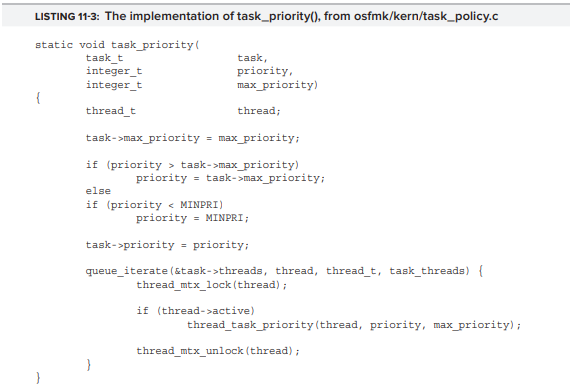

**queue\_iterate** macro는 **queue\_head\_t** 를 반복하여 각 thread를 차례로 lock 한다음 active 이면 priority를 설정하고 thread를 unlock한다.   
\(지금 버전에서는 해당 함수 없음\)


#### Ledgers

ledger는 mach task에 대한  할당량을 청구하고 제한을 설정하는 메커니즘을 제공한다. 이것은 POSIX에서 제공하는 **getrlimit/setrlimit** 시스템콜과 유사하다. resource\(일반적으로 cpu 및 memory\)는 ledger 간에 전송될 수 있으며 한계를 초과하면 ledger가 refill 될 때까지 Mach exception, callback execution 또는 thread block이 발생할 수 있다. 

BSD system call \#373\(ledger\) 는 문서화되어 있지 않으며 이 호출은 각각 0, 1 또는 2의 코드에 대해 Mach의 APIs인 **ledger\_info\(\), ledger\_entry\_info\(\), ledger\_template\_info\(\)** 에 대한 BSD bridge 이다. 이를 통해 per-task로 ledger를 사용할 수 있으므로 CPU 및 memory와 같은 system resource를 보다 강력하게 제어할 수 있다.

> **getrlimit\(\)/setrlimit\(\):** 자원의 제한값을 알아내거나 설정하기 위해 사용


### Task and Thread APIs

위에서 본것처럼 task\_t 및 thread\_t structure는 너무 방대하다. 대부분의 kernel API가 직접적으로 access할 필요가 없는 많은 세부 사항을 포함하며, kernel 버전 간에 구조가 바뀔 수 있다는 문제점이 있다.   
Mach에서는 O-OP 방식으로 task와 thread에서 사용할 수 있는 다양한 API call이 포함되어 있어 실제 구현은 opaque 하다.   
중요한 필드에 접근하기 위해 **get\_bsdthread\_info\(\), get\_bsdtask\_info\(\), get\_bsdthreadtask\_info\(\)** 등과 같은 특정 accessor function을 사용해야 한다. 또한 task와 thread의 method에 해당하는 API 를 사용할 수 있다.


#### Getting the Current Task and Thread

**current\_task\(\)** 와 **current\_thread\(\)** 함수를 통해 현재 task와 현재 thread 의 handle 을 얻을 수 있다. 해당 두 함수는 모두 "fast" 함수에 대한 매크로이다. **current\_task\(\)**는 **current\_taks\_fast\(\)** 를 래핑하며, **current\_thread\(\)**는 **get\_active\_thread\(\)**를 래핑한다. **get\_active\_thread\(\)**는 **CPU\_DATA\_GET** 을 래핑한다.


### Task APIs

Mach은 task를 처리하기 위한 함수의 완전한 서브시스템을 제공한다.  
유저 모드에 expose된 API는 다음과 같다. 

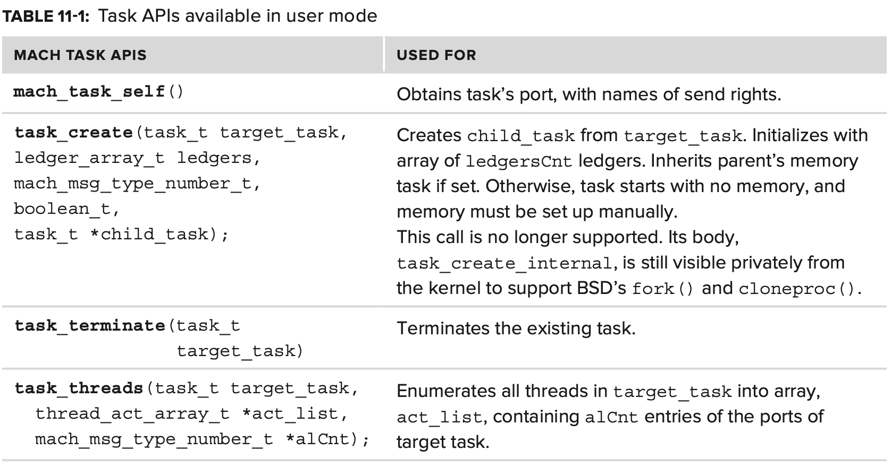

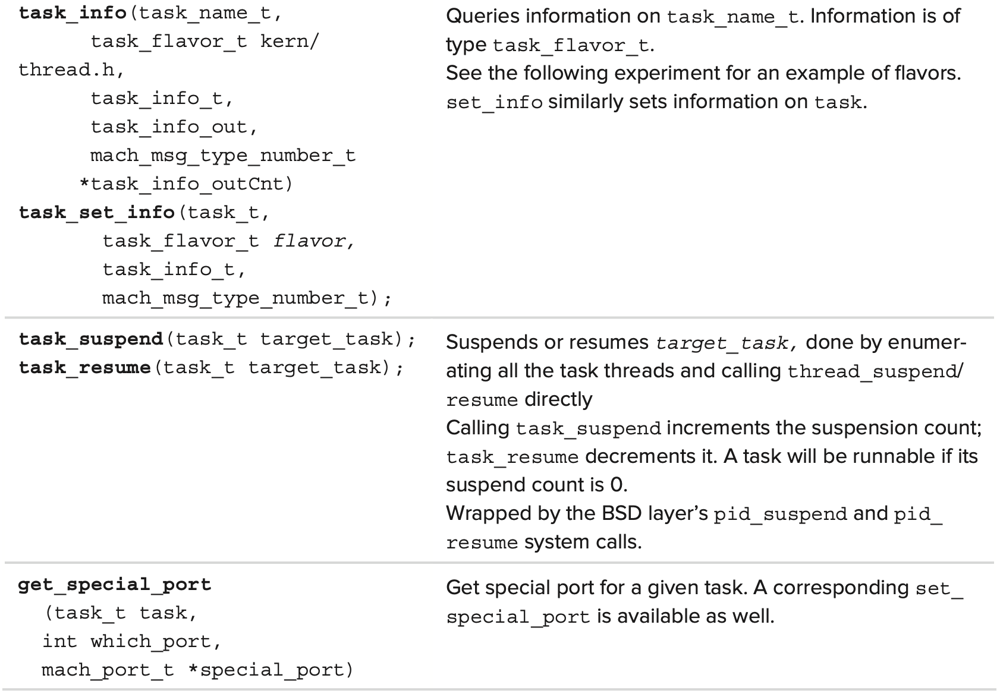

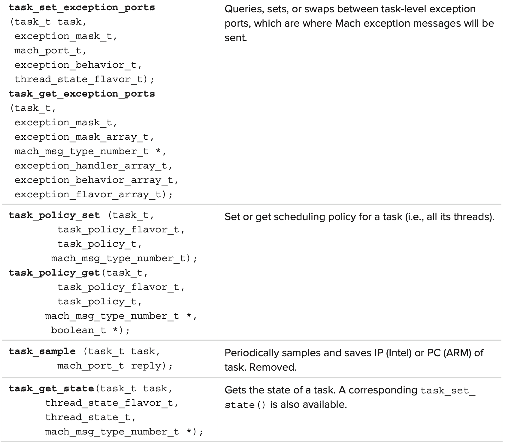

추가적으로 user mode로 expose 되지 않는 internal API들은 다음과 같다

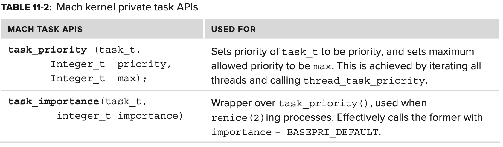

> task port는 해당 thread 및 resource를 완벽하게 제어할 수 있는 경로이다.   
> 위에 나와있는 API들은 Mach가 task에서 허용하는 operation의 일부에 불과하며, 이 외에도 더 많은 API 들이 존재한다. ch 12에서 task의 virtual memory image 를 위반하고 더럽힐 수 있는 API 및 tool 들이 더 나오는데, 이러한 기능은 **kernel\_task** 에 적용 시 너무 강력해져서 privileged user가 kernel memory를 엿보고 수정할 수 있게 된다.


### Thread APIs

Mach은 thread 관리를 위한 API도 다양하게 제공한다. 이들의 대부분은 task API와 동일한 기능을 하며, 실제로 task API는 종종 각 task의 thread 목록을 반복하며 해당 API를 차례로 적용한다. 이러한 호출은 \(**mach\_thread\_self** 제외\) Mach message를 통해 구현되며 MIG subsystem에 의해 생성된다.  
다음 Table 11-3에 thread API가 나열되어있다. 별 다른 언급이 없으면 kern\_return\_t를 반환한다.


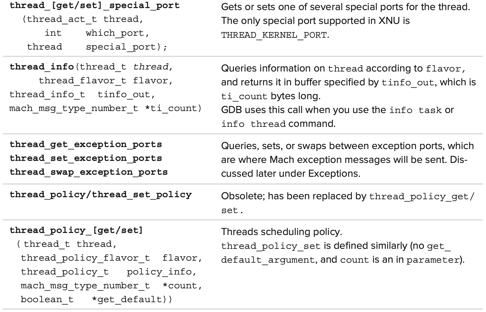

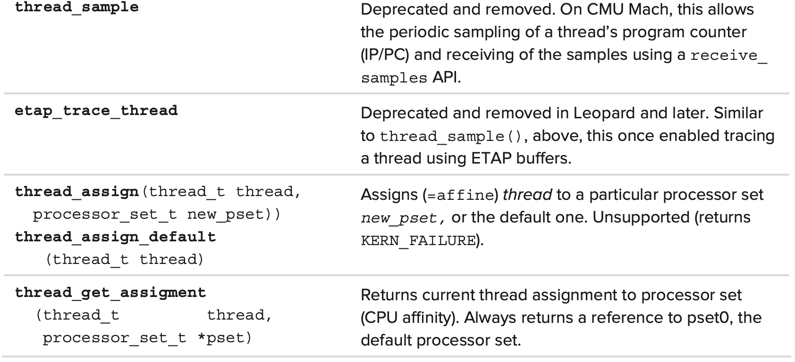


#### In-Kernel Threads API

Mach은 kernel mode 에서만 access할 수 있는 일련의 thread control function을 제공한다.   
이들 중 일부과 다음 표에 나와있다.

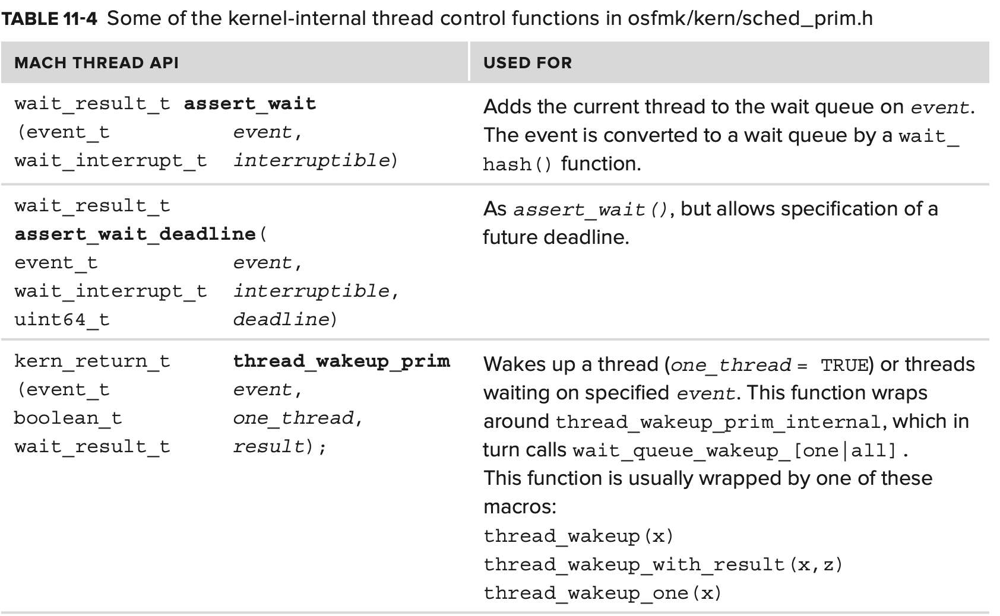

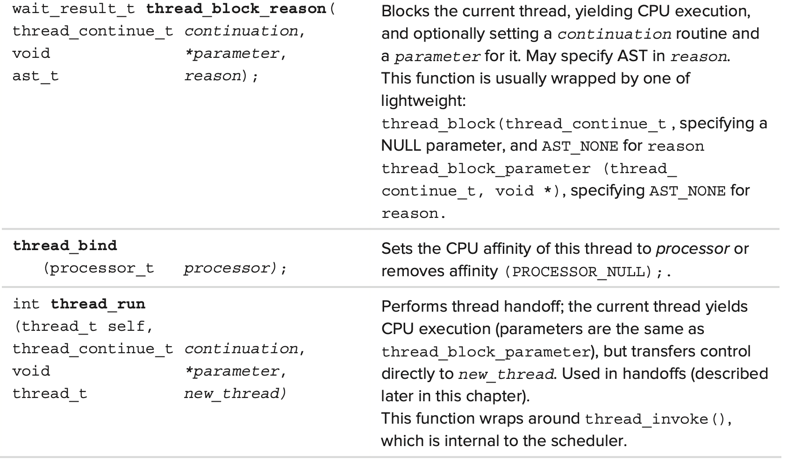


#### Thread Creation

thread creation API는 특히 중요하다. 자신을 포함하고 있는 container task 밖에서는 thread가 존재할 수 없으므로 해당 API는 task.h에 정의되어 있다.

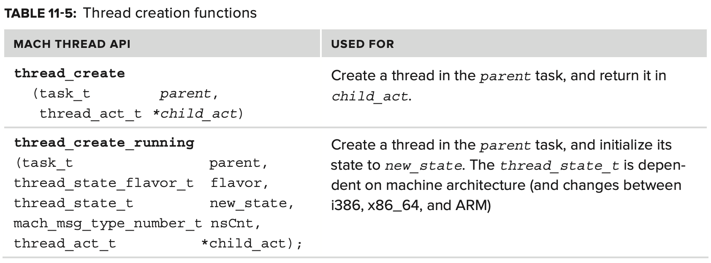

첫 번째 argument인 **task\_t parent** 는 thread가 생성될 task 이다. 이것은 Mach의 관점에서 보았을 때 사용자가 해당 port를 갖는 어떤 task에서도 thread를 생성할 수 있다는 것을 의미하며, 이 덕분에 remote thread creation을 가능하게 하는 Mach infra가 매우 유연해진다.

따라서 **pthread\_create\(\)** 를 사용할 경우 **mach\_task\_self\(\)** 를 첫 번째 argument로 사용하여 Mach의 **thread\_create** 를 호출한다. 만약 다른 task의 port가 있다면 그 안에 thread를 삽입할 수 있다. 주입 된 thread가 task의 virtual memory에 대한 full access를 얻고 감지하기 매우 어려우므로 올바르지 않은 기능이 구현될 수 있다. 


## SCHEDULING

시스템의 CPU\(core\)가 아무리 많아도 thread는 그보다 더 많을 것이다. 그러므로 kernel은 CPU에 thread를 저글링 할 수 있어야 하며, 인간 사용자가 동시성을 인식할 수 있게 많은 thread가 실행되도록 해야한다. 그러나 실제로 각 core는 한 번에 하나의 thread만 실행할 수 있으므로 kernel은 thread 하나를 선점하고 다른 thread로 교체하여 thread간 **context switch**을 수행할 수 있어야 한다. 

processor-set 추상화를 통해 Mach은 Linux 또는 Window 보다 이것에 좀더 적합하며 실제로 동일한 **pset**에서 동일한 CPU의 core를 관리하고 별도의 pset에서 개별 CPU를 관리할 수 있다. 이 섹션의 나머지 부분에서는 두 가지 케이스를 구분하지 않으며, physical CPU가 아닌 logical CPU를 CPU라고 지칭한다. 


### The High-Level View

**context switching**은 현재 실행중이던 기존 process의 register state를 predefine된 memory 위치에 기록하고, 새로운 process의 register state로 교체하는 작업을 말한다.

> **context?:** 사용자와 다른 사용자, 사용자와 시스템 또는 디바이스간의 상호작용에 영향을 미치는 현재 상태를 규정하는 정보들을 말하며, OS에서의 **context** 는 CPU가 해당 process를 실행하기 위한 정보들이다. **PCB\(Process Control Block\)** 에 저장되며, 다음과 같은 정보들이 있다.  
> - process state: 생성, 준비, 수행, 대기, 중지  
> - program counter: process가 다음에 실행할 명령어 주소  
> - register: accumulator, 스택, 색인 register  
> - process 번호

운영체제에 상관없이 thread scheduling의 기본 개념은 동일하다. thread는 CPU에서 필요한 만큼 execute 된다. execute란 CPU register 가 thread state로 채워져 있는 것을 말하며, 결과적으로 CPU가 execute하고 있는 코드는 해당 thread function의 code 이다. 이 execute는 다음 중 하나가 발생할 때 까지 계속된다.

* **thread가 종료:** 대부분의 thread는 결국 endpoint에 도달한다. thread function이 return 되거나 **pthread\_exit\(\)**를 호출하며, 이를 **thread\_terminate** 라고 부른다. 
* **thread의 자발적인 CPU 포기:** thread 작업이 끝나지 않았음에도 불구하고 resource나 다른 blocoking operaiton을 기다리기 때문에 더이상 execute를 계속할 필요가 없는 경우에 thread는 자발적으로 scheduler 에게 context switch 를 요청한다. 또한 thread는 deadline이나 몇 event에 대한 notification을 요청하여 CPU로 복귀할 시기를 system에게 알려야 한다. 
* **외부 interrupt에 의한 context switching:** 외부 interrupt는 thread execution을 방해하여 CPU가 thread register state를 저장하도록 지시하고 interrupt-handling code를 즉시 실행한다. thread가 중단되었기 때문에 interrupt-handling code에서 돌아오기 전에 system은 scheduler에 의해 다음에 실행할 thread를 다시 선정한다. 따라서 interrupt 직전에 실행중이던 thread가 interrupt 처리 후에 다시 시작하리라는 보장은 없다.


### Priorities

모든 thread 는 평등하다. 그러나 어떤 thread 는 다른 thread 들보다 더 평등하다. 다시 말해, thread에는 특정 prority가 할당되며, scheduled 되는 빈도에 직접 영향을 준다. Windows 에는 32개, Linux 에는 140개, Mach 에는 128개의 priority level 이 있으며 Apple이 _priority bands_ 라고 부르는 priority range의 사용법은 다음과 같다. 

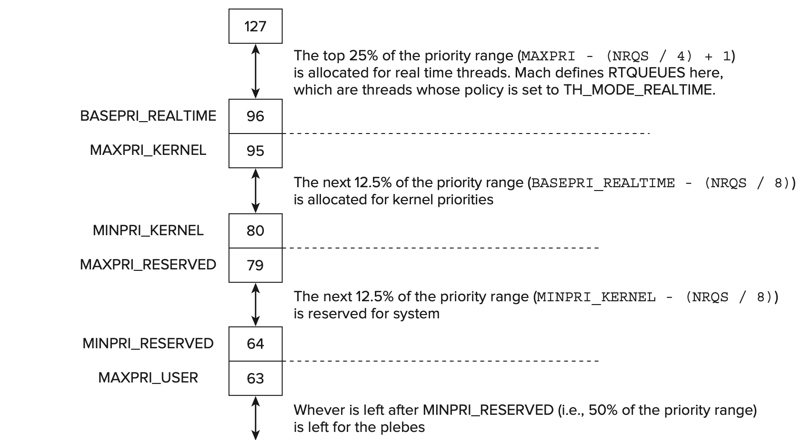


kernel thread의 최초 priority를 user mode보다 높은 80으로 설정하면 kernel 및 system 유지 관리가 몇 가지 매우 특수한 케이스를 제외한 모든 user mode thread를 선점할 수 있다.


#### Priority Shift

thread의 priority는 시작시 지정하지만, 종종 runtime중에 priority를 조정해야한다. Mach는 thread의 CPU usage및 전체 system load를 수용하기 위해 각 thread의 우선순위를 동적으로 조정한다. 따라서 thread는 CPU를 너무 많이 사용하면 priority가 감소하고, 충분히 사용하지 못했으면 priority가 높아지도록 priority band에서 _drift_  된다. 각 thread의 priority를 동적으로 업데이트 하는 것은 **do\_priority\_computation** 매크로와 **update\_priority** 함수 이다. macro는 계산된 **sched\_usage**\(함수에 의해 계산되고 CPU usate delta를 고려\) 를 **pri\_shift** 값만큼 이동하여 thread priority를 토글한다. **pri\_shift** 값은 global **sched\_pri\_shift** 에서 도출되며, 이는 scheduler에 의해 정기적으로 **compute\_averages** function의 system load 계산의 일부로 업데이트된다. CPU usage delta 를 빼면 CPU 사용량이 높은 thread에 효과적으로 페널티를 주고\(positive usage delta가 priority를 낮춤\) CPU 사용량이 적은 thread에 대해 보상한다\(negative usage delta가 priority를 증가시킴\).

thread의 CPU usage의 penalty 가 치명적인 지점에 도달하지 않도록 하기 위해 **update\_priority** function은 점차적으로 CPU usage를 aging 한다. 그것은 CPU usage의 기하급수적인 붕괴를 \(5/8\)^n factor로 시뮬레이션 하기 위해 sched\_decay\_shift structure를 사용하며, predefine된 shift 값을 사용하여 bit shift 및 addition으로 표현되는 계산 속도를 높일 수 있으며 곱셈보다 시간이 덜 걸린다.

Mach는 또한 _throttling_ 을 지원하며 priority throttled process, 즉 system 에 의해 의도적으로 불이익을 받는 process에 대해 **MAXPRI\_THROTTLE** 을 정의한다. 

sheduler가 가능한 최소 시간 내에 priority가 가장 높은 다음 실행 가능 thread를 찾을 수 있도록 다양하고 일시적인 priority 를 가진 모든 thread를 효율적으로 관리해야 한다. 이러한 이유로 **run queue** 를 사용한다.


### Run Queues

thread는 다음에 표시된 것처럼 _osfmk/kern/sched.h_ 에 정의된 priority list에 따라 **run queue** 에 배치된다.

```c
struct runq_stats { 
    uint64_t    count_sum; 
    uint64_t    last_change_timestamp;
};
#if defined(CONFIG_SCHED_TRADITIONAL) || defined(CONFIG_SCHED_PROTO) || 
defined(CONFIG_SCHED_FIXEDPRIORITY)


struct run_queue {
    int highq;                        /* highest runnable queue */
    int bitmap[NRQBM];                /* run queue bitmap array */
    int count;                        /* # of threads total */
    int urgency;                      /* level of preemption urgency */
    queue_head_t queues[NRQS];        /* one for each priority */
    
    struct runq_stats runq_stats;
};

#endif /* defined(CONFIG_SCHED_TRADITIONAL) || defined(CONFIG_SCHED_PROTO) || 
defined(CONFIG_SCHED_FIXEDPRIORITY) */
```

**run queue** 는 128개의 priority 각각에 대해 하나의 대기열\(\#defined as **NRQS\)** 을 나타내는  multi-level list 또는 array 이다. 실행할 다음 priority를 빠르게 검색하기 위해 O\(1\) sheduling을 사용한다. 배열을 보지 않고 NULL이 아닌 항목을 찾을때 까지 각 항목을 체크하는 것이다. Mach는 bitmap을 check 하므로  32\(\#defined as **NRQBM**\) 를 동시에 볼 수 있다. 이것은 scheduling logic 이 자주 그리고 중요한 시간에 실행된 다는 것을 고려할 때 가능한 한 빠르고 가장 중요하게 만든다

thread에 새로운 priority를 할당하면 thread를 한 queue에서 다른 queue로 이동한다는 의미이므로 code는 thread의 **sched\_pri** field를 직접 수정할 수 없다. 이 작업은 **set\_sched\_pri** 에 의해 수행되며, **compute\_priority** 에 의해 호출된다. 

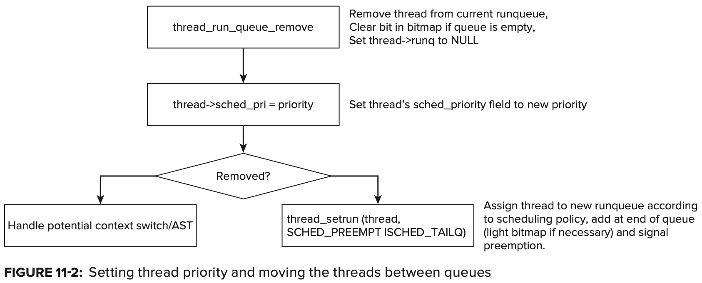


#### Wait Queues

thread는 processor를 기다리는 동안 running 또는 ready sate에 최적이다. thread가 block되어 일부 IPC object\(mutex 또는 semaphore 등\), 몇몇 I/O operation\(file 또는 socket 등\) 또는 event를 기다리는 경우가 있다. 이러한 경우 thread scheduling을 고려할 때 이득이 없다. object 가 사용 가능하거나, operation 이 완료, 혹은 event가 발생한 후에만 실행을 재개할 수 있기 때문이다. 이러한 경우 thread를 **wait queue** 에 배치할 수 있다.

```c
/*
* wait_queue_t
* This is the definition of the common event wait queue
* that the scheduler APIs understand. It is used
* internally by the gerneralized event waiting mechanism
* (assert_wait), and also for items that maintain their
* own wait queues (such as ports and semaphores). *
* It is not published to other kernel components. They
* can create wait queues by calling wait_queue_alloc. *
* NOTE: Hardware locks are used to protect event wait
* queues since interrupt code is free to post events to
* them. */
typedef struct wait_queue {
    unsigned int            /* flags */
    /* boolean_t */       wq_tyoe:16,     /* only public field */
                          wq_fifo:1,      /* fifo wakeup policy? */
                          wq_prepost:1,   /* waitq supports prepost? set only */
                          :0;             /* force to long boundary */
    hw_lock_data_t        wq_interlock;   /* interlock */
    queue_head_t          wq_queue;       /* queue of elements */
} WaitQueue;
```

**wait queue**에 thread를 추가하려면 **wait\_queue\_assert\_wait\[64\[\_locked\]\]** 을 사용하면 된다. 해당 함수는 thread가 realtime, privileged, 또는 FIFO wait queue가 아닌 이상\(이 세 경우에는 queue의 head에 삽입\) queue 의 tail 에 thread를 집어넣는다. wait condition 이 충족되면 대기중인 thread를 unblock 하고 dispatch 할 수 있다.   
**wait\_queue\_wakeup64\_\[all\|one\]\_locked** 는 event 발생 시 하나 또는 모든 thread를 깨우기 위하여 사용된다. 이 함수는 **wait queue** 에서 thread를 빼고 **thread\_go** 를 사용하여 dispatch 한다. **thread\_go** 는 thread를 unblock 하고dispatch 한다. 


## MACH SCHEDULER SPECIFICS 

앞서 살펴본 scheduling에 대한 관점은 모던 운영체제에 있어서 공통되는 부분이다.   
이 외에도 Mach에는 다음과 같은 몇가지 기능이 추가되었다.

* **handoff**를 사용하면 thread가 자발적으로 CPU를 넘겨줄 수 있다. 다만, 다른 아무 thread에게나 CPU를 넘기는 것이 아니고, 선택한 특정 thread에게 CPU 사용권을 넘긴다. 이 기능은 Mach이 message-passing kernel이며 thread간에 message가 전달된 다는 점을 생각하면 매우 유용함을 알 수 있다. 이렇게 하면 다음 message의 sender나 reciever가 다음에 scheduled 될 때 까지 기다리지 않고 최소한의 latency로 message를 처리할 수 있다. 
* **Continuations** 은 thread가 자체 stack에 크게 신경 쓰지 않고 폐기할 수 있는 경우 사용되며, stack을 복원하지 않고 system 을 resume할 수 있도록 해준다. 이 기능은 Mach에만 해당하며 kernel 주변 여러 곳에서 사용된다. 
* **Asynchronous Software Traps\(ASTs\)** 는 low-level hardware trap mechanism 을 보완하는 소프트웨어이다. kernel은 **AST** 를 사용하여 event scheduling 과 같이 주의가 필요한 out-of-band event에 응답할 수 있다. 
* **Scheduling algorithms이 modular** **이며 schdeuler는 부팅시 동적으로 설정** **가능**하다. 그러나 실제로는 하나의 scheduler\(traditional scheduler\)만 사용된다.


#### Handoffs

모든 운영 체제는 yielding\(양도\)의 개념을 지원한다. 이는 CPU를 다른 thread에게 자발적으로 넘겨주는 행위이다. 고전적인 형태에서는 양도한 thread가 후속 작업을 선택할 수 없고 scheduler에 의해 다음 thread가 선정되었다.   
Mach에서는 CPU를 전달하는 option을 추가하여 이를 개선하였다. 이를 통해 양도한 thread 는 scheduler에 다음으로 실행할 최상의 thread에 대한 힌트를 제공할 수 있다. shceduler가 이를 반드시 따라야만 하는 것은 아니기 때문에 양도한 thread가 지정한 thread가 아닌 다른 thread가 실행될 수도 있지만\(지정된 thread가 실행 불가능한 경우 등\), scheduler는 thread policy를 무시하기 때문에 **handoff** 는 대체로 성공한다. **handoff** 의 결과로 현재 thread 의 남은 quantum 이 다음으로 schedule 될 새 thread에게 제공된다. 고전적인 yield 대신 handoff 하기 위해 thread는 전환할 thread의 port를 지정하는 **thread\_switch\(\)** 를 호출하고 옵션 플래그\(ex. 교체 thread의 priority를 낮춤\) 및 이러한 옵션이 적용되는 시간을 지정한다.   
**thread handoff mechanism**은 user mode에서도 엑세스 할 수 있다. Mach 는 **thread\_switch\(\)** trap을 제공하여 user mode에서도 **handoff** 를 사용할 수 있도록 한다.


#### Continuations

context switch 는 대부분의 운영체제에서 간단하지만, 각 thread 마다 고유한 task 를 지니는 클래식 모델에 따라 Mach 은 **continuation** 이라는 개념을 도입하여 대안을 제공한다. **continuation** 은 optional resumption function\(argument와 함께\) 이며, 자발적으로 context switch 를 요청하는 경우 thread 가 지정할 수 있다. **continuation** 이 지정되면 thread가 재개될 때 새 stack으로 continuation point 에서 reload 되고 이전 상태는 저장되지 않는다. register의 저장 및 로딩을 생략할 수 있어 context switching이 훨씬 빨라지며, kernel stack 의 공간도 절약할 수 있다. **continuation** 인 thread는 4~5 KB만 필요하므로 다른 thread 들이 추가적으로 필요로 하는 16K를 절약할 수 있다. 전체 register 상태 및 thread stack 대신 **continuation** 및 optional parameter만 저장하면 되며, thread structure 자체에서 수행될 수 있다.   
thread는 **thread\_block\(\)** 을 사용하여 차단할 것을 지정하고 선택적으로 **continuation** 을 지정한다\(또는 **THREAD\_CONTINUE\_NULL** 사용\). **continuation** 에 대한 argument는 **thread\_block\_parameter\(\)** 에 의해 지정될 수 있으며, 두 호출 모두 **thread\_block\_reason\(\)** 에 대한 래퍼이다.

**continuation** 은 context switch 비용을 완화하는 빠르고 효율적인 메커니즘이며 주로 Mach의 kernel thread 에서 사용된다. 실제로 Mach의 **kerenl\_thread\_create**\(및 주요 호출자인 **kernel\_thread\_start\_priority**\) 는 **continuation** 개념을 기반으로 구축되었다.

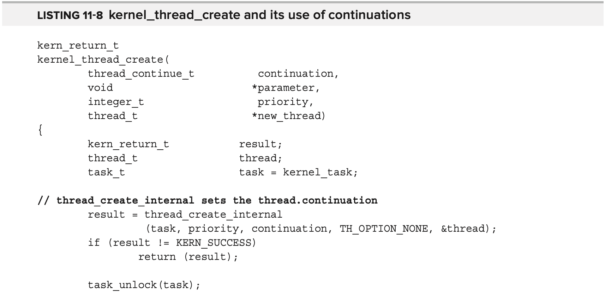

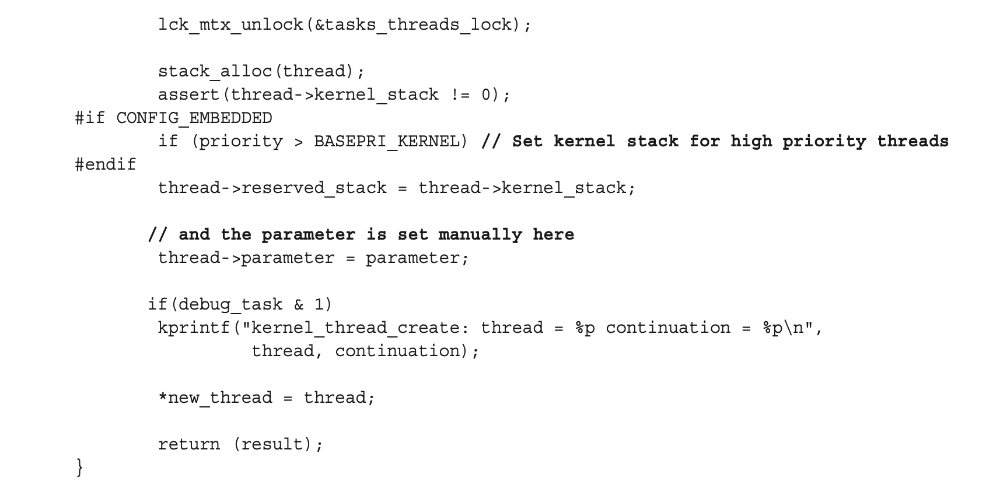


#### Preemption Modes

system 의 thread는 다음 두 가지 방법 중 하나로 preempted 될 수 있다: 명시적으로 thread가 CPU control 을 포기하거나, blocking으로 define된 operation 에 들어갔을 때 interrupt로 인해 암시적으로 발생한다. explicit preemption은 사전에 예측 가능하기 때문에 synchronous 라고도 한다. 본질적으로 예측할 수 없는 인터럽트는 implicit preemption을 asynchronous로 만든다. 


**Explicit Preemption**

thread가 자발적으로 CPU를 포기하려고 할 때 explicit preemption이 발생한다. resource 또는 I/O를 기다리거나 일정 시간 동안 절전 모드로 인해 발생할 수 있다. user mode thread는 **read\(\), select\(\), sleep\(\)** 등과 같은 blocking system call을 호출할 때 explicit preemption을 따른다. explicit preemption을 제공하기 위해 Mach는 **thread\_block\_reason\(\)** 함수를 제공한다. 

**Implicit Preemption**

OS X는 preemptive multitasking system 이다. 일반적으로, Mach는 thread의 ready 여부에 관계 없이 특정 시점에 thread를 preemption 할 권리를 가진다. explicit preemption과 달리 implicit preemption은 thread에게 invisible 하다. thread 는 이에대해 인지하지 못하고, save되었다가 다시 restore 된다. 대부분의 thread는 신경쓰지 않지만 CPU를 많이 사용하는 thread의 경우에는 문제가 될 수도 있다.  
implicit preemption의 경우 explicit한 경우보다 더 간단한데, **continuation** 이 없기 때문이다. thread는 자신이 suspend 된 것을 알지 못하기 때문에 **continuation** 을 요청할 수 없다.   
thread가 자체 scheduling을 제어할 수는 없지만 Mach는 서비스 등급을 보장하는 데 도움이 될 수 있는 몇 가지 사전 설정된 policy를 제공한다. Mach는 real time system이 아닌 time sharing system이므로 서비스를 보증할 수 없기 때문에 "work toward"에 유의한다. user mode에서 접근 가능한 Mach trap인 **thread\_policy\_set\(\)** 을 사용하면 이러한 정책을 요청할 수 있다.

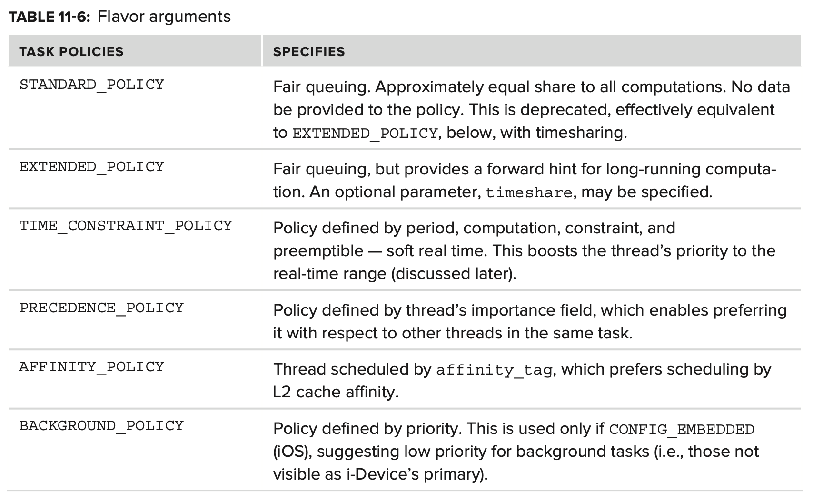

이러한 특징은 개별 thread의 scheduling을 세밀하게 제어할 수 있게 한다. 기본 정책 **THREAD\_STANDARD\_POLICY**는 fair time sharing에 사용된다. 추가 매개 변수는 필요하지 않다. 

**THREAD\_EXTENDED\_POLICY** 는 이를 기반으로 하여 false 인 경우 alternative policy 를 지정하고, true 인 경우 standard policy 로 돌아가는 boolean parameter **timeshare** 를 추가한다. 

더 복잡하고 realtime policy 에 더 가까운 **THREAD\_TIME\_CONSTRAINT\_POLICY** 는 세밀한 scheduling 조정을 허용한다. 이 정책의 핵심은 해당 thread의 scheduling인 "processing arrival" 개념이다. 단위는 kernel의 CPU clock 주기로 측정된다. 이 정책은 여러 argument를 기반으로 한다.

* **Period:** 연속된 두 번의 processing arrival 사이의 시간을 요청한다. 이 값이 0이 아니라면 해당 thread는 주기 마다 한 번씩 processor 시간을 구하는 것으로 가정한다.  
* **Computation:** thread가 schedule 될 때마다 필요한 computation time을 지정하는 32-bit integer 
* **Constraint:** computation의 시작과 끝 사이의 maximum\(real\) time 
* **Preemptible:** computation 중단 여부를 지정하는 boolean 값. 즉, 이러한 computation cycle이 연속적이어야 하는지\(preemptible = false\) 또는 아닌지\(preemptible = true\)

**THREAD\_PRECEDENCE\_POLICY** 는 한 개의 argument인 **importance** 를 취하는데, 이는 동일한 task의 다른 thread에 비교하여 해당 thread의 상대적 중요성을 제공한다. 이 값은 signed 이며, XNU의 최소 우선 순위는 0으로 정의되어있는 **IDLE\_PRI** 이다.

**THREAD\_AFFINITY\_POLICY** 는 동일한 cache의 thread 간에 L2 cache affinity를 제공한다. 모든 core가 동일한 L2 캐시를 공유하므로 코어\(모든 코어가 동일한 L2 캐시를 공유하므로\) 에 관계 없이 이러한 thread가 동일한 CPU 에서 실행될 가능성이 높지만, true SMP환경에서 CPU를 교차할 가능성은 낮다는 것을 의미한다. 이 것을 제공하기 위해 해당 정책은 relate process\(parent and descendats\) 간에 공유되는 affinity\_tag 를 사용한다.


### Asynchronous Software Traps\(ASTs\)

**AST** 는 인공적인 비 하드웨어 trap 조건이다. **AST** 는 kernel 작업에 중요하며 preemption event와 같은 scheduling event 및 BSD signal이 구현되는 기판 역할을 한다. **AST** 는 thread의 제어 블록에서 다양한 bit field로 구현되며 **thread\_ast\_set\(\)** 을 호출하여 개별적으로 설정할 수 있다. **thread\_ast\_set\(\)**은 아래에서 볼 수 있다시피 매크로 이다.

```c
#define thread_ast_set(act, reason) (hw_atomic_or_noret(&(act)->ast, (reason))) 
#define thread_ast_clear(act, reason) (hw_atomic_and_noret(&(act)->ast, ~(reason))) 
#define thread_ast_clear_all(act) (hw_atomic_and_noret(&(act)->ast, AST_NONE))
```

Table 11-8에는 define된 **ASTs**와 그 목적들이 나와있다.

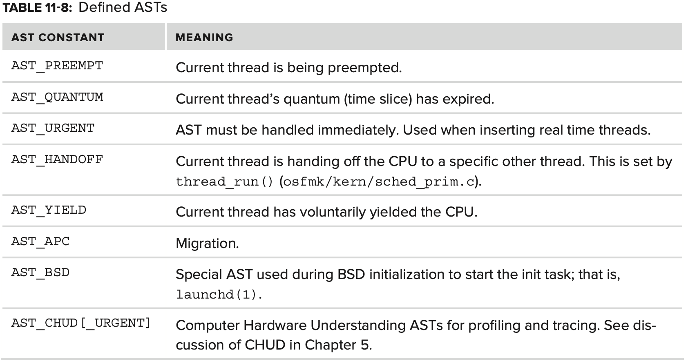

**AST**는 또한 combo로  사용될 수 있으며 이는 preceding flags의 bitwise OR 이다. Table 11-9에 나와있다.

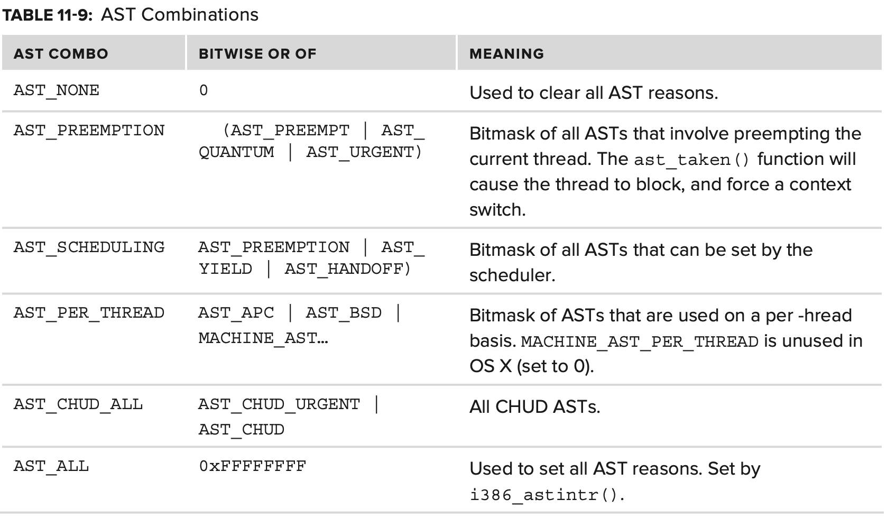

시스템이 trap\(**user\_trap\_return** 호출 후\) 또는 interrupt\(**INTERRUPT** 호출 후\) 에서 복귀하면 즉시 user mode로 돌아가지 않는다. 대신 code는 thread의 field를 보고 **AST** 가 있는지 확인한다. 0이 아닌 경우 Listing 11-12 에 표시된 것처럼 **i386\_astintr\(\)** 를 호출하여 처리한다.

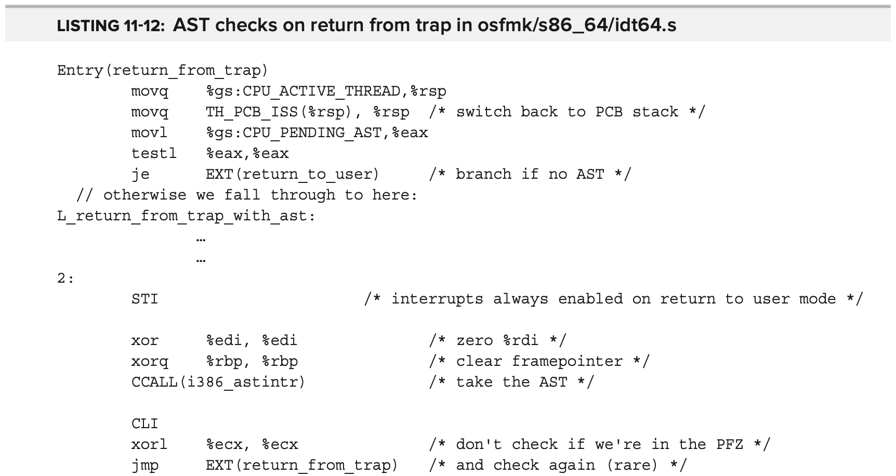

Figure 11-4 는 Listing-11-12와 같이 trap 및 interrupt 에서 복귀할 때의 **AST** check point를 보여준다. **AST** 는 모든 interrupt가 활성화 된 상태로 실행되지만 여전히 "out of process time" 상태에서 실행된다는 점에서 Linux의 softIRQ와 약간 비스하다. **i386\_astintr\(\)** 은 Listing 11-13에 표시된 것처럼 **ast\_taken\(\)** 에 대한 wrapper 이다. 


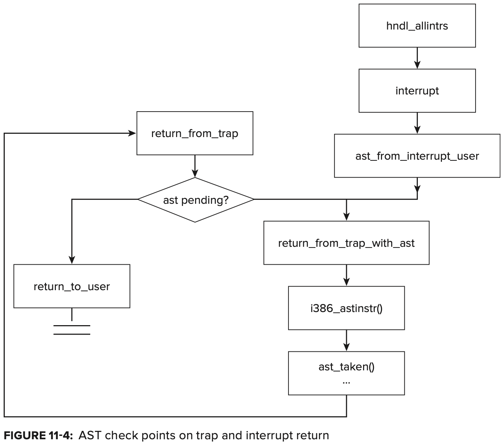

kernel trap 및 kernel thread termination시 호출될 수 있는 **ast\_taken\(\)** 함수는 kernel idle thread를 저장하는 모든 thread 에서 **AST** 를 처리한다. **AST\_URGENT** 및 **AST\_PREEMPT**\(**AST\_PREEMPTION** combo\)로 표시된 **AST** 는 thread를 즉시 preemption 한다. 그렇지 않으면 이 함수는 BSD event\(signal 등등\)을 위해 Mach에 임시로 넣었지만 무기한으로 남아있는 hack을 확인한다. **BSD AST** 가 설정되면 signal을 처리하기 위해 **bsd\_ast** 를 호출한다.

**AST** 에서 특별한 경우는 **Preemption Free Zone\(PFZ\)** 로 알려진 **commpage** 상의 특별한 영역이다. 이 zone에 있는 동안 미결 **AST** 는 pending된다. 

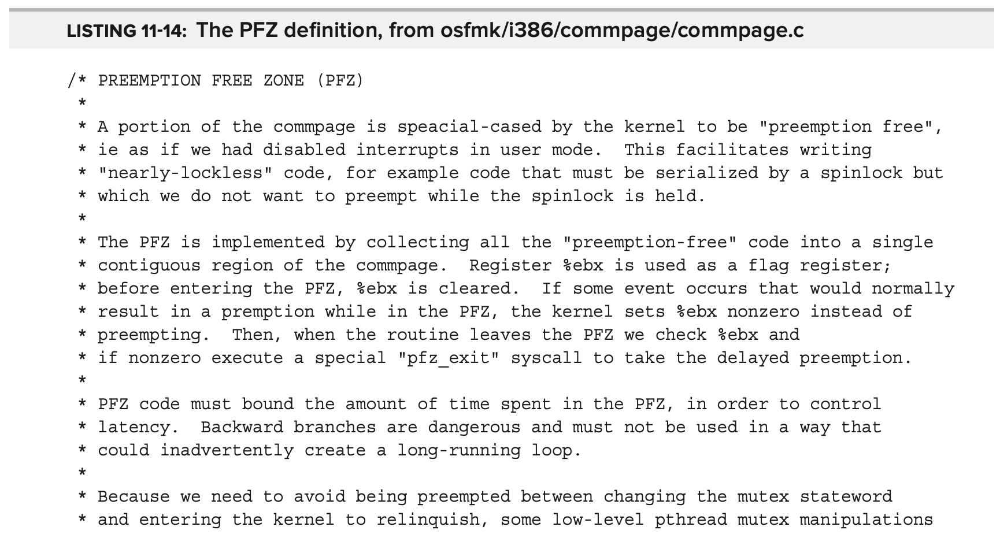


### Scheduling Algorithms

Mach의 thread scheduling algorithm은 확장성이 뛰어나며, 실제로 thread scheduling에 사용되는 algorithm을 변경할 수 있다.

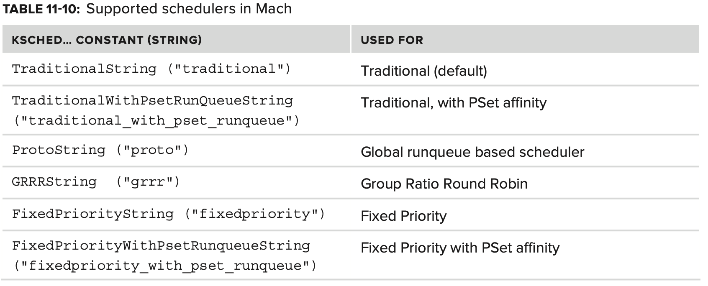

일반적으로 기존 scheduler인 traditonal scheduler만 사용 가능하지만 Mach architecture에서는 compile 중에 해당하는 **CONFIG\_SCHED\_** 지시문을 사용하여 추가 scheduler를 정의하고 선택할 수 있다. 사용할 scheduler는 scheduler boot-arg 또는 device tree entry 로 지정할 수 있다.

각 scheduler object는 **sched\_dispatch\_table** structure를 유지하며, 여기서 다양한 operation은 함수 포인터로 유지된다. 글로벌 테이블 **sched\_current\_dispatch** 는 현재 활성 scheduling algorithm을 보유하며 runtime 중에 scheduler 전환을 허용한다. 모든 scheduler는 동일한 field를 구현해야하며, 일반 scheduler logic은 **SCHED** 매크로를 사용하여 호출한다. 

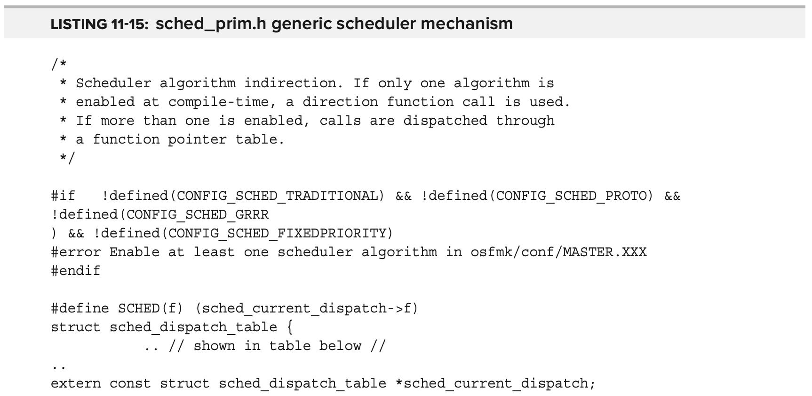

scheduler dispatch table 은 다음 Table 11-11에 설명되어있다.

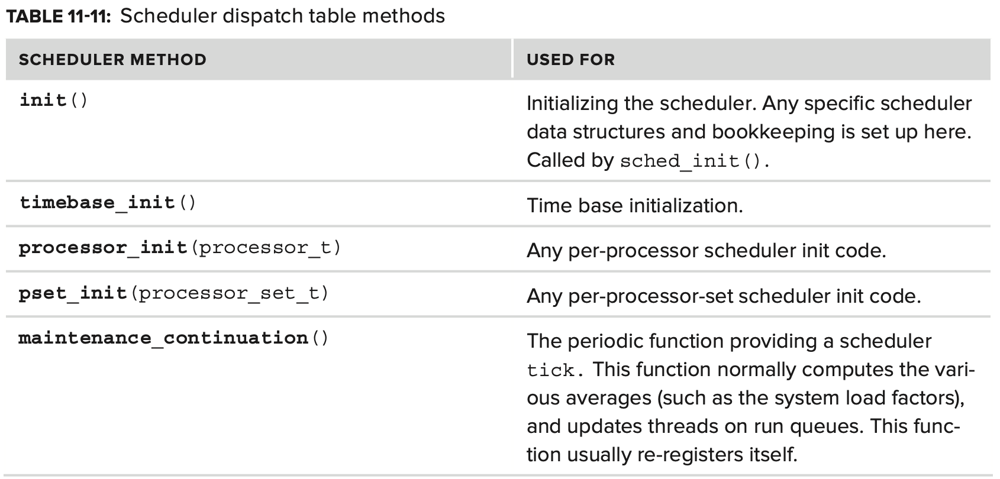

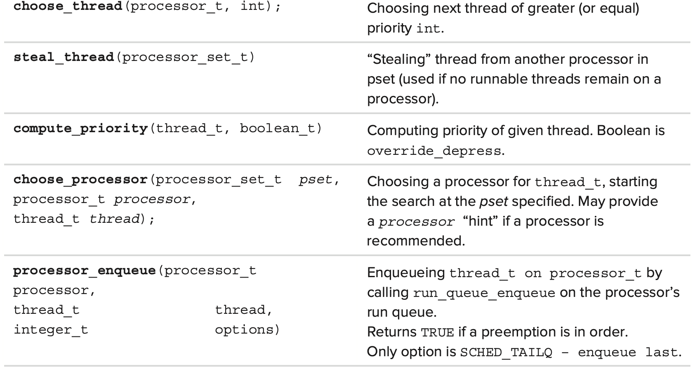

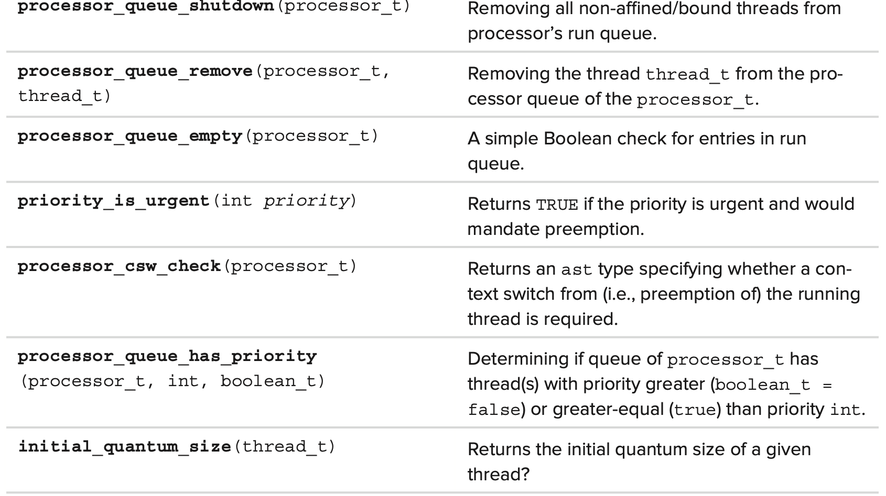

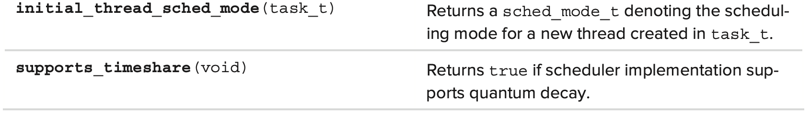

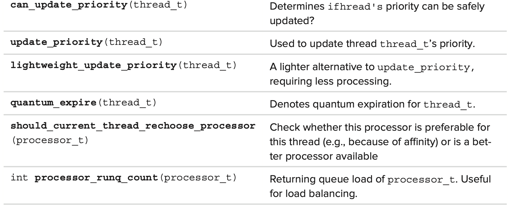

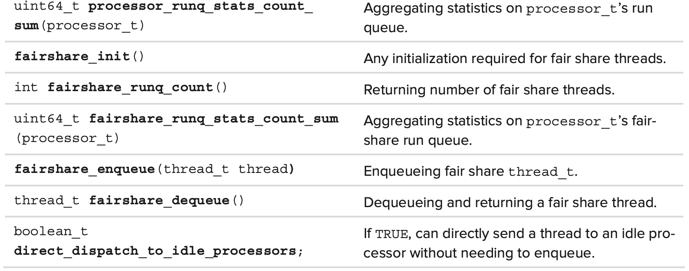

thread scheduling 을 유지하기 위해 모든 schedule은 앞에서 설명한 **continuation** 메커니즘을 적용한 **maintenance\_continuation** 함수를 구현한다. 여기에서 scheduler thread는 **clock\_deadline\_for\_periodic\_event** 를 사용하여 clock notification을 등록한다. **assert\_wait\_deadline** 은 thread가 지정된 최종 기한 내에 실행되고 thread가 **continuation** 에서 block 된다. process는 scheduler의 init function에서 jumpstart 된다.

scheduler는 이 장에서 논의된 **AST\(Asynchronous Software Trap\)** 메커니즘을 많이 사용한다. 특히 scheduler 는 매우 특정한 유형인 **AST\_PREEMPTION** 의 trap을 사용한다. 이들은 interrupt handling 및  kernel/user space transition을 위해 scheduling logic 을 묶는다.   
또한 scheduling logic은 **kdebug** 메커니즘에 대한 호출과 연계되어 있어서  **DBG\_MACH\_SCHED** 로 정의된 **kdebug** 코드는 scheduler flow에서 가장 중요한 point를 표시한다. 

## TIMER INTERRUPTS

지금까지는 scheduling logic 에서 Mach가 사용하는 primitive 와 construct를 다루었다. 이 섹션에서는 이러한 idea가 scheduling 을 이끄는 "engine", 즉 timer interrupt와 통합된다.


### Interrupt-Driven Scheduling

시스템이 preemption multitasking을 제공하려면 먼저 scheduler가 CPU를 제어하여 현재 실행중인 thread를 preempt 한 다음 scheduling algorithm을 수행하여 현재 thread 가 실행을 다시 시작할지 또는 CPU를 더 중요한 thread에게 양도하기 위해 "kicked out" 될지 여부를 결정하는 메커니즘을 지원해야 한다. 

원래의 thread 로부터 CPU의 제어를 빼앗아 오기 위해서 현대 운영체제는 hardware interrupt의 already-existing mechanism을 활용한다. CPU로 하여금 "drop everything" 하고 interrupt handler로 longjmp 하도록 강제하는 interrupt의 특성때문에 interrupt mechanism에 의존하여 interrupt 시에 scheduler를 실행하는 것이 타당하다.

그러나 한가지 작은 문제가 남아있다. interrupt는 asynchronous 이므로 언제든지 발생할 수 있으며 예측할 수가 없다. 사용량이 많은 시스템이 초당 수천 개의 interrupt를 처리하는 동안 quiet I/O period - 일반적인 interrupt source\(disk, network, user\)가 모두 idle인 상태 - 인 system 도 interrupt-wise 로 idle 상태가 될 수 있다. 따라서 주어진 시간 프레임 내에서 interrupt를 trigger 하기 위해 신뢰할 수 있는 예측 가능한 interrupt source  가 필요하다. 

다행이도 이러한 interrupt 소스가 존재하며 XNU는 이를 **real time clock**, 또는 **rtclock** 이라고 한다. 이 clock은 하드웨어에 따라 다르며\(Interl architecture의 경우 이 목적으로 local CPU의 **APIC** 를 사용\), 주어진 cycle 수 이후 interrupt를 생성할 수 있도록 kernel에 의해 설정할 수 있다. 이 inetrrupt source 는 종종 timer interrupt 라고 한다.  


이전 버전의 XNU는 timer interrupt를 고정된 값의 times per second \(hz\)로 트리거 하였다. 이 값은 여전히 _bsd/kern/clock.c_ 에 global 로 정의되어 있지만 더이상 사용되지 않고 무시되어진다. 실제로 이 값을 무시해야 하는 충분한 이유가 있다. 고정된 간격으로 kernel을 중단시키는 timer는 예측 가능하지만 관계없는 interrupt를 야기시킨다. hz 값이 너무 높으면 불필요한 interrupt가 많이 발생하고, 너무 낮을 경우엔 sub-hz delay가 타이트한 loop에 의해서만 달성될 수 있기 때문에 시스템의 responsive가 낮아지게 된다. 따라서 구버전 OS X 에서 사용된 hertz\_tick\(\) 함수는 여전히 존재하지만 XNU가 프로파일링으로 컴파일 된 경우에만 사용되지 않고 조건적으로 컴파일된다. 

해결책은 tick-less kernel의 다른 모델을 채택하는 것이다. 이 모델은 Linux와 매우 유사하다. 매 timer interrupt 마다 scheduler 가 그럴 필요가 있다고 생각할 때만 다음 interrupt를 schedule 하기 위해 timer 를 리셋한다.즉, 매 timer interrupt 때마다 interrupt handler는 thread에 의해 설정된 sleep timeout set인 pending deadline의 list를 빠르게 전달해야 하고, 필요한 경우 이에 따라 다음 timer interrupt를 schedule 해야한다. 따라서 각 timer interrupt 에서 더 많은 처리를 수행하면 가짜 inerrupt를 줄일 수 있으며 가장 긴급한 deadline만 추적하여 처리를 최소화 할 수 있다. 


### Timer Interrupt Processing in XNU

XNU는 CPU 별로 timer-based event를 추적하는 데 사용되는 **rtclock\_timer\_t** type을 정의한다. 이 구조는 timer의 deadline과 **call\_entry** structure의 queue를 기록하며,  Listring 11-17에 나온 바와 같이 define된 callout을 유지한다. 

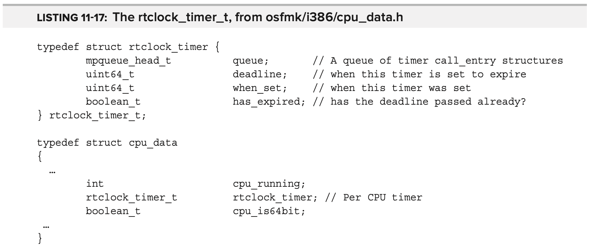

**rtclock\_timer** 의 queue는 오름차순으로 정렬되며 deadline field는 가장 가까운 deadline 순으로 설정된다. 

XNU는 다른 machine-independent한 **event timer**\(**Etimer** 라고도 함\) 개념을 사용하여 **rtclock\_timer** 를 래핑하고 실제 machine level timer interrupt 구현을 숨긴다.


#### Scheduling Deadlines

deadline timers 는 **timer\_queue\_assign** 호출을 통해 설정\(**rtclock**의 queue에 추가\)된다. 이 함수는 현재 CPU의 **rtclock\_timer.deadline** 에 이미 설정된 것보다 빠른\(빨리 만료되는\) 경우에만 deadline을 설정한다. 하드웨어 레벨에서의 실제 deadline 설정은 **etimer\_set\_deadline** 에 의해 처리되고, CPU의 local APIC를 설정하는 **etimer\_resync\_deadlines**  가 뒤이어서 호출된다. 

scheduler는 thread의 **wait\_timer** 를 매개변수로 하여 **timer\_call\_enter** 를 호출하여 _timer callout_ 의 상위 레벨 abstraction 을 통해 **timer\_queue\_assign**과 interface 한다. callout은 Listing 11-18에 표시된 것처럼 _osfmk/kern/timer\_call\_entry.h_ 에 pre-set argument가 정의되어있는 function pointer 이다.

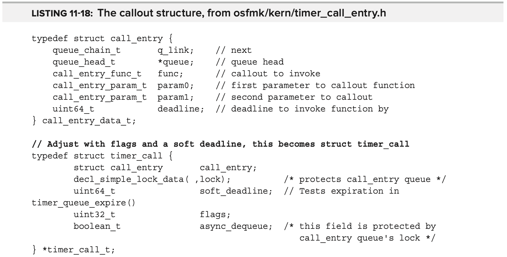

crtical 하다고 간주되지 않는 timer event는 동시에 만료될 확률을 증가시키기 위해\(따라서 전체 timer interrupt 를 감소시키기 위해\) 이를 병합하는 이른바 "slop" 값을 추가한다. **timer\_call\_enter** 의 다양한 호출자는 **TIMER\_CALL\_CRITICAL** flag를 지정하여 중요한 호출로 선언할 수 있다. scheduler의 끝에서 timer deadline을 설정하는 과정은 Figuer 11-5에 나와있다.

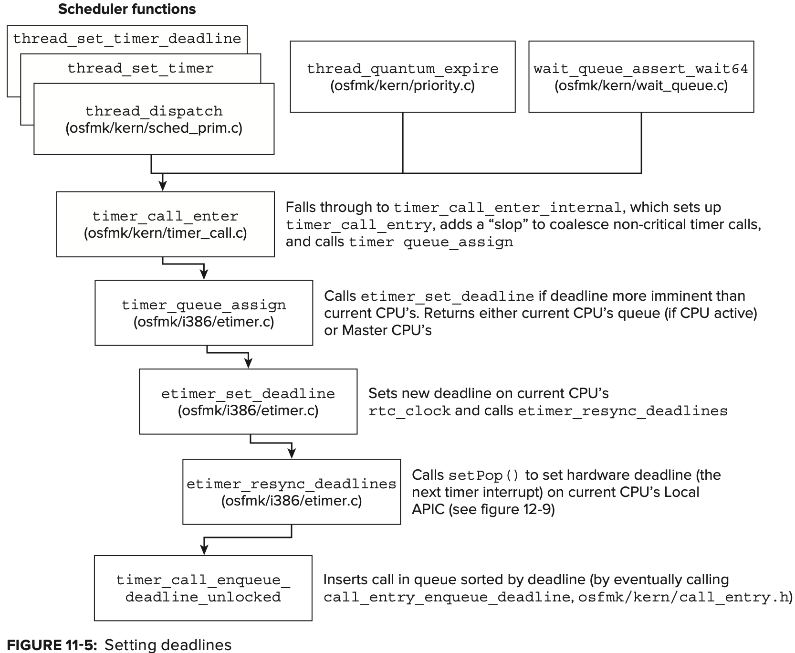


#### Timer Interrupt Handling

timer interrupt 처리는 **rtclock\_intr** 에 의해 수행된다. 이 함수 자체는 많은 일을 처리하지 않는다. 단지 모든 interrupt가 비활성화 되어 어떤 mode\(kernel 또는 user\)가 중단되었는지 확인하고 기존 thread의 register를 저장한다. 실제 작업은 timer deadline\(**rtclock\_timer-&gt;deadline**\) 또는 power management deadline\(**pmCPUGetDeadline\(\)** 에서 반환된 대로\) 이 만료되었는지 확인하고 **etimer\_intr** 를 호출하여 수행된다. scheduler를 deadline queue의 producer 로 생각하면 이 함수는 consumer 이다.

timer에 대해 동작하기 위해 **etimer\_intr** 은 **timer\_queue\_expire** \(power management와 관련된 deadline일 경우에는 **pmCPUDeadline**\) 을 호출한다. 이 함수는 queue를 순회하며 만료된 timer의 callout function을 호출 한다\(호출 전후로 **kdebug** event를 기록\). 이 하무는 deadline이 아직 만료되지 않은 첫 번째 calllout에 도달할 때까지 callout을 queue에서 빼내고 호출한다. queue는 deadline에 대해 오름차순으로 정렬되므로 만료되지 않은 첫 번째 callout 에 도달하면 그 뒤의 callout들도 모두 만료되지 않은 것이다. 만료되지 않은 첫 번째 deadline은 다음으로 처리될 deadline 이므로 **etimer\_intr** 로 반환된다.   
Figuer 11-6에 이 과정이 나와있다.

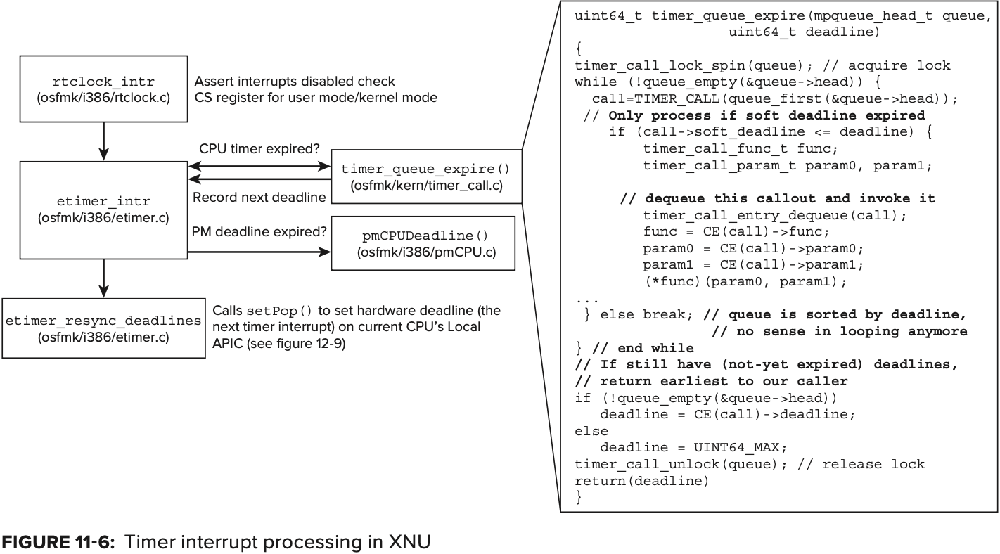


#### Setting the Hardware Pop

deadline timers는 그들이 만료될 때 다음 timer interrupt를 생성하도록 하드웨어에게 요청하기 위해서 hardware level과 communicate 해야한다. 이것이 timer event 를 scheduling 할 때와 timer expiration을 처리할 때 모두 **etimer\_resync\_deadlines\(\)** 에 대한 호출을 포함하는 이유이다. 이 함수는 timer 또는 power management deadline이 pending 중인지 여부를 확인한다\(expiration 후 rescheulde 될 수 있음\). deadline type 중 하나가 발견되면 함수는 앞선 두 경우를 처리하기 위해 다음 interrupt를 schedule 하려고 **setPop\(\)** 을 호출한다. 만약 pending중인 deadline이 없다면 **setPop\(\)** 은 **EndOfAllTime** 을 의미하는 값으로 호출된다. **setPop\(\)** 은 **rtc\_timer** 를 global로 사용하여 local APIC에 timer를 설정한다.   
Figure 11-7은 **etimer\_resync\_deadlines** 의 흐름을 보여준다.

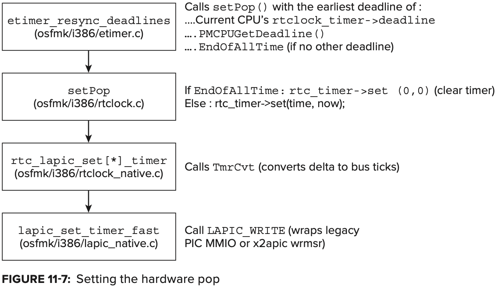

> **EndOfAllTime** 은 문자 그대로 우리가 알고 있는 '시간의 끝' 이다. 이 값은 _etimer.h_ 에 2^64 - 1 로 설정되어있다. 일 년이 약 3150만 초라는 것을 감안하면 해당 숫자에 도달하기 까지 거의 10^12년이 소요될 수 있다. 그 정도 시간이면 우주는 crunch back 해서 다시 우주가 시작될 때의 특이점으로 돌아갔거나 빛도 따라잡지 못하는 빠른 속도로 확장되고 있을 것이다. 어쨌거나 그 즈음이면 지구는 이미 오래전에 태양에 의해 재가 되어 사라졌을 것이다.


## EXCEPTIONS

kernel의 책임 중 하나는 processor trap과 exception에 대한 event를 처리하는 것이다. 이는 모든 모던 운영체제에서 동일하며, 다른 것은 해당 기능을 달성하기 위해 각 kernel이 취할 수 있는 특정 접근 방식이다.

Mach는  already-existing message-passsing architecture 상에서 구현된 exception에 대해 고유한 접근 방식을 취한다. 다음 섹션에서 제시되는 이 모델은 lightweight architecture 이며 실제로 exception을 처리하지 않는다. 이것은 상위계층인 BSD 에서 처리된다.


### The Mach Exception Model

Mach exception-handling facility의 디자이너는 다음과 같은 요소를 언급한다.

* **consistent semantic을 갖춘 single facility:** Mach는 user define, platform agnostic, platform specific에 상관없이 모든 exception에 대해 단 하나의 exception-handling mechanism을 제공한다. exception은 exception type으로 group화 되고, 특정 platform은 특정 subtype을 정의할 수 있다. 
* **Cleanliness 와 simplicity:** interface는 매우 정교하며\(덜 효율적일지라도\) well-defined 된 message 및 port의 architecture에 의존한다. 이를 통해 디버거 및 external handler 뿐만 아니라 이론적으로는 network-level exception handling에 대한 확장이 가능하다.

Mach에서 exception 은 kernel의 주요 기능인 **message passing** 을 통해 처리된다. exception 은 오류 thread 또는 task에 의해 발생되어\(**msg\_send\(\)** 로\) handler에 의해 caught 되는\(**msg\_recv\(\)** 로\) 메시지에 지나지 않는다. 그런 다음 handler는 exception을 처리하고 exception을 지우거나\(exception을 처리된 것으로 표시한 후 계속 진행\) 또는 thread를 terminate 시킬 수 있다.

exception handler가 오류 thread의 context에서 실행되는 다른 model과 달리 Mach는 오류 thread가 미리 지정된 exception port에 message를 보내고 reply를 기다리게 하여 별도의 context 에서 exception handler를 실행한다. 각 task는 exception port를 등록할 수 있으며 이 exception port는 동일한 task의 모든 thread에게 영향을 준다. 또한 개별 **thread는 thread\_set\_exception\_port** 를 써서 ****각자 exception port를 등록할 수 있다. 일반적으로 task 및 thread의 exception port 는 모두 NULL 이므로 exception이 handle되지 않는다. 일단 생성 되면, 이 port는 시스템의 다른 port들과 동일하며 다른 task나 host로 전달될 수 있다.

exception 이 발생하면 먼제 exception 을 thread exception port로  raise 하고, 그 다음으로 task exception port, 마지막으로 host\(i.e. machine-level registered default\) excepion port로 raise 한다. 이 중 어느것도 **KERN\_SUCCESS** 가 되지 않으면 전체 task가 terminate 된다. 그러나 앞서 언급했듯 Mach는 exception processing logic을 제공하지 않으며, exception notification을 전달하는 framework만 제공한다.


### Implementation Details

exception은 일반적으로 processor trap으로 시작된다. trap을 처리하기 위해 modern kernel 은 trap handler 를 install 한다. 이것은 kernel의 assembly-language core에 의해 설치되고 underlying processor architecture에 matching되는 low-level functions 이다. 

Mach는 하드웨어 abstraction layer 를 유지하지 않지만, machine-specific한 부분과 machine-agnostic한 부분간의 명확한 분리를 목표로 한다. exception code는 특정 architecture에 속하는 별도의 file에 포함되며 XNU를 컴파일 할 때 수동으로 include 된다. architecture-independent exception code는 &lt;mach/exceptoin\_types.h&gt; 에 \#defined 된다. 이 code는 모든 platform에 공통이며, &lt;mach/machine/exception.h&gt;를 \#include 하면 machine-specific subcode  지원을 제공한다. XNU open source에서 이 file은 &lt;mach/i386/exception.h&gt; 를 제외한 다른 platform에 대해서는 컴파일에 실패한다.   
Listing 11-19는 일반적인 Mach exception을 보여준다.

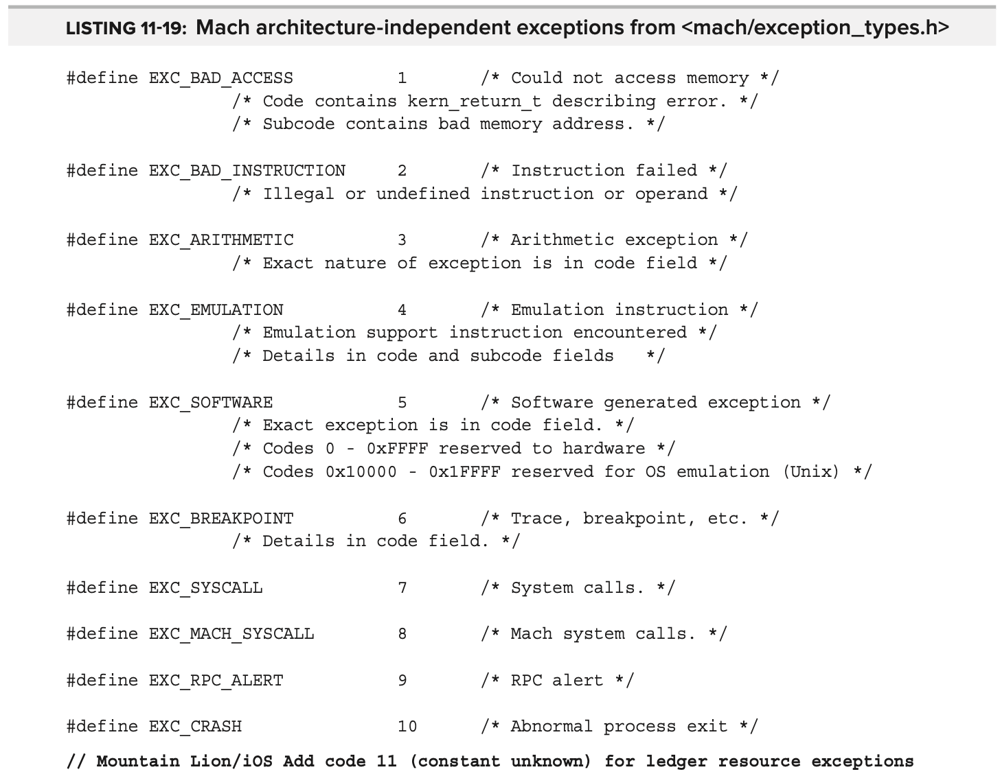

마찬가지로, Mach exception handler인 **exception\_triage\(\)** 는 exception 을 Mach message로 convert 하는 generic handler 이다. process가 core dump로 종료될 때마다 **abnormal\_exit\_notify** 에서 ****BSD의 **proc\_prepareexit** 의 **EXC\_CRASH** 와 함께  호출된다. 그러나 kernel의 다른 곳에서 호출되는 경우에는 architecture dependent 하다.

i386/x64 에서 **i386\_exceptoin\(\)** 함수는 **exception\_traiage\(\)** 를 호출한다 \(Figure 11-8 참조\). **i386\_exception\(\)** 자체는 다음과 같은 여러 위치에서 호출될 수 있다.

* **low level Interrupt Descriptor Table\(IDT\) handlers:** idt.s 와 idt64.s는 kernel mode exception을 위해 **CCALL3** 및 **CCALL5** 매크로를 사용하여 **i386\_exception\(\)** 을 호출한다.  
* **user\_trap\(\):** **IDT handler** 에서 자체적으로 호출되며 code와 함께 **i386\_exception\(\)** 을 호출한다. 
* **mach\_call\_munger\_xx functions:** 잘못된 Mach system call에서 **EXC\_SYSCALL** 과 함꼐 **i386\_exception\(\)** 을 호출 
* **fpextovrflt:** 특정 FPU fault로, floating point processor가 memory access fault를 발생시 호출된다.  
* **fleh\_swi:** 잘못된 system call 또는 **EXC\_BAD\_ACCESS**에서 **EXC\_SYSCALL**과 함께 **exception\_triage** 를 호출하는 system call handler 
* **sleh\_undef:** undefined instruction에서 undefined instruction handler 인 **fleh\_undef** 에 의해 호출 
* **sleh\_abort:** processor instruction 또는 datat abort시 **EXC\_BAD\_ACCESS** 와 함께 **exception\_triage** 호출 

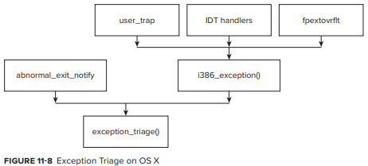

**exception\_triage\(\)** 는 두 architecutre에 대해 동일한 main exception logic\(Mach message level\)으로 작동한다. 이 함수는 **exception\_deliver\(\)** 를 사용하여 앞에서 설명한 방식으로\(thread, task, host\) exception을 전달하려고 시도한다.

host 자체뿐만 아니라 각 thread 또는 task object는 보통 **IP\_NULL** 로 초기화 되어있는 exception port의 배열을 가지고 있으며, **xxx\_set\_exception\_ports\(\)** 로 설정될 수 있다\(xxx는 thread, task, host 이다\).

```c
set_exception_ports(xxx_priv_t   xxx_priv, // xxx is thread, task, or host
    exception_mask_t             exception_mask,
    ipc_port_t                   new_port,
    exception_behavior_t         new_behavior,
    thread_state_flavor_t        new_flavor)
```

"behaviors" 는 exception에서 어떤 type의 messsage 가 생성되는지에 대한 machine-independent 한 indication 이다.  각 behavior는 operating system-speific 할 수도 있는 "flavor"를 가진다.

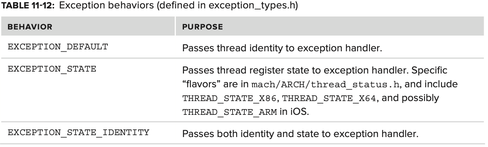

behavior **EXCEPTION\_DEFAULT** 는 **\[mach\]\_exception\_raise**, **EXCEPTION\_STATE**는 **\[mach\]\_exception\_state\_raise** 로 구현된다. 여기서 함수 이름은 behavior constant와 동일하며, exception code가 64-bit일 경우엔 \[mach\] function이 대신 사용된다. 

다양한 behavior는 host level 에서 hard-coded 된 exception catcher인 **catch\_\[mach\]\_exception\_xxx** 에 의해 처리된다. 앞서 경우와 같이 function name은 behavior와 동일하다\(마찬가지로 \[mach\] 변형은 64-bit **mach\_exception\_data\_t** 에 대해서 사용한다\). 이러한 함수는 **ux\_exception** 을 호출하여 exception을 해당하는 UNIX signal로 변환하여 **threadsignal** 을 통해 오류 thread로 전달한다. 

exception port 는 OS X 의 가장 중요한 기능중 하나인 crash reporter를 활성화하는 메커니즘이다. **launchd** 는 exception port를 등록하고, port가 fork를 건너 상속되기 때문에 동일한 exception port가 모든 자식들에게도 적용된다. **launchd** 는 **ReportCrash** 를 **MachExceptionHandler** 로 설정한다. 이렇게 하면 **launchd** 의 job에서 exception이 발생할 경우 crash reporter가 on demand 하게 자동적으로 시작될 수 있다. debugger는 exception port를 사용하여 exception을 trap하고 error를 break 한다. 

