# CH.12 Commit to Memory

이 챕터에서는 XNU에서 사용되는 외부 virtual memory manager의 확장 가능한 프레임워크 뿐만 아니라 Mach의 강력한 VM primitive에 대해 설명한다.

먼저 virtual memory architecture를 전체적으로 한번 살펴보고, 물리적 메모리 관리와 커널에 제공하는 수많은 memory allocator에 대한 개요를 알아본다. 마지막으로 pager와 custom memory manager에 대해 설명한다.

## Virtual Memory Architecture

Mach가 제공하는 가장 중요한 메커니즘은 memory object와 pager를 통해 virtual memory를 abstract 하는 것이다. scheduling 과 mach primitive와 마찬가지로 XNU의 경우 상위 레이어인 BSD에서 사용되는 low level primitive를 사용하여 abstraction layer를 처리한다.

### The 30,000-Foot view of Virtual Memory

mach의 VM subsystem은 당연히 관리하고자 하는 virtual memory만큼 복잡하고 세부적인 기능을 갖추고 있다. 그러나 high level view에서 보면 virtual plane과 physical plane, 두 가지 개별 plane을 확인할 수 있다.

#### The Virtual Memory Plane

virtual memory plane은 전적으로 machine agnostic, independent 한 방식으로 virtual memory management를 처리한다. virtual memory는 여러가지 주요 abstraction으로 표현된다.

* **vm\_map\(vm\_map.h\):** task의 주소 공간에서 하나 이상의 virtual memory 영역을 나타낸다. 각 region은 별도의 **vm\_map\_entry** 이며 doubly linked list 방식의 **vm\_map\_links** list로 유지, 관리 된다. 
* **vm\_map\_entry\(vm\_map.h\):** 이것은 핵심 구조이지만 포함하는 map의 context 내에서만 access 된다. 각 **vm\_map\_entry** 는 virtual memory의 contiguous region이다. 이러한 각 영역은 특정 access protection\(가상 메모리 페이지와 관련된 일반적인 r/w/x\) 으로 보호될 수 있다. task 간에 영역을 공유할 수도 있다. **vm\_map\_entry** 는 일반적으로 **vm\_object** 를 가리키지만 중첩된 **vm\_map**, 즉 서브맵을 가리킬 수도 있다. 
* **vm\_object\(vm\_object.h\):** **vm\_map\_entry** 를 실제 backing store 메모리와 연결하는데 사용된다. 여기에는 **vm\_page** 들로 이루어진 linked list 와, page를 retrieve 하거나 flush 할 수 있는 적절한 _**pager**_ 에 대한 mach port\(**memory\_object** 라고 함\) 가 포함되어 있다. 
* **vm\_page\(vm\_page.h\):** 이것은 vm\_object 또는 그 일부\(**vm\_object** 에 대한 오프셋으로 식별\) 의 실제 표현이다. **vm\_page** 는 resident, swapped, encrypted, clean, dirty 등일 수 있다.

Mach 는 둘 이상의 pager를 허용한다. 실제로 기본적으로 3~4개의 pager가 존재한다. Mach의 pager는 external entity로 간주된다. 다른 system 에서 볼 수 있는 kernel-swapping thread와 유사한 task 이다. mach 의 디자인은 pager가 별도의 kernel task 또는 user mode task일 수 있도록 한다. 마찬가지로 기본 백업 저장소는 disk swap\(OS X 의 **default\_pager** 에서 처리\) 에 상주할 수 있고 file\(및 **vnode\_pager** 에서 처리\), device\(및 해당 **device\_pager**\) 또는 remote machine 에 매핑될 수 있다.

Mach에서 각 pager는 자신에게 속한 page 의 paging request를 처리하지만 해당 request는 **pageout** daemon에 의해 이루어져야 한다. 이 daemon\(kernel thread로 존재\) 은 kernel의 page 목록을 유지하고 flush 할 page 를 결정한다. 따라서 deamon이 유지하는 paging policy 와 pager 가 구현하는 paging operation 이 분리된다. 

> process의 logical address space 는 memory 에 대해 매핑된 영역으로 구성.  
> kernel은 각각의 logical address space의 영역에 대해 vm object 를 연결.  
> 임의의 memory 영역은 backing sotre 나 memory mapping file 에 매핑 가능.  
> 각각의 vm object는 memory 영역에 대해 default pager 나 vnode pager 와 연결되는 매핑 정보를 가지고 있음.

#### The Physical Memory Plane

virtual memory 는 결국 어딘가에 저장되어야 하기 때문에 physical memory plane 은 physical memory 에 대한 매핑을 처리한다. 여기에는 **"pmap"** 이라는 단 하나의 abstraction 만 존재하지만 machine-independent interface 를 제공하기 때문에 중요하다. 이 인터페이스는 플랫폼 고유의 기능을 숨겨 프로세서 수준에서 페이징 operation \(hardware **P**age **T**able **E**ntrie**s**, **T**ranslation **L**ookaside **B**uffer**s** 등\) 을 허용한다. 

 

### The Bird's Eye View

Figure 12-1은 이러한 모든 object가 어떻게 연결되어 있는지 더 가까이, 그리고 다소 단순화된 모습을 보여준다. 이 장의 나머지 부분에서는 이를 이해하고 각 abstraction 에 대해 자세히 설명한다.

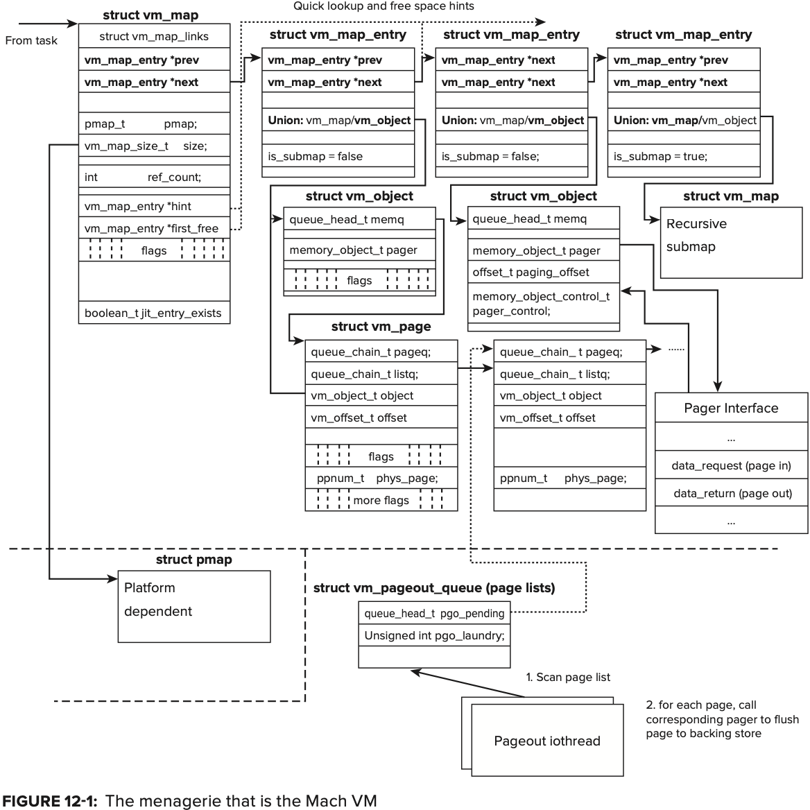

모든 mach task에는 자체 virtual memory space가 있으며, 해당 task structure의  **vm\_map** structure인  **map** 멤버에 저장된다.

**vm\_map** 은 **vm\_map.hdr.nentries** entry의 list\(**vm\_map.hdr.links**\) 에서 유지된 **vm\_map.size** byte 의 총 메모리를 나타낸다. 각 link 는 **vm\_map\_entry** 로, page range에 대한 많은 detail 이 있는 virtual memory 의 contiguous 한 chunk 를 나타낸다.

**vm\_map.hdr** 에는 **vm\_map\_links** 가 있으며, vm\_map\_entry 의 개수에 대한 정보\(**vm\_map.hdr.nentries**\) 를 가지고 있다. vm\_map\_links 는 vm\_map\_entry 들을 링크드 리스트 형태로 관리하고 있으며, 총 가상 메모리의 시작 주소와 끝 주소를 저장한다. 각 vm\_map\_entry 에는 사용하는 가상 메모리의 시작 주소와 끝 주소, entry 의 속성\(공유 메모리, 접근 권한 등\) 정보를 담고 있다.

**vm\_map\_entry** 의 핵심 요소는 다른 **vm\_map**\(submap으로\) 또는 **vm\_object\_t** 를 보유하는 union인 **vm\_map\_object** 이다\(union이므로  content를 판별하려면 별도의 field인 **is\_sub\_map** bool 변수가 필요\). **vm\_object** 는 거대하지만 불투명한 구조이며 기본 VM 을 처리하는데 필요한 모든 데이터를 포함한다. 

**vm\_object** structre는 헤더 파일에 잘 문서화 되어있으므로 전부 살펴보지는 않을 것이다. 그 안에 있는 대부분의 field는 기본 메모리 상태\(wire, physically contiguous, persistent 등\) 또는 counter\(reference, resident, wired 등\) 을 나타내는 bit-wise flag 이다. 그러나 그 중에서 세 가지는 다음과 같이 구체적으로 언급할 가치가 있다.

* **memq:** 각각 resident virtual memory page에 해당하는 struct **vm\_page** object의 linked list를 보유한다. object가 single page에 해당할 수 있지만 object를 포함하지 않는 것보다 훨씬 많은 page가 필요하기 때문에 각 page가 지정된 offeset 에 있는 object로 link back 된다. 
* **pager:** pager 에 대한 mach port인 **memory\_object** structure 이다. pager는 non-resident page를 backing store\(memory-mapped file, device, 또는 swap\) 에 link하여 page가 memory에 없을 때 page를 hold 한다. 다시 말해, pager\(하나 이상일 수 있음\) 는 data를 memory 내외부의 backup  store로 이동시켜야 한다. pager는 virtual memory subsystem에서 매우 중요하며 이 장의 뒷 부분에서 더 자세히 살펴본다. 
* **internal:** **vm\_page** 의 많은 bit-field 중 하나이며, kernel에서 내부적으로 사용하는 경우에 해당한다. 이 bit는 page가 끝나는 pageout queue에 영향을 준다. 

**vm\_page** 는 bit field가 대부분인 작은 structure 이다. 이것은 두 개의 list에 참여한다: **listq** field는 자신이 속한 **vm\_object**의 related page를 pointing 하며 **VM Map** layer에서 사용된다. **pageq** field는 kernel의 **pageout** thread에서 사용하는 kernel의 page list중 하나를 가리킨다. **vm\_page**에는 owner **vm\_object** 에 대한 pointer도 포함되어있다. 이 pointer 는 kernel의 **pageout** thread가 이 page를 flush 하기로 결정할 때 pager에 연결하는 데에 사용된다. 

특히 중요한 **vm\_map** instance는 **kernel\_map** 이다. 이것은 kernel space 의 virtual memory map이며 user space 또는 kernel space memory access를 결정하는데 자주 사용된다.

### The User Mode View

이전 장에서 설명한 task 및 thread API와 마찬가지로 Mach 는 virtual memory 에 대한 주목할만한 user-level view를 제공한다. user mode는 API 세부사항을 **vm\_map\_t** 수준\(불투명한 **mach\_port\_t** \) 으로 유지하면서 다음 세부 정보를 알기만 하면 까다로운 세부 사항을 모르더라도 유지할 수 있다. 

Table 12-1 에서 볼수 있듯, **vm\_map\_t** 는 실제로 task parameter 이다. 즉, 해당 VM map 이 호출의 영향을 받는 Mach task를 전달한다. **mach\_** 접두어를 사용하거나 사용하지 않는 이러한 호출의 변형들이 있다. 전자는 "최신" API set\(32, 64-bit 모두\)로 간주되지만 대부분의 경우 kernel에서 동일한 기본 구현을 사용하는 것 처럼 일반적으로 작동한다.

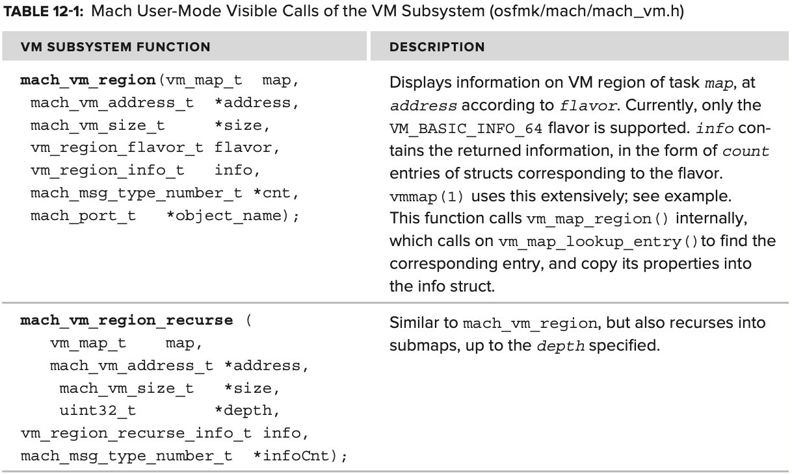

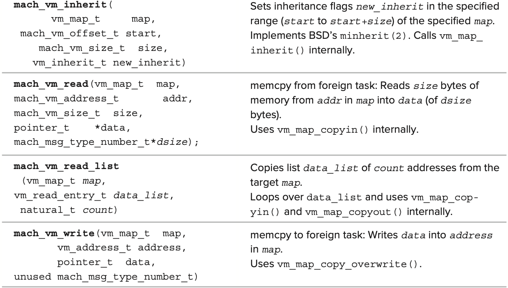

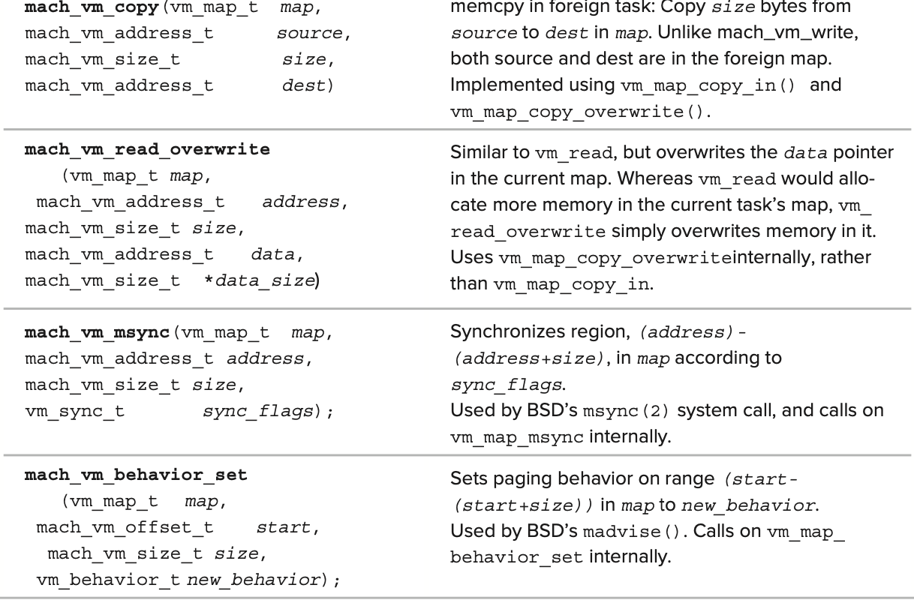

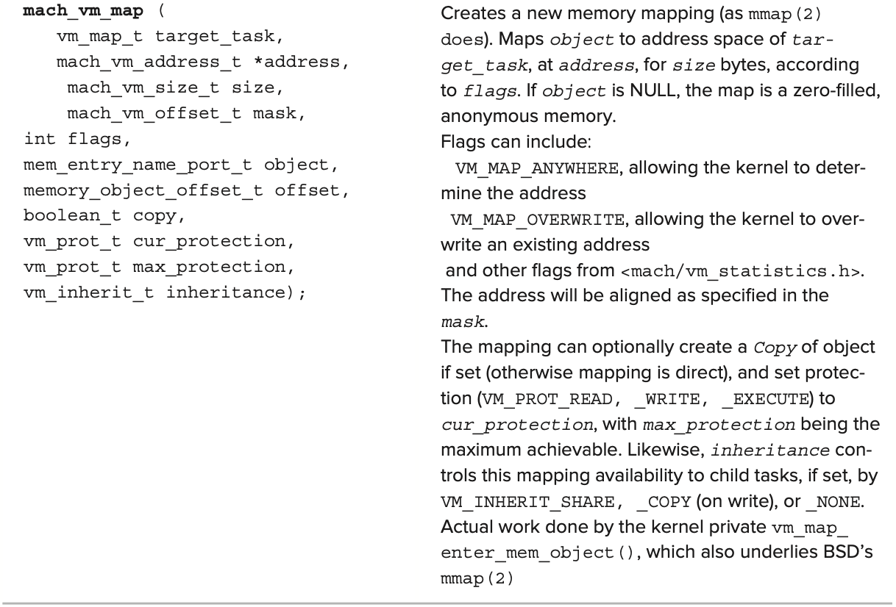

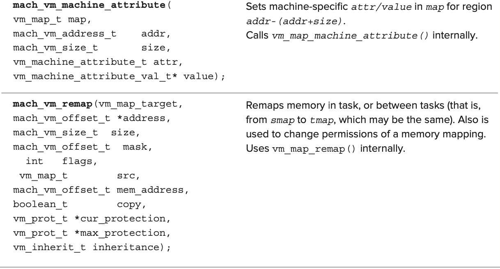

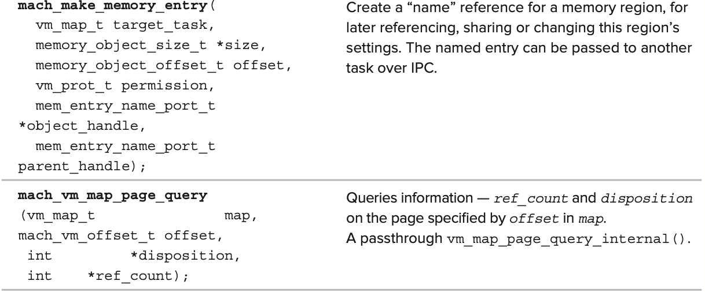

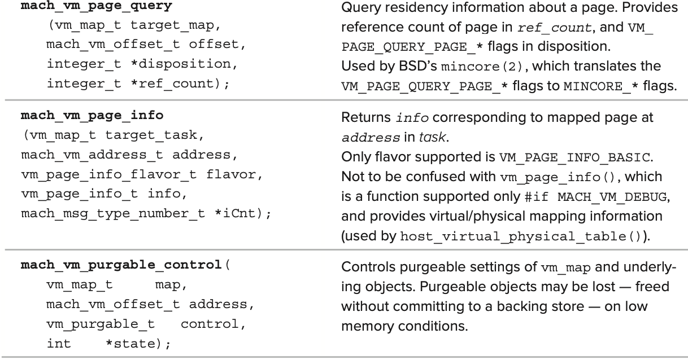

위 Table 에는 없지만 중요한 또 하나의 function은 **\[mach\_\]vm\_wire\(\)** 이다. 

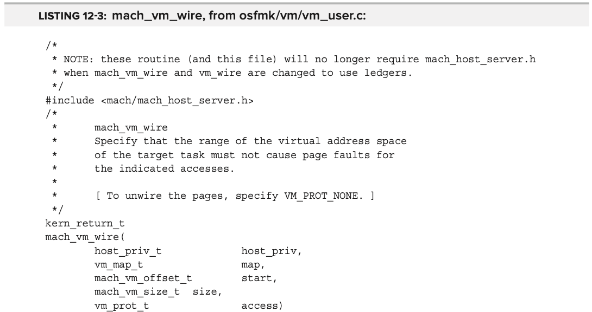

이 function 을 사용하면 caller가 virtual memory \(**vm\_map** 의 일부\) 를 **"hard-wire"** 해서 resident 하며 unpageable 하게만든다. 이는 호스트의 ram 에 영향을 미쳐 다른 프로그램에도 영향을 미치므로 privileged host level operation 으로 정의된다. 

많은 Mach VM function들은 기능적으로 POSIX system call 과 동일하다. 실제로 BSD memory management system call은 일반적으로 Mach system call을 통해 직접 구현된다. 예를 들어 BSD의 **msync** 는 **mach\_vm\_msync** 를 호출한다. **madvise** 는 **mach\_vm\_behavior\_set\(\)**  을 호출한다. **mlock / munlock** 호출은 **mach\_vm\_wire\(\)** 등의 간단한 래퍼이다. Mach 호출을 통해 구현되었다던 user mode memory allocation이 POSIX로 이동되었다. 

> **mlock?:** free memory 영역 중 프로그래머가 원하는만큼 할당하고 이 부분을 locking하여 paging이 일어나지 않도록 하는 함

그러나 Mach API는 POSIX가 제공하는 것보다 훨씬 강력하다. 특히 한 task가 다른 task의 주소 공간에 쉽게 침입할 수 있기 때문이다. 이를 위해서는 permission이 필요하다. 그러나 이 minor technicality를 제외하면 이러한 call은 사실상 무한한 힘을 제공한다. 실제로 OS X의 많은 프로세스 침입 및 스레드 injection 기술은 BSD가 아닌 이러한 Mach call에 의존한다.

## Physical Memory Management

kernel은 user space와 마찬가지로 거의 virtual address space 에서 작동하지만 virtual memory는 필연적으로 physical address로 변환되어야 한다. 시스템의 RAM 은 사실상 virtual memory 로 들어가는 창으로, virtual memory의 유한하고, 종종 연결 해제된 영역에 access 할 수 있게 해준다. 나머지 virtual memory는 대부분 disk 같은 external device로 lazy allocate, share, 또는 swap 된다.

그러나 physical memory management는 기본 architecture 에 한정된다. virtual memory와 physical memory의 개념은 모든 아키텍쳐에서 본질적으로 동일하지만, 기본적인 구현은 idiosyncrasies 한 것으로 가득하다. XNU는 **pmap** 이라 불리는 Mach의 physical memory abstraction layer를 기반으로 한다. 이 layer는 설계상 physical memory에 대한 동일한 ineterface를 허용하며, 이는 architecture의 세부사항을 숨긴다. 

> "Mach가 작동하는 방식에 대해서는 거의 알 필요가 없지만, 기본 아키텍쳐에 대해서는 매우 많이 알 필요가 있다" - pmap 구현자

#### The PMAP APIs 

Mach의 **pmap**은 논리적으로 다음과 같은 두 가지 sublayer로 구성되어 있다.

* **The machine-independent layer:** machine agnostic한 API 집합을 제공하며, VM paging에 대한 기본 개념을 지원한다. VM layer는 struct **pmap** 에 대한 pointer인 **pmap\_t** 만 보고 패스하며, 이 포인터는 사실상 void pointer나 마찬가지 이다. 
* **The machine-dependent layer:** 특정 구현에 대한 **pmap** 을 묶고, 기반 아키텍처의 모든 측면을 다룬다. **PTE\(Pate Table Entry\)** 매크로, bit mask, register\(Intel의 CR3 및 ARM의 c7-c8\), **pmap\_t** 가 참조하는 기본 struct **pmap** 의 정의 등 특정 하드웨어에 특정한 \#define 집합이다. 이 layer는 \#ifdefs 및 \#includes를 통해 machine-independent layer에 연결된다.  

객체 지향적 관점에서, machine-independent layer는 **pmap** 에 대한 interface로 간주될 수 있으며 machine-dependent layer가 그에 대한 구현이다. 소프트웨어 엔지니어링 관점에서 interface가 변경되지 않는 한 그것의 클라이언트\(즉, Mach VM subsystem\)은 세부 사항을 완벽하게 알지 못하는 상태로 유지될 수 있다. 따라서 **pmap**의 세부 사항은 Mach의 VM에 불투명하다. 이것은 portability를 최대화하지만, 성능의 대가를 치른다. 

Table 12-2 는 machine-independent layer의 일부 **pmap** API를 보여준다.

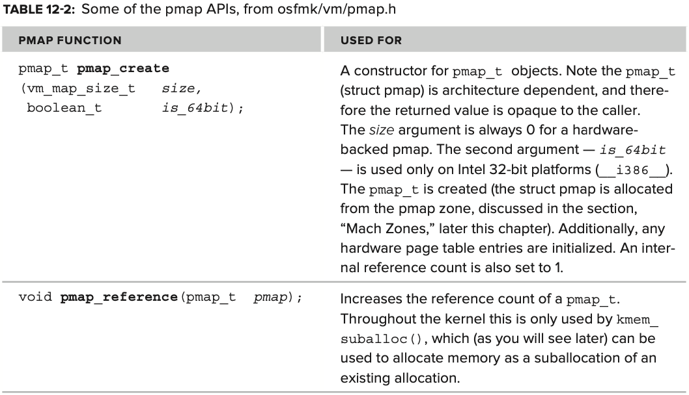

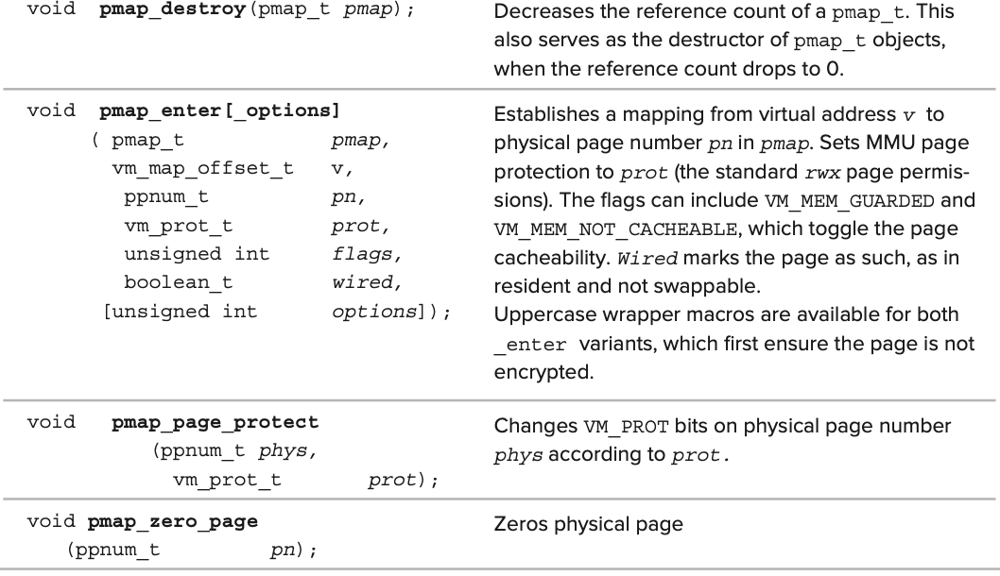

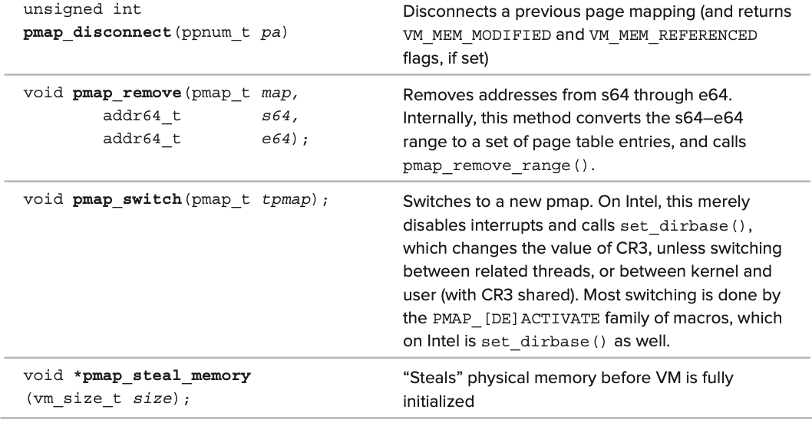

**pnum\_t**  argment를 accept 하는 **pmap** 의 low level memory function은 실제 page 에서 직접 작동할 수 있다. 

**pmap** 은 중첩될 수 있다\(다른 **pmap** 을 포함하도록\). 이것은 매우 일반적인 기술로, implicit\(shared libraries\) 및 explicit\(**mmap**\) 메모리 공유에 크게 의존한다. 또한 **kernel\_map vm\_map** 과 유사하게 kernel이 사용하는 physical memory page를 보유하는 global **kernel\_pmap** 이 있다.

#### API Implementation Example on Intel Architecture

**pmap**  이 시스템에 독립적인 interface를 클라이언트에 제공할 수 있는 방법을 더 이해하려면 Figure 12-2와 같이 Intel 아키텍쳐의 특정 page entry bit를 참조하라. 

Figure 12-2 는 Intel architecutre manual 에 정의된 대로 _osfmk/vm/pmap.h_ 의 플래그가 Interl PTE 용 특정 page entry bit로 변환되는 방법을 보여준다. 변환은 platform 에 독립적인 interface, flag 및 option 을 유지하는 **pmap\_enter\(\)** 의 platform 별 구현에서 이루어진다. 다른 많은 **pmap** function 은 이러한 방식으로 구현된다. 

Intel 아키텍쳐에 대한 **pmap\_t** 구현은 Listing 12-6 과 같이 _ofmk/i386/pmap.h_ 에 정의된다. 

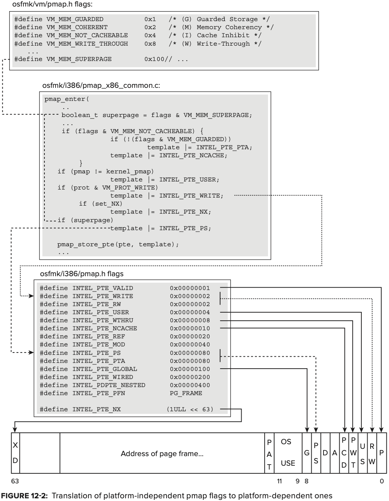

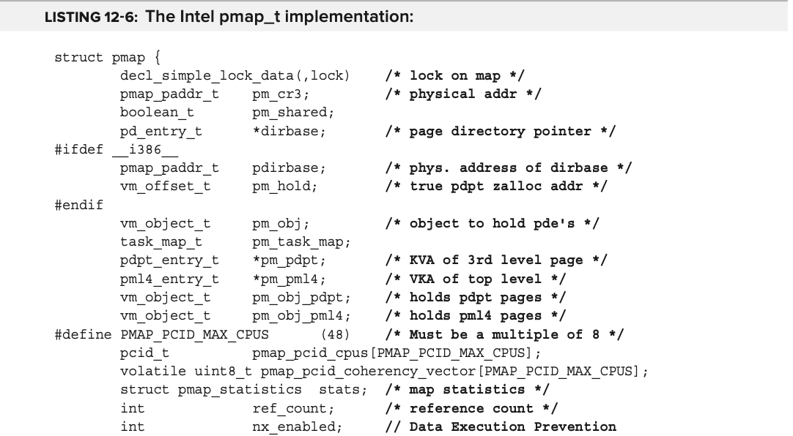

## Mach Zones

Zones은 linux과 memory cache를 호출하는 것과 Windows 에서 Pools를 호출하는 것의 Mach 버전 아이디어이다. Zones은 fixed size의 자주 사용하는 object를 빠르게 할당하고 해제하는 데 사용되는 memory region 이다. Zone API는 kernel 내부에 있으며 user mode에서 access 할 수 없다. 그럼에도 불구하고 zones은 mach 에서 광범위하게 사용된다.

Zone을 표시하기 위해 **zprint** command를 사용할 수 있다. 이 명령은 호스트 포트에 의해 expose된 **mach\_zone\_info\(\)** function 에 의존한다. 

### The Mach Zone Structure

Zone은 다음 Listing 12-7 과 같은 structure 이다.

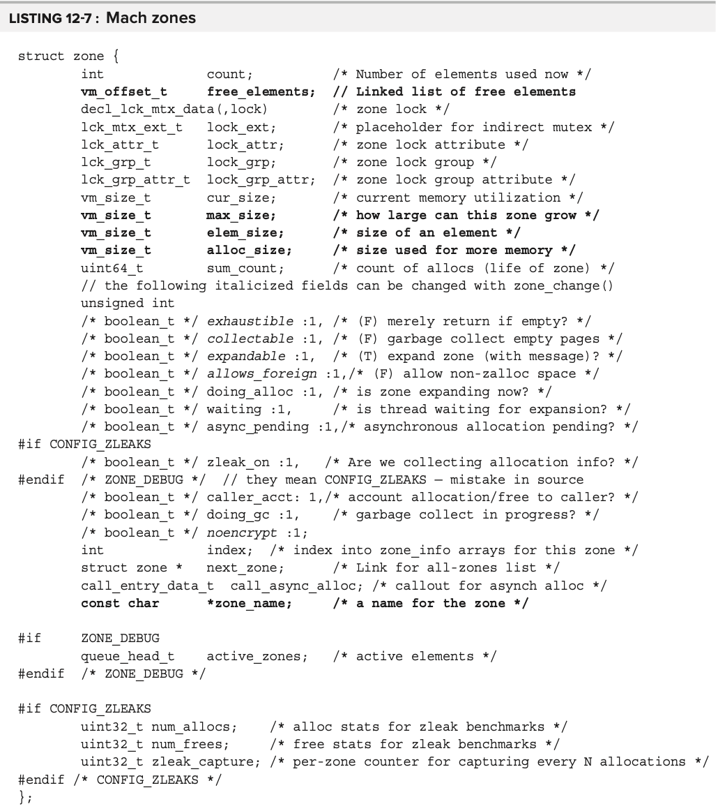

풍부한 debug information 외에도 zone은 free elements와 zone statistics를 포함하는 다소 작은 structure 이다. 

zone을 만들고 처리하기 위해 Mach 는 Table 12-3과 같이 모두 동일한 header file에 정의되고, _osfmk/kern/zalloc.c_ 에 구현된 여러 가지 기능을 제공한다.

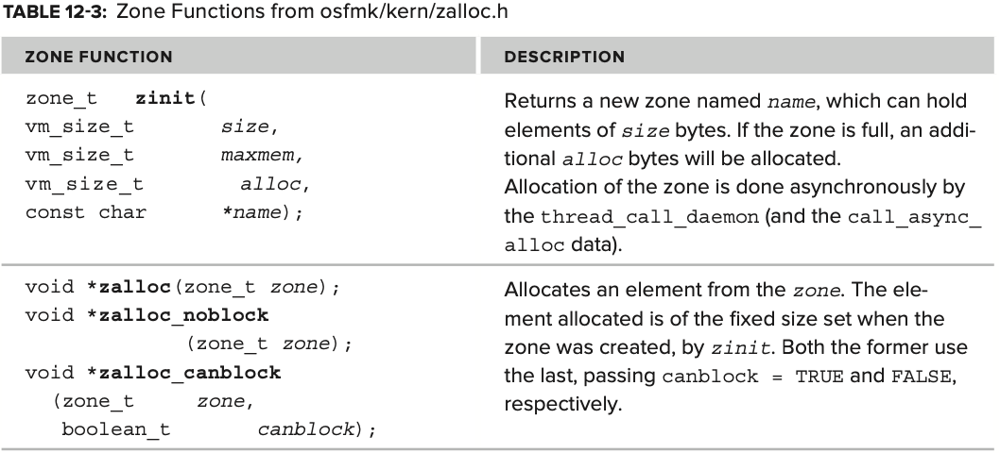

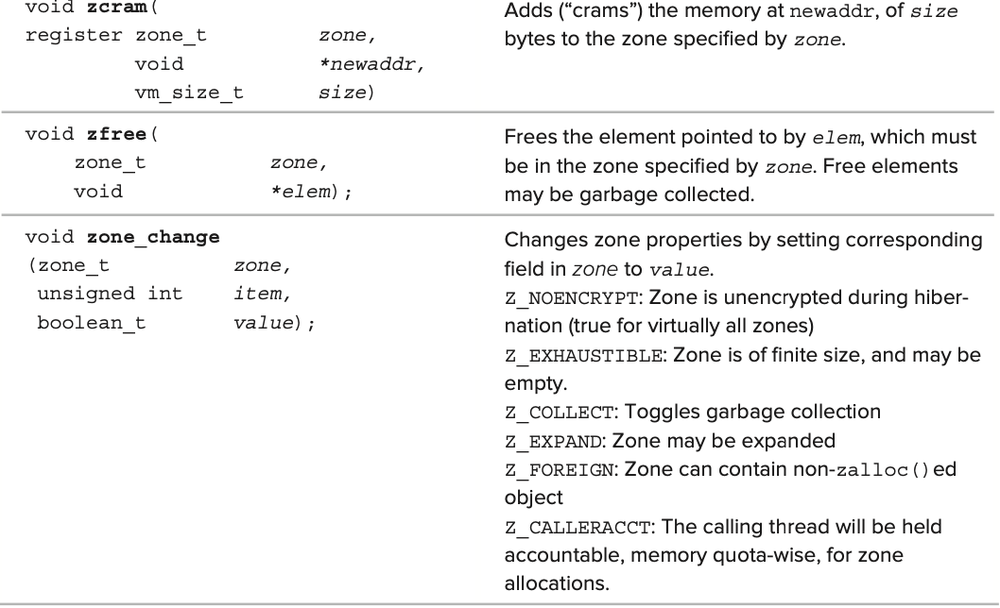

모든 zone memory는 **zinit\(\)** 호출에서 효과적으로 pre-allocated 된다\(low-level allocator인 **kernel\_memory\_assign\(\)** 호출\). **zalloc\(\)** 에 대한 호출은 **REMOVE\_FROM\_ZONE** macro를 효과적으로 래퍼링 하여 zone의 free list에서 다음 element를 반환한다\(zone이 가득 찬 경우 zone의 alloc\_size byte의  **kernel\_memory\_allocate\(\)** 에 의지\). **zfree\(\)** 는 반대 매크로인 **ADD\_TO\_ZONE** 을 사용한다. 두 function 모두 상당한 양의 sanity checking을 수행하였는데, 이것은 지금까지 큰 도움이 되지 않았다: 과거의 zone allocation bug는 몇가지 악용 가능한 memory corruption을 제공했다. **zalloc\(\)** 의 더 중요한 클라이언트는 **kernel**의 **kalloc\(\)** 이며, **kalloc.**\* zone에서 할당된다. BSD의 **mcache** 메커니즘도 Mach의 바로 위에 구축된 BSD kernel zone과 마찬가지로 자체 zone에 할당한다.

### Zone Setup During Boot

zone은 kernel boot 동안 **vm\_mem\_bootstrap\(\)** 으로부터 두 개의 호출에 의해 설정된다.

* **zone\_bootstrap\(\):** 모든 다른 zone data가 저장되는 master zone\("zones"\) 를 설정 
* **zone\_init\(\):** zone subsystem locks와 pages 를 initialize\(**zone\_page\_init\(\)** 을 이용\)

zone handling function은 _osfmk/kern/zalloc.c_ 에 있다. 개별 zone은 다양한  subsystem에 의해 create될 수 있다. 

**zone\_init\(\)** function 은 **zsize** argument를 받는다. 이 argument는 디폴트로 **maximum** 의 1/4로 설정되며, kernel command-line argument\(MB 단위로\)를 이용해서 **ZONE\_MAP\_MIN** 과 **ZONE\_MAP\_MAX** 사이의 값으로 덮어씌울수 있다. 또한 kernel configuration\(**CONFIG\_**\* 를 이용\) macro 의 일부로도 이 값들을 설정할 수 있다.

XNU에는 꽤 많은 양의 zone이 존재한다. 이 zone들은 대부분 kernel boot 동안 해당 subsystem 의 **init** function 에 의해 create 된다.

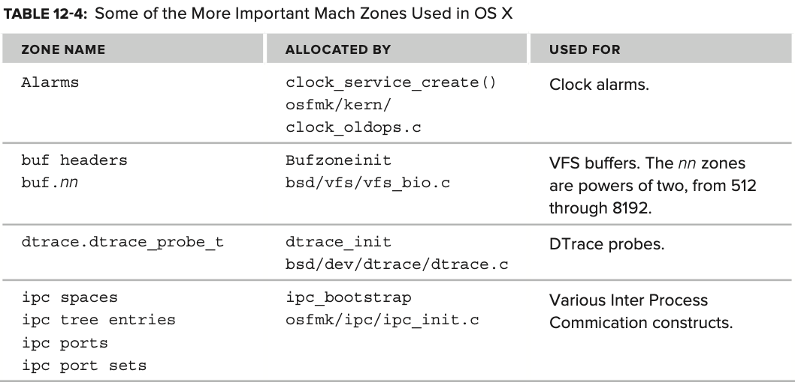

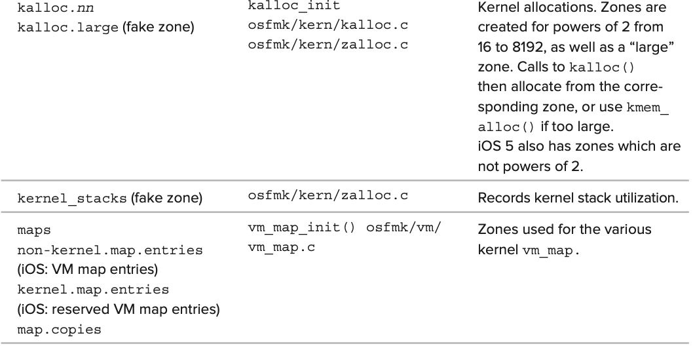

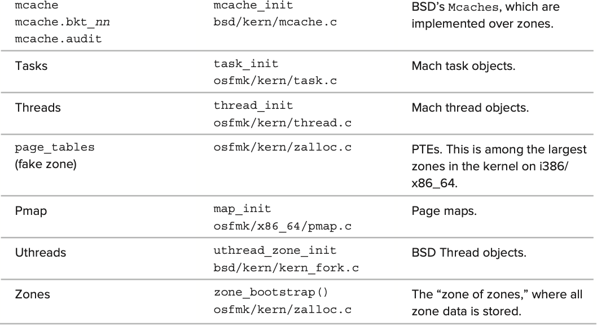

### Zone Garbage Collection

 만약 system의 memory 가 부족해지면 zone에서 garbage collection 이 수행될 수 있다. 이것은 **vm\_pageout\_garbage\_collect** thread에 의해 호출되는 **consider\_zone\_gc\(\)** 에 의해 처리된다. **consider\_zone\_gc** 는 다음 상황중 하나에서 zone garbage collection\(**zone\_rc**\) 부르도록 선택할 수 있다.

* **zfree\(\)** 가 zone에서 한 page 이상의 element를 free 했고, system의 **vm\_pool** 이 낮을 때 
* **zone\_gc\_time\_throttle** 에 의해 지정된대로 **zone\_rc** 가 마지막으로 실행된 이후 시간이 흘렀을 때 
* system이 hibernating이고, **hibernate\_flush\_memory\(\)** 가 호출되었을 때

이러한 상황들이 Figure 12-3에 묘사되어 있다.

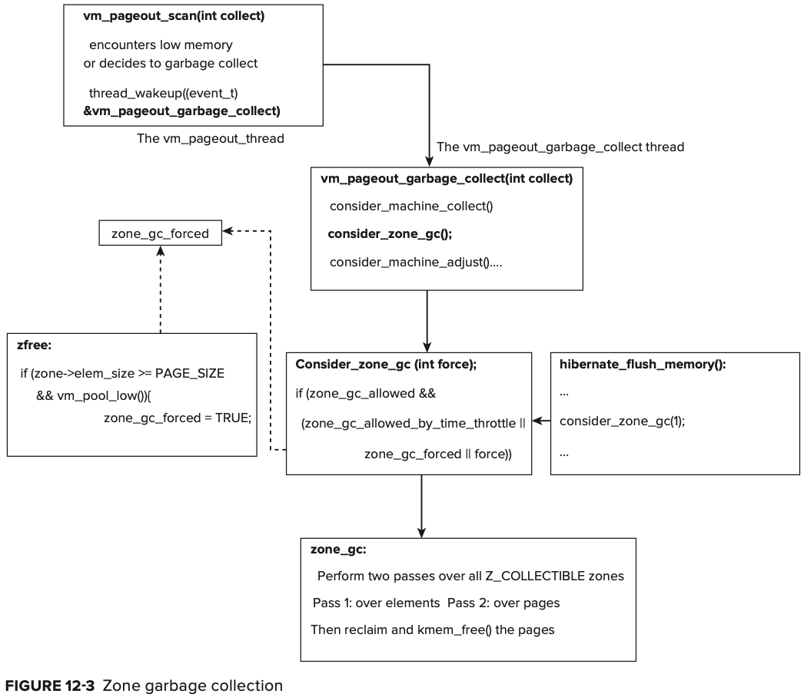

garbage collection 은 two-pass process이다. 시스템은 먼저 전체 zone을 훑으며\(non-collectable 로 mark된 zone은 스킵함\), 그들의 free list를 검사하여 어떤 object가 claim 되어질 수 있는지 확인한다. 두번째 pass에서 object는 page로 변환된다: non-freed object와 page를 공유하는 object는 오직 full page만 해제할 수 있으므로 시스템에 사용되지 않는다. 마지막으로, free할 page들이 결정되었으면 간단한 **kmem\_free\(\)** 로 free 한다.

### Zone Debugging

드물게 필요한 경우 **zprint** command로 제공된 간단한 기능을 넘어 여러가지 방법으로 zone을 디버깅 할 수 있다.

* **CONFIG\_ZLEAKS 와 함께 compile:** 이것은 보다시피 memory leak을 체크하기 위해 strcut zone에 더 많은 data를 할당하는 것이다. **CONFIG\_ZLEAKS** 는 또한 **kern.zleaks** 에 대한 **sysctl** 을 호출하여 BSD layer 와 user mode 에서 **zleaks** 를 toggle 할 수 있도록 만든다. 
* **Toggle zone element checking:** **-zc** boot argument를 사용 
* **Toggle zone poisoning:** **-zp** boot argument 사용 
* **Save zone info in each task:** **-zinfop** boot argument 사용 
* **Specific zone logging boot arguments:** **zlog** 를 사용하여 log를 남길 zone의 정확한 이름을 지정할 수 있으며, **zrec** 를 이용해서 몇 개의 records를 log에 유지할 지 설정할 수 있다\(최대 8000개\).

## Kernel Memory Allocators

지금까지 설명한 VM abstarction 은 중요하지만 kernel code가 memory를 할당해야 할 때, 특히 자체 **vm\_map**\(즉, **kernel\_map**\) 내에서 해야 할 때 virtual memory를 할당하고 이것을 physical page로 백업 할 수 있는 실제 allocator function 에 의존할 필요가 있다. 이 절에서는 Figure 12-4에 표시된 XNU의 풍부한 allocator hierarchy 에 대해 다룬다\(BSD의 cahche와 slab allocator는 제외\).

### kernel\_memory\_allocate\(\)

모든 kernel memory path\(연속된 physical memory 를 저장\)는 single function **kernel\_memory\_allocate\(\)** 를 사용하여 완료된다. 이 function 은 실제로 memory 의 allocation 을 수행하기 위해 **vm\_map** 과 **pmap** 두 가지를 모두 처리한다. 이것은 Listing 12-8에 표현되어 있다.

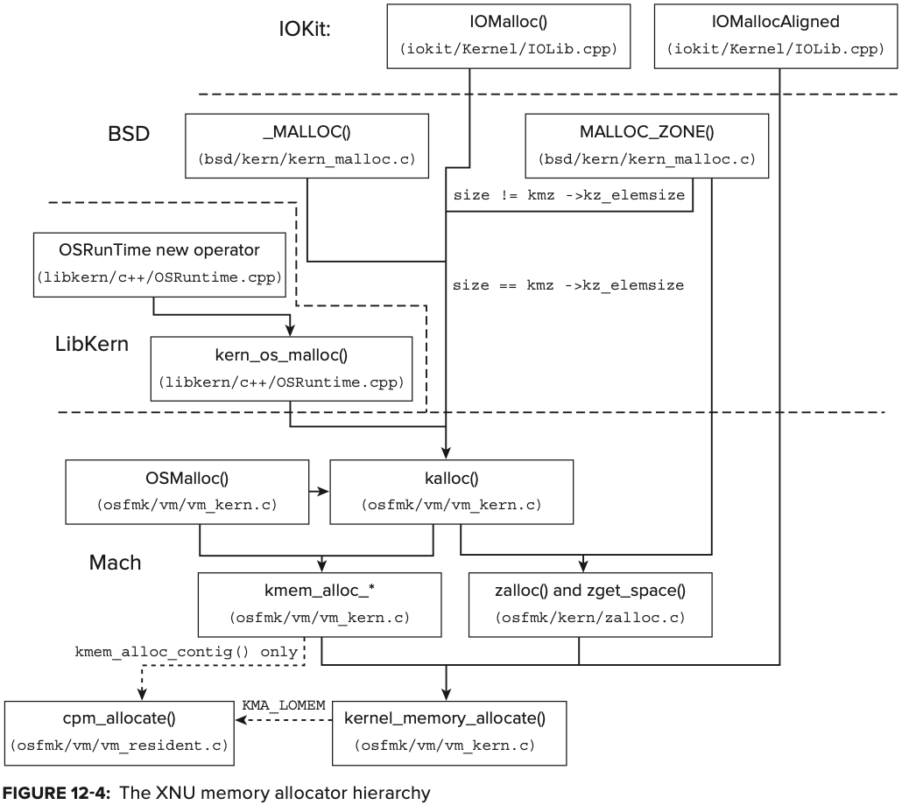

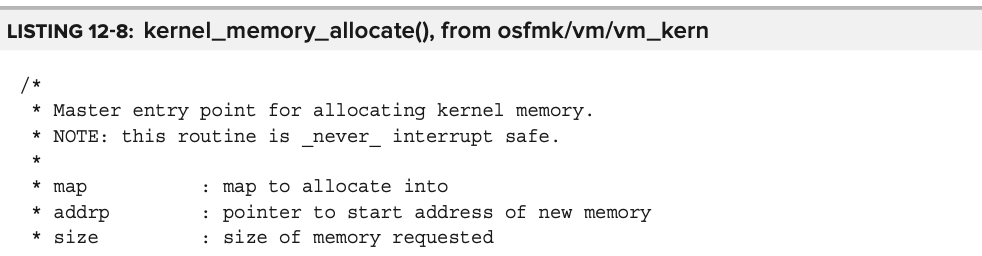

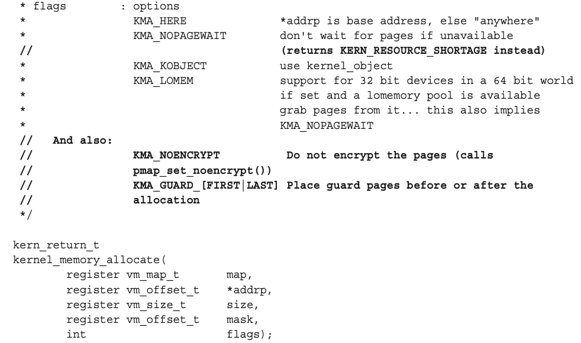

이 function 은 전달되는 **vm\_map** 에서 충분히 큰 virtual address를 찾고, allocate를 만족하기 위해 wired list에서 memory를 가져온다. 몇 케이스에서\(특히 **stack\_alloc\(\)** 에 의해 호출된 경우\), **kernel\_memory\_allocate\(\)** 에 대한 flag는 실제 allocate 전후에 guard page 에 대한 요청을 지정할 수 있다. guard page는 원칙적으로 user mode의 **libgmalloc.dylib** 와 유사하며 access 시 page fault를 trigger 하기 위해 non-accessible로 mark된 virtual-only page 이다. guard page를 가져오려면 **vm\_map** 에 요구되는 space만 있으면 되고, physical 백업은 필요하지 않으므로 **pmem** 이 필요하지 않다.

**kernel\_memory\_allocate\(\)** 의 단순화 된 흐름이 Figure 12-5에 나와있다. physical page의 실제 allocation은 proccessor당 free list 또는 low memory list 중 하나를 보고 이루어진다. 후자의 경우는 특정 physical memory 영역\(16MB 미만\) 이 필요한 경우에만 가끔 발생한다. **vm\_page\_grablo\(\)** function 은 **cpm\_allocate\(\)** 를 호출한다. 이 function 은 free list에서 직접 page를 steal하여 연속적인 physical memory를 할당하는 데 사용된다. 

**cpm\_allocate\(\)** function 은 거의 호출되지 않으며, **kmem\_alloc\_contig\(\)** , **vm\_map\_enter\(\)** \(superpages의 경우\) 또는 **vm\_map\_enter\_cpm\(\)** 에서만 호출된다.  
**kernel\_memory\_allocate\(\)** function 도 거의 직접 호출되지 않는다. 예외적으로 초기 시작시에 사용되거나\(선택이 거의 없는 경우\), kernel stack allocate 및 IOKit의 **IOMallocAligned\(\)** 에서는 예외적으로 정렬된 메모리가 필요해서 **kernel\_memory\_allocate\(\)** 가 호출된다.   
이 외의 다른 모든 경우에는 래퍼가 사용되며, 가장 중요한 것은 **kmem\_alloc\(\)** 이다.

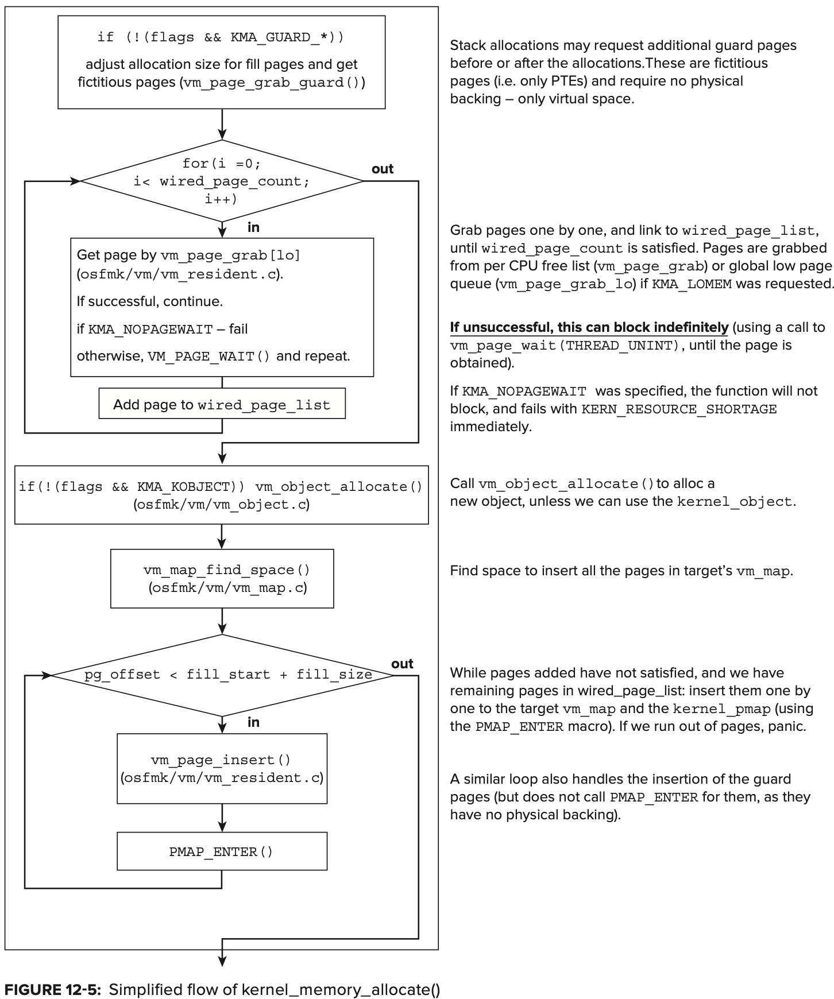

### kmem\_alloc\(\) and Friends

Mach의 대부분의 memory allocator는 **kmem\_alloc\(\)** familiy function 들에 의해 제공되며, 이 함수들은 Figure 12-6 처럼 **kernel\_memory\_allocate\(\)** 를 래핑한다.

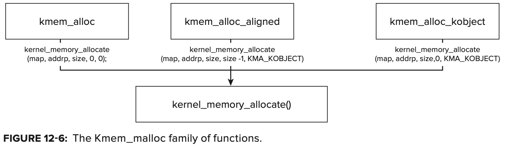

Figure 12-6에 나오는 모든 **kmem\_alloc** type은 map, in/out pointer, 그리고 size argument 까지 세 개의 argument를 가지는 동일한 prototype을 공유한다.  map argument는 pageable memory 가 요청되지 않는 한, 일반적으로 **kernel\_map vm\_map** 이다. Figure 에서 볼 수 있듯 이 functions는 이전에 설명한것 처럼 **kernel\_memory\_allocate\(\)** 위에 layer 되어있다.

**kernel\_memory\_allocate\(\)** 위에 구현되지 않은 다른 **kmem\_alloc\_**\* functions도 존재한다. 이 함수들은 다음과 같다.

* **kmem\_alloc\_contig\(\)** - 연속된 physical memory 용 \(**cpm\_allocate\(\)** 위에 구현\) 
* **kmem\_alloc\_pageable\(\)** \(**vm\_map\_enter\(\)** 위에 구현\), non-wired memory를 할당. 그러나 non-wired memory는 warning 없이 paged out 될 수 있다. 
* **kmem\_alloc\_pages\(\)** 는 이미 존재하는 object에 새로운 page를 할당하기 위해 사용되며, **vm\_page\_alloc\(\)** \(**kernel\_memory\_allocate\(\)** 의 **vm\_page\_grab\(\)/vm\_page\_insert\(\)** 를 래핑한 함수\) 를 래핑한다.

**kmem\_alloc\(\)** 을 사용하는 것은 특히 physical map backing 때문에 비용이 상당히 많이 든다. 따라서 **kernel\_memory\_allocate\(\)** 의 underlying implementation 은 무기한으로 block 될 수 있다. 대체로 더 빠른 **kalloc\(\)** \(zone에 대한 좀 더 효율적인 메커니즘 위에 구축됨\) 을 대신 사용한다. 

### kalloc

Mach zone이 initialize 되면 **kalloc\(\)\_** family functions에 의해 제공되는 빠른 kernel internal allocation 에 사용될 수 있다. 

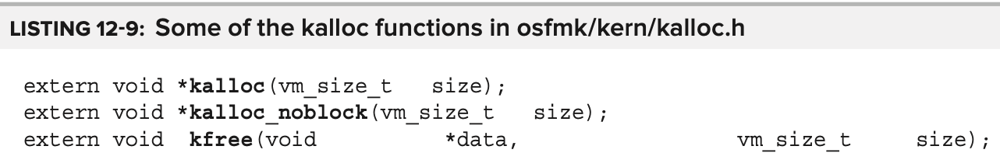

이 함수들은 user mode의 **malloc\(\)** , **free\(\)** 와 기능적으로는 동일하지만, zone을 활용하기때문에 **kalloc\_noblock\(\)** function 에서와 같이 nonblocking 기능울 제공할 수 있다. zone memory 는 pre-allocate 되므로 **kalloc\(\)** 할당은 해당 zone에서 **zalloc\_canblock\(\)** 에 대한 호출이다. zone 자체는 system 시작시 **vm\_mem\_bootstrap\(\)** 에서 호출되는 **kalloc\_init\(\)** 에 의해 설정된다. **kalloc\(\)** 이 최대 zone 보다 큰 크기로 호출되면 **kmem\_alloc\(\)** 을 대신 호출한다\(그리고 반드시 block 해야함\). 마찬가지로 **kfree\(\)**가 해제된 block의 크기가 zone 중 하나와 일치하지 않음을 감지하면 **zfree\(\)** 대신 **kmem\_free\(\)** 를 호출한다. **kalloc\(\)** function 은 global 에 할당해야하는 가장 큰 block size를 추적하며, **kfree\(\)** 는 해당 크기보다 큰 block을 해제하려는 시도를 무시한다. 내부적으로 **krealloc\(\)** 함수도 정의되어있지만 **kget\(\)** 과 마찬가지로 사용되지 않는다. 

전반적으로 이 메커니즘은 Linux의 **kmalloc\(\)** 과 매우 유사하며 메모리를 빠르고 잠재적으로 non blocking 방식으로 할당한다. 또한 **kalloc\(\)** 크기는 2의 거듭제곱중 가장 가까운 값으로 반올림 되므로 공간이 상당히 낭비될 수 있다 \(ex. 4098 바이트는 실제로 8192 바이트를 소비\).

**kalloc** function 은 XNU에서 가장 널리 사용되는 memory allocator 이며, 다음을 포함하는 많은 래퍼가 있다.

* **IOKit의 IOMalloc:** **kalloc\(\)** 을 직접 래핑하며, 또한 allocation 을 record 하기 위한 **IOStatisticsAlloc** macro\(**ioalloccount** 를 위해\)를 위한 호출도 추가한다.  
* **Libkern의 kern\_os\_malloc:** **kalloc\(\)** 의 직접 래퍼이며, block size를 할당에 우선한다. 이 function 은 **new** operator에 의해 래핑된다. 
* **BSD의 \_MALLOC:** BSD layer에서의 다양한 할당에 사용된다. **kern\_os\_malloc\(\)** 과 유사하게 block size를 allocation 에 우선한다.

### OSMalloc

Mach는 또 다른 memory allocation function family인 **OSMalloc** 을 export한다. 

**OSMalloc** 의 핵심 컨셉은 불투명 type인 tag로, 무조건 먼저 할당되어야 한다. caller가 tag를 소유하면 **OSMalloc** function 중 하나\(blocking 또는 non-blocking 변형\) 로 전달되어 메모리를 할당할 수 있다. **OSFree\(\)** 를 사용하여 memory를 비울 수 있으며, tag가 더이상 필요하지 않은 경우에도 마찬가지로 메모리를 비울 수 있다. tag 플래그가 허용하는 경우\(**OSMT\_PAGEABLE\)** **OSMalloc** memory 가 **kmem\_alloc\_pageable** 와 함께 할당된다. 그렇지 않으면 wired memory에서 **kalloc\(\)** 으로 할당된다. 또는 noblock/nowait function\(기능적으로 동일함\) 는 wired memory에 대해 **kalloc\_noblock\(\)** 을 호출한다.

tag 자체는 각각 reference count가 있는 tag의 linked list의 일부이다. 할당은 tag의 reference count를 증가시킨다.  
Listing 12-12는 tag의 structure를 보여준다.

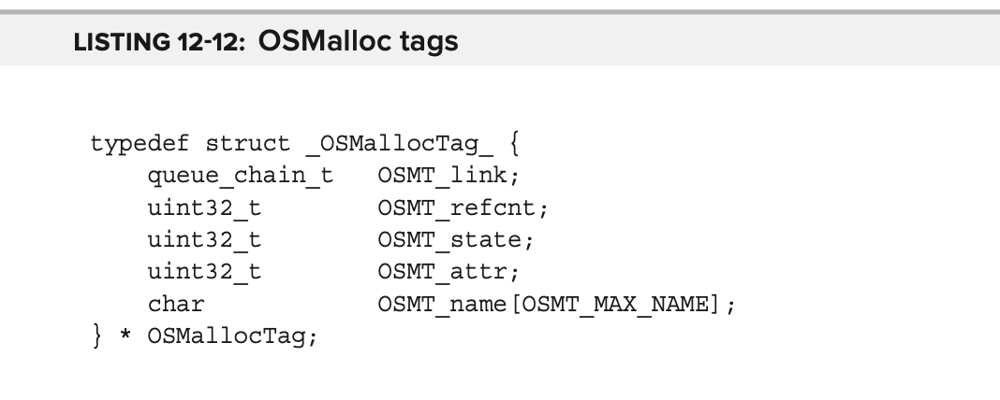

## Mach Pagers

늦던 빠르던, 프로세스의 메모리 요구사항은 RAM 의 가용량을 넘어서게 되고, 시스템은 비활성화된 page 를 찾아서 RAM에서 제거하여 RAM에 더 많은 활성화된 page가 저장될 수 있도록 한다.

다른 운영체제에서 이것은 kernel thread의 몫이다. 예를들어 리눅스의 경우, **pdflush** 와 **kswapd** 가 이러한 일을 해준다. Mach 의 경우 pager 라 불리는 tasks, 그리고 in-kernel thraeds, 또는 심지어 external user mode \(or remote\) servers가 담당한다.

Mach pager는 memory manager로, 특정 타입의 backing store에 virtual memory를 백업하는 것을 담당하는 task 이다. backing store는 RAM이 불충분해서 swapped out된 memory page들의 content를 저장하고 있다가 RAM이 다시 가용해지면 복구해준다. 이 작업은 해당 page들이 "dirty" 할 때, 즉 RAM 에서 변경이 생긴 경우에만 수행하며, 이러한 경우에 data loss를 막기 위해서 반드시 저장해줘야한다.

여기에 나열된 pager는 오직 memory object의 paging operation 을 구현할 뿐이라는 것을 기억해야 한다. 이것들은 system의 paging policy를 manage하거나 control 하지 않는다. 이러한 작업은 **vm\_pageout** daemon 에 의해 수행된다.

### The Mach Pager Interface

비록 수많은 타입의 pager 들이 있지만, 모두 kernel 에 표현되는 interface 는 동일하다. pager는 모두 특정 routine으로 expose 되며, memory object에 대해 operation을 수행한다. Mach의 오리지널 디자인은 pager를 fully external entities로 다루며, pager가 kernel과 communicate하기 위해 사용하는 Mach message의 type을 명시하기 위해 **External Memory Manager Interfcae\(EMMI\)** 를 define 했다. pager에 대한 MIG specification Table 12-5 에 명시된 .defs에서 찾을 수 있다.

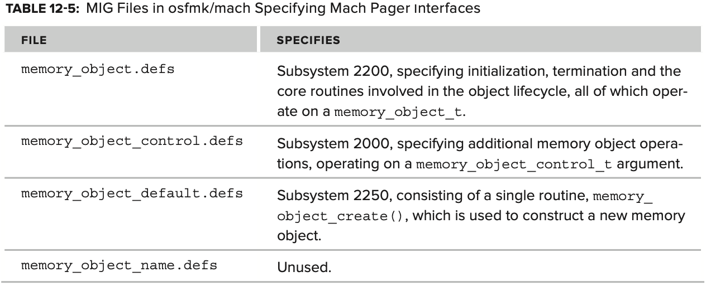

하지만 실제로는, 지금껏 봐 왔듯 XNU는 더 좋은 효율을 달성하기 위하여 중요한 shortcut들을 만들고 Mach의 원래 microkernel design 에서 벗어나기도 한다. 따라서 XNU의 pager는 in-kernel로 구현되어 있으며, pager의 interface도 over messsage가 아닌 function call로 구현되어 있다. Mach thread scheduler 와 유사하게, Mach pager는 object로 정의되며 well-known methods 또는 operation의 set으로 구현된다. 이 operation 들은 **memory\_object.defs** 의 MIG routines에 해당하며, 다음 Table 12-6에서와 같이 struct **memory\_object\_pager\_ops** 에 정의되어 있다. 

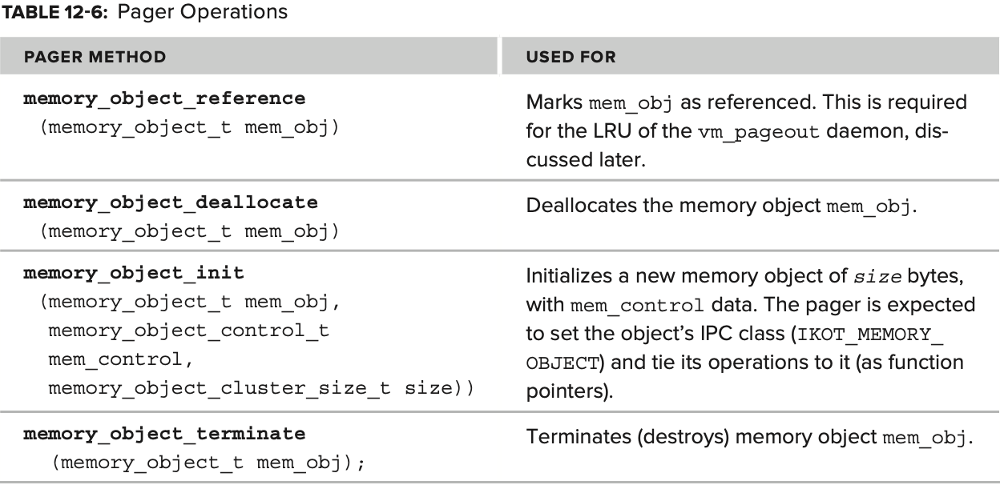

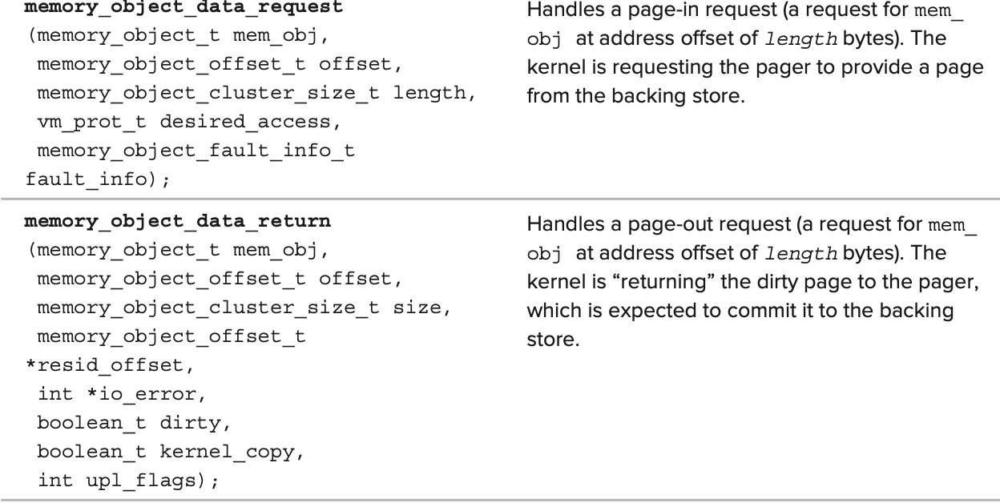

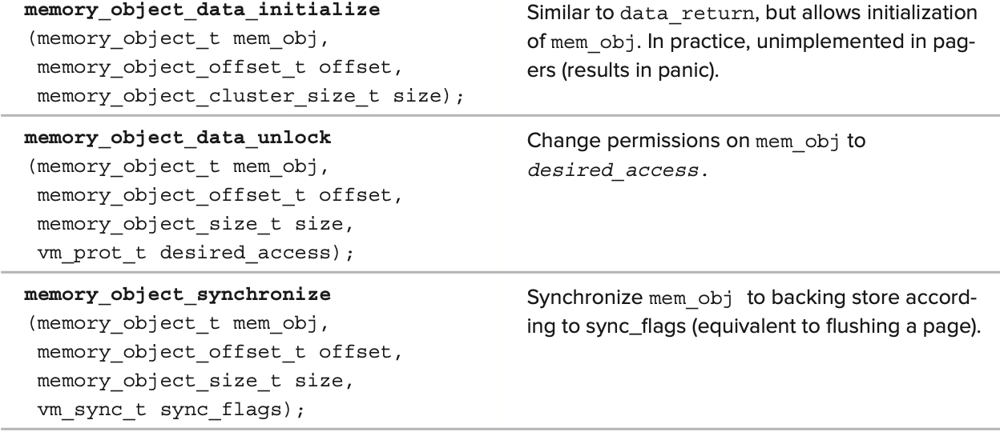

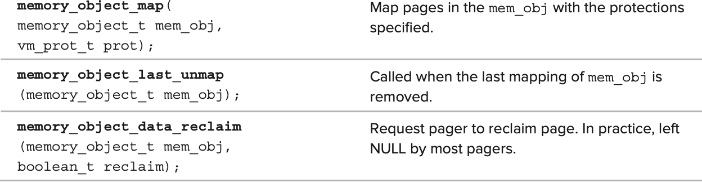

위의 Table에서 가장 중요한 두 operation 은 **data\_request** \(swap in 하는 함수\) 와 **data\_return** \(swap out 하는 함수\) 이다. pager 는 저 Table에 있는 method중 전부를 구현하고 있지는 않으며, 실제로 몇몇 memory manager는 특정 method 호출시 panic이 발생한다.

추가적인 memory object operation 은 불투명한 **memory\_object\_control\_t** type에 정의되어 있다. 이것은 getting/changing attribute, locking, 그리고 UPL related request를 포함한다. **memory\_object\_t** 와 **memory\_object\_control\_t** 는 모두 _osfmk/mach/memory\_objects\_types.h_ 에 다음 Listing 12-13과 같이 정의되어 있다.

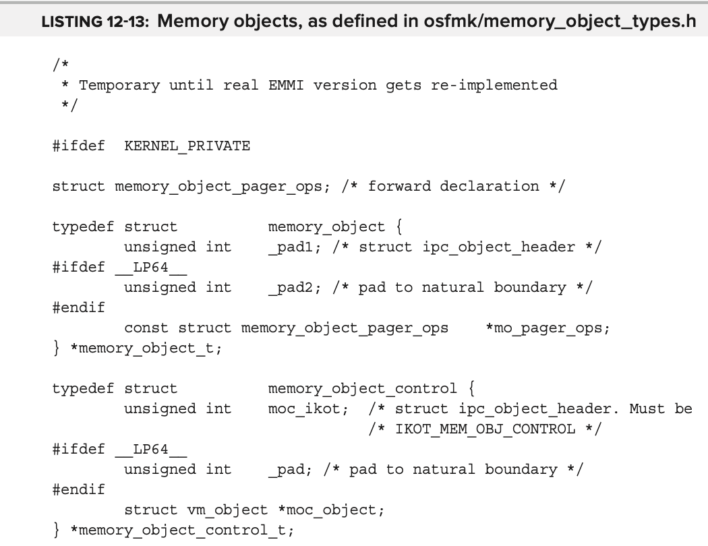

Table 12-6에 있는 **memory\_object\_t** 의 operation 은 구현 pager로 redirect 된다\(structure의 **mo\_pager\_ops** field를 경유하여\). **memory\_object\_control\_t** argument를 요구하는 다른 operation은 control structure의 **moc\_object** field만 return 해주는 **memory\_object\_control\_to\_vm\_object\(\)** 를 호출하여 그들의 argument를 struct **vm\_object** 로 convert 한다.

다른 pager 는 memory object를 확장하여 그들 고유의 memory object를 구현한다. 그들의 pager object 구현은 반드시 **memory\_object\_t** 와 일치해야 하지만, 구현에 있어서  Figure 12-7과 같이 field를 더 추가하는 것은 상관 없다.

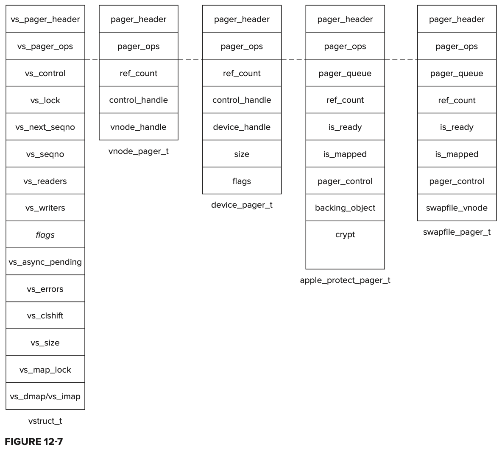

### Universal Page Lists

Mach는 implementation-agnostic list에 있는 page에 대한 information을 유지관리하기 위하여 **Universal Page List\(UPL\)** structre를 사용한다. "Univeral" 이라는 단어가 암시하듯 page가 어느 타입의 backing store에도 백업될 수 있다. UPL structure는 일반적으로 pager\(주로 pageout daemon\) 와 몇몇 BSD component\(notably, filesystems, Unified Buffer Cache\)를 제외한 대부분의 kernel compoenets 로 부터 숨겨져 있다. 정의는 Listing 12-14와 같다.

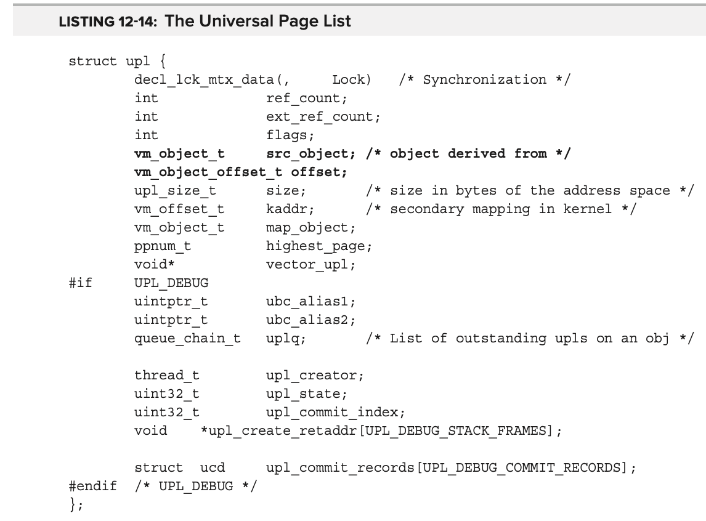

UPL은 Windows Memory Descriptor List\(MDL\) 또는 IOKit의 IOMemoryDescriptor 처럼 virtual address와 acutal physical page를 link 해준다. 해당하는 physical page properties가 UPL에 기록된다. 이 API는 UPL-aware인 몇 안되는 component에 대해서도 direct로 사용되지 않고 abstraction layer를 몇 개 통과시켜서 사용한다. 

MIG file _osfmk/mach/upl.defs_ 는 몇가지 UPL operation의 define을 포함한다. 모든 operation은 _osfmk/vm/vm\_pageout.c_ 에 구현되어 있으며, Table 12-7에서 확인할 수 있다.

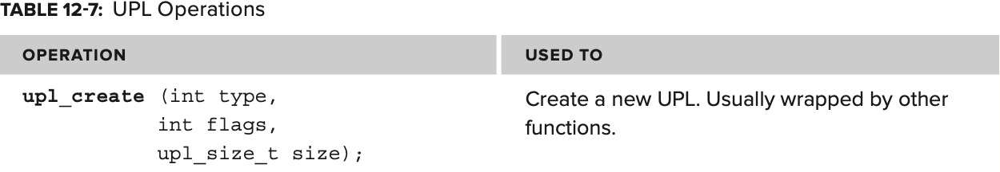

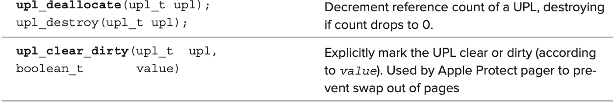

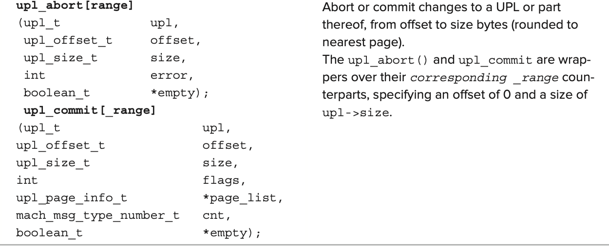

### Pager Types

XNU 에 포함된 pager는 다음과 같다

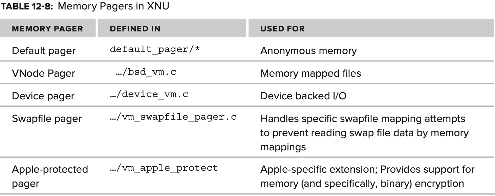

비록 Mach는 **EMMI** 를 이용하여 pager를 extern하게 define 하는 것을 허용하지만, 이 pager 들은 모두 in-kernel thread 이다. 

#### The Default Pager

비상주\(non-resident\) virtual memory page를 관리하는 시스템 매니저로 backing store에 쓰여있는 page를 관리하고 필요시 읽어들인다. 

default pager는 이름에서 암시하듯 Mach 와 XNU의 기본 pager 이다. 이것은 _osfmk/default\_pager/_ 에 있는 다음과 같은 file들에 정의되어 있다.

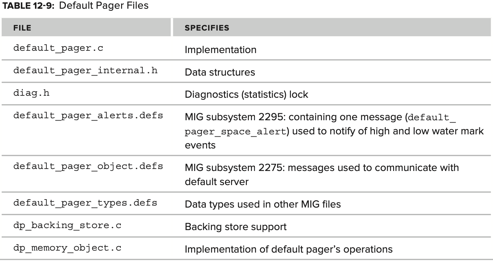

default pager는 **macx\_swapon\(\)** 또는 **macx\_triggers\(\)** 두 Mach trap 중 하나로부터 시작된다. 만약 어느 trap이던 pager 가 초기화되지 않은 것을 감지하면\(즉 **default\_pager\_init\_flag** 가 0 이면\) **start\_def\_pager\(\)** 를 호출하고, 이 함수는 또 **default\_pager\_initialize\(\)** 를 호출한다.

default pager가 initialize 되면, 이것은 자신의 pager object를 위해 **vstruct\_zone** 을 생성하고, **host\_default\_memory\_manager\(\)** 를 이용하여 Mach port 를 등록한다. communicate 를 원하는 클라이언트는 동일한 function을 호출하여 port를 얻고 message중 하나\(**default\_pager\_objects.defs** 에 정의된 것들\)을 보낼 수 있다.  이 port는 또한 user mode로도 얻을 수 있다\(host의 privileged port를 경유하여 동일한 Mach message를 보내서\). pager는 swap file의 add, delete, adjusting을 처리하는 user mode 공범인 **dynamic\_pager** 와의 communication을 유지한다. 이 user mode daemon은 그러나 messaging이 아닌 Mach trap을 사용해서 **default\_pager** 와  communicate back 한다.

비록 default pager port가 user mode에서도 accessible 하지만, 대부분의 경우 이것은 direct 하게 사용될 수 있다는 뜻은 아니다. 공식적인 user mode client는 **dynamic\_pager** 뿐이다. information을 요청하길 원하는 client들을 위해 information message **default\_pager\_info\_64** 는  **macx\_swapinfo\(\)** Mach trap로 래핑되었다. 그러나 이 trap도 **sysctl** interface와 **kern.swapusage** MIB에 의해 래핑되었다.

port 등록의 side effect로 새 kernel thread, **vm\_pageout\_iothread\_internal** 이 **vm\_pageout\_internal\_start\(\)** 에 의해 시작된다. 이 kernel thread 는 kernel 내부적으로 사용되는 **vm\_object** 를 page out 하는 것을 담당한다.

#### The Vnode Pager

vnode pager는 file의 memory mapping을 지원하는 역할을 한다. file이 memory에 매핑될 때, file의 contents가 file system으로부터 read되어야 한다. memory mapped file이 memory에서 dirty 되었으면 file system 으로 write back 되어야 한다. 이 메커니즘은 과거에 메모리에 로드된 적이 있는 데이터를 읽고 쓸 수 있게 해준다.

#### The Device Pager

device pager는 device의 memory mapping을 지원하는 역할을 한다. vnode pager와 개념은 비슷하지만, **IOKit** 과 긴밀하게 통합되어 있다. **device\_pager\_setup\(\)** \(IOKit의 **IOGeneralMemoryDescriptor:doMap\(\)** 으로부터 호출\) 은 새 pager memory object를 만들고 제공된 device handle 을 여기에 연결한다. device pager의 **data\_request** 와 **data\_return** method은 그 다음으로 **device\_data\_action\(\)** 을 호출하여 data를 device 로부터 read 하거나 device 에 write 할 수 있다.

\*\*\*\*

#### The Swapfile Pager

swapfile pager 의 이름은 오해의 소지가 있다. 이것은 swapping을 담당하는 page가 아니다. 실제로 이것은 swap file을 direct하게 매핑하려는 시도를 좌절시킨다. 만약 유저 프로세스가 swap file을 매핑하려고 시도하면, mapping은 default 대신 swapfile pager 에 연관된다. 

이 pager는 page-out request를 처리하지 못하며, 만약 **data\_return** function이 호출되면 panic이 발생한다. 

#### The Apple Protect Pager

특정한 external memory manager중에서 가장 중요한 것은  **Apple Protect pager** 이다. 이것은 Apple의 code encrypthion mechanism을 책임지는 memory pager 이다. 이 pager 는 가끔 swapfile pager와 유사하지만, page를 zeroed out 하는 대신 decryption function을 부른 후에 page를 return한다. Apple Protect Pager는 **pager\_crypt\_info** structure를 추가 field로 가지며, struct **pager\_crypt\_info** 는 다음과 같다.

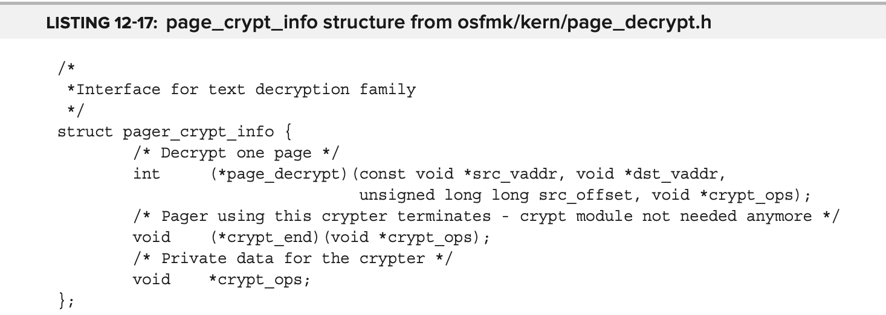

**page\_decrypt** field는 다양한 decryption module에 대해 외부에서 설정할 수 있는 function pointer, hook 이다. 이 mechanism은 애플이 "protected"로 선언된 memory를 decrypt 하기 위해 encrypt module을 plug-in 할 수 있게 한다. OS X의 XNU에는 기본 모듈인 DSMOS kernel extension이 있다. decrypt 된 page는 dirty로 표시되지 않으므로 disk로 swap out 되지 않는다\(plain text copy가 swap file에서 발견될 수 있는 경우 암호화 하는 의미가 없음\). 실제로, 이 method가 호출되면 Apple Protect pager 는 data return \(read, page-out\) 및 panic\(\) 을 처리할 수 없다. 

이 mechanism은 다양한 종류의 encrypt된 memory에 사용될 수 있지만, Apple은 현재 바이너리를 암호화하는데에 사용한다. kernel의 Mach-O handler인 **load\_segment\(\)**  는 **SG\_PROTECTED\_VERSION\_1** flag가 segment에 설정되어있는지 확인하고, 설정되어 있으면 **unprotect\_segment\(\)** 를 호출한다. 

만약 XNU 가 **CONFIG\_CODE\_DECRYPTION** 으로 컴파일 되었으면 default로 **unprotect\_segement\(\)** 가 Apple protect pager를 호출한다. 이는 다음 Listing 12-19에서 확인할 수 있다.

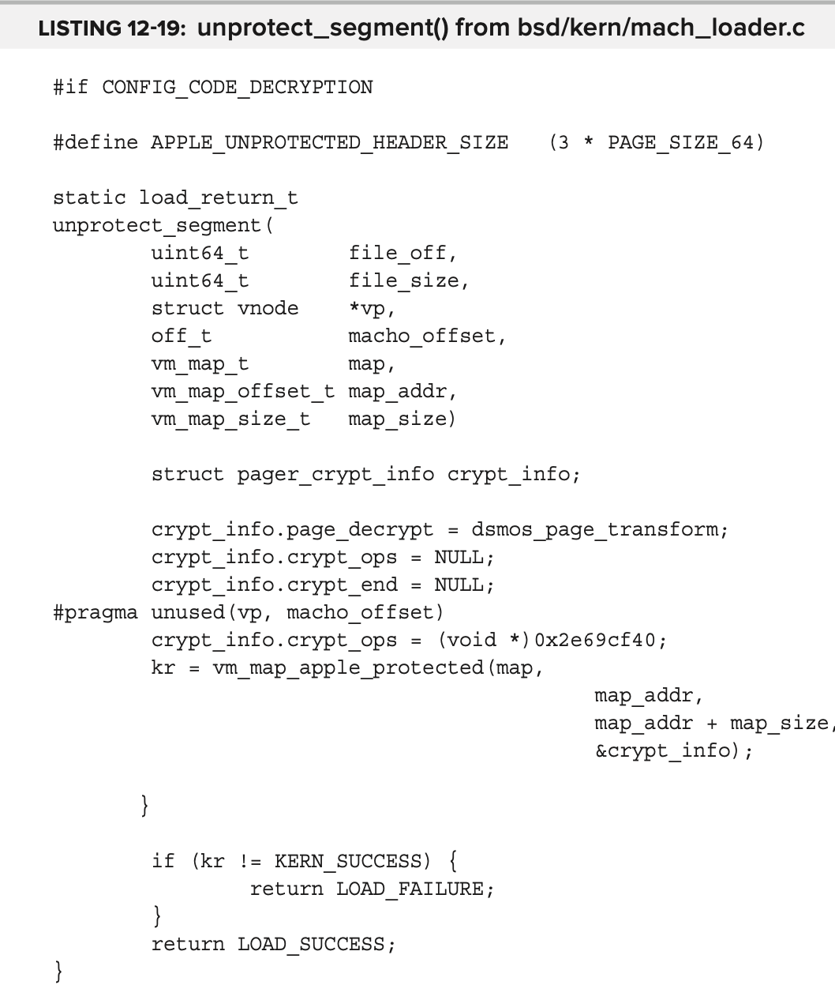

**vm\_map\_apple\_protected\(\)** 는 **apple\_protect\_pager\_setup\(\)** 을 호출하여 AP pager의 queue를 반복하고 object\(있는경우\) 를 찾거나 새 object를 만든다. 이런 식으로 **data\_request** 를 사용하여 **vm\_map** 을 검색하면 AP pager가 제공된 decrypt function을 호출할 수 있다.

앞서 언급했듯 이 방법으로 binary를 암호화 하려는 노력은 용감하지만 쉽게 패배할 수 있다. task 외부에서 사용할 수 있는 Mach의 강력한 **vm\_map** API 를 사용하면 memory가 이미 decrypt 된 task의 memory를 직접 읽을 수 있다.

## Paging Policy Management

앞에서 설명한 Mach pager type 은 해당 backing store 에 memory object를 paging 하는 dirty work 을 수행하지만 자체적으로 작동하지 않고 callback 을 기다린다\(**data\_request**, **data\_return**\). 별도의 entity 가 지시할 수 있어야 하고 어떤 page를 commit 해야 하는지 결정해야 한다.

### The Pageout Daemon

pageout daemon은 실제로는 daemon이 아니라 thread 이다. 그냥 thread 도 아니다. **kernel\_bootstrap\_thread\(\)** 가 kernel initialization 을 끝내고 더이상 할 것이 없을 때 절대 return 되지 않는 **vm\_pageout\(\)** function을 호출하여  문자 그대로 pageout daemon으로 바뀐다. 이 thread 는 \(다른 몇몇의 도움을 받아\)  page swapping policy 를 관리하고, 어떤 page를 해당하는 backing store에 write back 해야할지 결정한다.

#### vm\_pageout thread:

**vm\_pageout\(\)** function은 효과적으로 thread를 리셋하여 **kernel\_bootstrap**\_**thread** 를 pageout daemon으로 전환한다. 이 function은 thread의 priority를 설정하고, 다양한 paging statistics 및 parameters 를initialize하며,  external iothread 와 garbage collector 두 가지 thread를 spawn한다\(세 번째인 internal iothread는 default pager가 등록될 때 시작됨\).

셋업이 끝나면 **vm\_pageout\(\)** 은 주기적으로 깨어나 **vm\_pageout\_scan\(\)** 을 수행하기 위해 **vm\_pageout\_continue\(\)** 를 마지막으로 호출한다. 이 거대하고 엉켜있는 함수는 네 개의 page list\(page queue라고 부름\) 를 유지한다. 시스템 상의 모든 **vm\_page** 는 자신의 **pageq** field를 통해 이 네 가지 queue 중에 하나와 연결된다.

* **vm\_page\_queue\_active:** active list. 최근에 active 되었으며, memory에 매핑되어 있는 page들. 
* **vm\_page\_queue\_inactive:** inactive list. 최근에 access 되지 않은 page 들의 목록. 이 page 들은 유효한 data 를 가지고 있지만, 언제든지 제거될 수 있다. 
* **vm\_page\_queue\_free:** free page list. inactive 상태이지만 laundered\(page out\)된 page. VM object에 연결되지 않은 memory address 의 physical memory 상 page 를 포함한다. 이 page 들은 필요시 언제든지 사용 가능. 
* **vm\_page\_queue\_speculative:** read-ahead의 결과, 추측으로 매핑된 page. 이 page 들은 inactive이지만 조만간 사용될 확률이 높음. 이 queue는 많은 "bins"\(**VM\_PAGE\_MIN\_SPECULATIVE\_AGE\_Q** 에서 옴\) 로 구성되며, 일반적으로 milliseconds 동안 **vm\_pageout\_scan\(\)** 으로부터 보호된다. page들은 inactive status로 떨어질 때까지 age가 점진적으로 증가하여 결국 **vm\_page\_queue\_inactive** 로 들어간다.

이 function은 **vm\_page\_\[active\|inactive\|free\|speculative\]\_target** variable에 유지되는 모든 queue 에 대한 target value 를 충족시킨 다음 thread 를 block한다. current value\(비슷하게 명명된 count variable 에 유지됨\) 가 target value 아래로 떨어지면 thread 가 깨어난다. 일반적으로 check 는 **vm\_page\_grab\(\)** 또는 기타 page operation 의 마지막 단계로 수행된다.

pageout daempon의 통계는 **HOST\_VMINFO\[64\]** 요청으로 **host\_statistics\[64\]** 를 호출하여 얻을 수 있다. 

#### vm\_pageout iothreads

internal 및 external iothread는 각각 **vm\_pageout\_queue\_ts** 를 보고 **vm\_pageout\(\)** 에 의해 initialize 된다. **vm\_pageout\_queue\_internal** 은 내부 VM object\(kernel에 의해 생성되고 default pager에 의해 유지되었으며 internal flag 가 true 로 설정됨\) 를 위해 reserve 되어있으며 **vm\_pageout\_queue\_external** 은 다른 모든 VM object에 사용된다. 

두 thread 모두 동일한 thread function인 **vm\_pageout\_iothread\_continue\(\)** 를 사용하지만 다른 queue 에 있다. 이 function\(기술적으로는 continuation\) 은 queue 를 반복하여 각 page 를 queue 에서 빼고 해당하는 pager 를 가져오고 \(**vm\_object** reference 에서\) pager 의 **memory\_object\_data\_return\(\)** function을 호출한다. 이를 통해 pageout thread는 실제 paging 구현에서 분리될 수 있으며, 이에 대한 책임은 전적으로 해당 pager 에게 있다.

#### Garbage Collection Thread:

garbage collection thread 는 때때로 **vm\_pageout\_scan\(\)** 에 의해 연속으로 깨어난다. 이 thread는 세 가지 영역에서 garbage collection 을 처리한다.

* **stack\_collect\(\):** kernel stack 의 page 
* **consider\_buffer\_cache\_collect\(\):** function이 실제로 정의되어 있는 경우. function을 정의하기 위해 caller는 **vm\_set\_Buffer\_cleanup\_callout\(\)** 을 사용한다. BSD layer 는 **bufinit\(\)** function 에 **buffer\_cache\_gc\(\)** 를 등록한다. 
* **consider\_zone\_gc\(\):** 이 챕터의 앞부분에서 설명한 대로 zone garbage collection의 경우.

garbage collection thread는 continuation을 block하기 직전에 **vm\_dispatch\_memory\_pressure\(\)** 로 넘어가는 **assume\_pressure\_events\(\)** 를 호출한다. 이 메커니즘은 ch.13에서 살펴보는 BSD layer의 Jetsam 메커니즘 \(Linux의 low memory killer와 유사\) 에 연결되어 있다.

### Handling Page Faults

**vm\_pageout\(\)** daemon은 실제 메모리에서 backin store 로의 한 방향 swap만 처리한다. 다른 방향인 paging in 은 page fault 발생시 처리된다. logic은 매우 복잡하지만 다음과 같이 단순화 할 수 있다.

* trap 이유가 page fault인 경우 machine level trap handler\(Intel 의 경우 _user/kernel\_trap\(\)_\)가 **vm\_fault\(\)** 호출 
* **vm\_fault\(\)** function 은 **vm\_page\_fault\(\)** 를 호출하여 실제 오류 페이지를 처리하고 backing store에서 검색한다. 이는 예상대로 **vm\_page** 의 해당 **vm\_object** 를 조회하여 pager port를 가져와서 수행된다. 그러고 나서 pager의 **data\_request** function 은 backing store의 contents에서  paging 작업을 수행한다. page-in operation 은 또한 page를 decrypt\(암호화된 swap에 있는 경우\) 할 뿐만 아니라 code signature가 있을 경우 이를 검증한다. 
* **PMAP\_ENTER\(\)** 는 page를 task의 pmap에 삽입한다.

여러 유형의 page fault가 있을 수 있으며, fault가 non-resident page type 인 경우, 즉 page가 **vm\_map** 에 있지만 **pmap** 에는 없는 경우에만 위에서 설명한 behavior를 예상할 수 있다. page fault 의 다른 경우에는 다음과 같다.

* **Invalid access:** 프로세스 주소 공간에 매핑되지 않은 주소에 엑세스\(task의 **vm\_map** 에서\). 이것은 보통  stray pointer가 dereference 될 때 발생한다. 그 결과 process에 **SIGSEGV** 가 발생한다. 
* **Page protection fault:** 매핑되었지만 page protection mask가 request 된 access를 금지하는 주소에 access. 일반적으로 data segment\(intel의 NX/XD bit 에 의해 적용\)의 주소로 건너뛰거나 non-writable page에 쓰려고 시도하는 경우. 이로 인해 프로세스에 **SIGBUS** 발생한다. 
* **Copy-On-Write:** read-only 로 표시된 page에 task가 쓰려고 하면 fault가 trap 되고 쓰기 작업이 재시도 되기 전에 page가 복사될 수 있다. 이는 RAM을 절약할 수 있는 방식으로 memory를 공유할 수 있는 매우 일반적인 방법이다. process가 많은 공유 라이브러리를 로드하므로 대부분의 task의 **vm\_map** 은 이러한 방식으로 공유된다. 이 경우의 fault는 page 의 private copy가 pre-allocate 되지 않은 kernel의 "laziness" 때문이다. 따라서 page fault handling code는 위와 유사한 방식으로 투명하게 처리하며, task는 어떤 일이 발생하더라도 알지 못한다. 

### The dynamic\_pager\(8\) \(OS X\)

**dynamic\_pager** 는 system swap file \(기본적으로 _/private/var/vm/swapfile_\) 을 유지관리하는 user mode daemon 이다. 이 daemon은 Table 12-9의 실제 pager중 하나가 아니고 paging operation 을 직접 제어하지도 않으므로 이름이 잘못되었다. 대신 kernel의 default\_pager 가 user mode 개입이 필요한 방식으로 swap file 설정의 크기를 조정하거나 수정해야하는 경우 kernel space 에서 호출된다.

daemon 은 Mach message를 통해 **default\_pager** 와 통신하고 Mach trap을 사용하여 system swaping 을 제어한다. 특히 daemon이 시작되면 **HOST\_DYNAMIC\_PAGER\_PORT**\(host specail port\) 를 등록한다. 또한 port를 alert port\(**macx\_triggers** trap을 사용\)로 등록하여 kernel 에서 message 를 가져올 수 있다. 그런 다음 kernel은 daemon에게 message를 보내면 user mode에서 필요한 지원 작업\(즉 file 생성, 크기조정, 삭제, 이름 변경\) 을 수행하고 Mach trap을 호출하여 kernel에 알릴 수 있다. 이러한 trap은 Table 12-10에 표시된 것 처럼 _bsd/vm/dp\_backing\_file.c_ 에서 BSD layer의 일부로 실제로 정의된다.

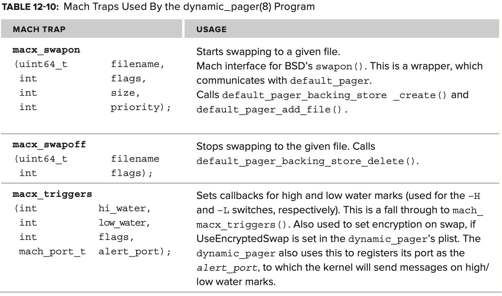

