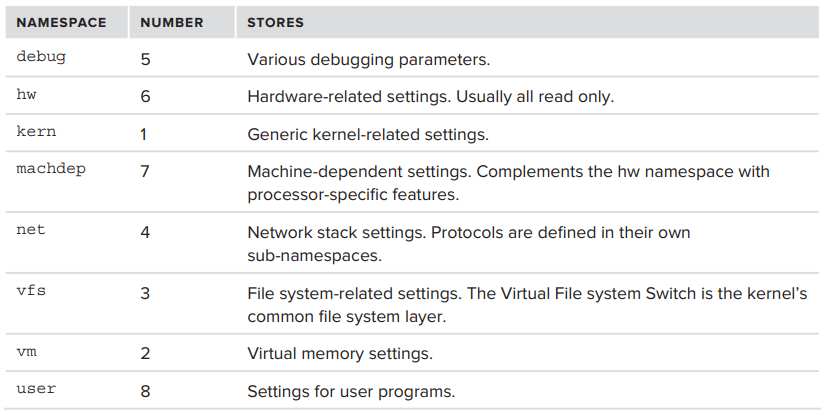
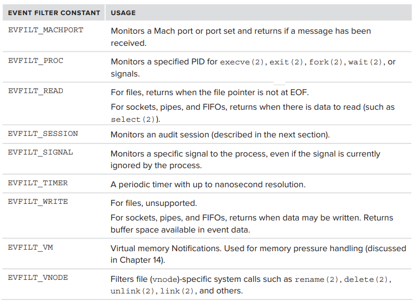
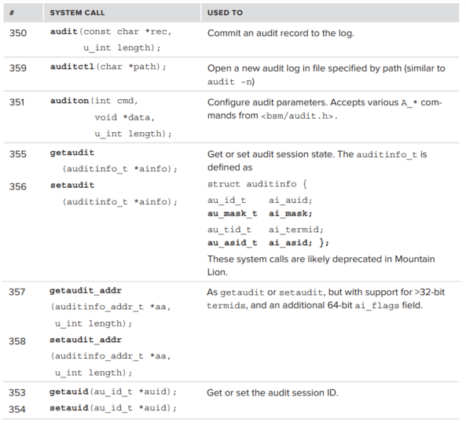
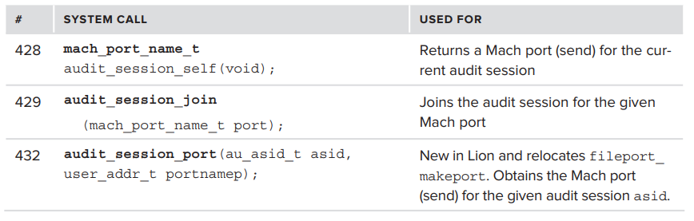
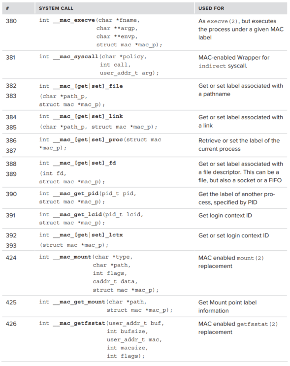
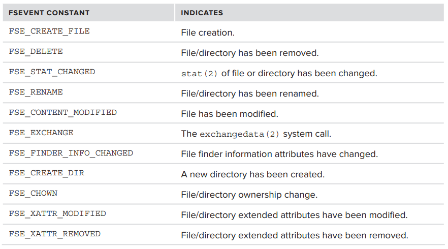
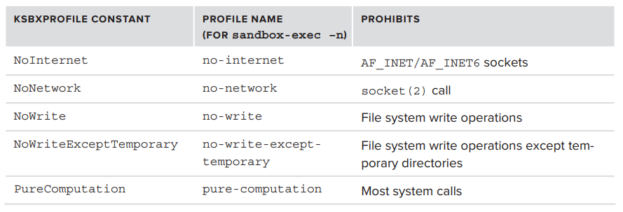
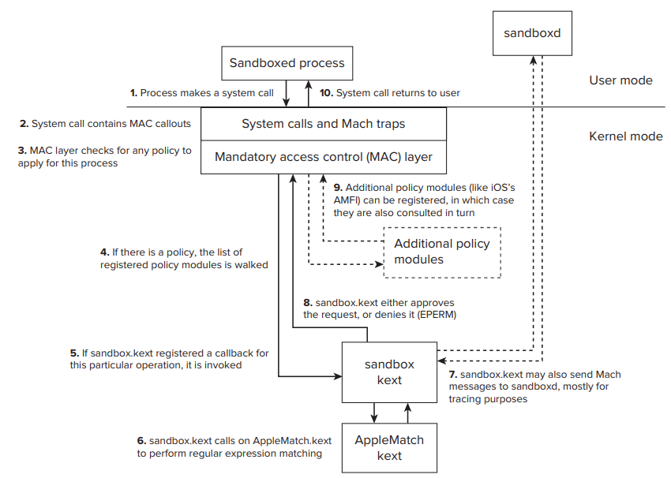
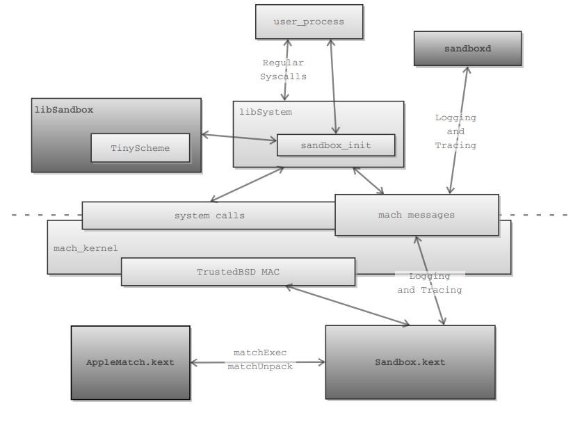

# CH.3 On The Shoulders of Giants

OS X는 BSD에서 파생된 system이기 때문에 해당 architecture의 고유한 kernel 기능 대부분을 상속한다.

하지만 Apple은 BSD를 기반으로 하여 구성 요소를 향상, 대체 하여 OS X를 개발하였기 때문에 OS X를 "또 다른 BSD system"으로 분류하는것은 잘못된 것 이다.

이 장에서는 먼저 BSD에서 영감을 받은 API에 대해 논의한 다음, Apple 고유의 API에 대해 알아본다.  
여기서는 API를 user mode 관점에서 알아보며, 해당 API들의 kernel mode 관점에 대해서는 ch.14 를 참조해야한다.  

## BSD HEIRLOOMS

XNU의 core는 명백히 Mach 이지만, user mode의 main interface는 BSD의 main interface 이다. OS X와 iOS는 둘 다 POSIX 호환 system call 과 여러 BSD system call을 제공한다.  
경우에 따라 추가 기능이 덧붙여 구현된 것도 있고, 그중 일부는 BSD로 back-port 되기도 하였다.

### SYSCTL

kernel 내부상태에 access 하는 표준화된 방법이다. admin은 이 command로 kernel variable value를 직접 query하여 중요한 runtime diagnostics을 제공 가능하다.

> kernel의 방대한 variable 기반 중 아주 작은 subset만 이런 방식으로 export 가능하다.

**sysctl** command는 **sysctl** library call을 wrapping 하고 이 call은 **\_\_sysctl** system call을 wrapping 한다.  
export한 kernel variable은 **MIB\(Management Information Base\)** naming convention에 따라 명명된다.

> **MIB?** **\(SNMP\(Simple Network Management Protocol\)** 에서 차용. variable을 namespace별로 분류한다.

> **SNMP?** IP network 상의 device로부터 정보를 수집, 관리하며, 또한 정보를 수정하여 device의 동작을 변경하는 데에 사용되는 internet standard protocol

XNU 에서는 상당히 많은 수의 hard coding 된 namespace를 지원한다. 

namespace는 integer 표현으로 변환되므로 variable을 integer array로 나타낼 수 있다.   
**sysctlnametomib** library call은 text에서 integer 표현으로 변환할 수 있지만 **sysctlbyname** 을 사용하여 name으로 해당하는 variable의 value를 찾을 수 있기 때문에 그다지 자주 쓰이지 않는다.   
각 namespace에는 직접\(i.e. _kern.ostype, 1.1_\) 또는 sub-namespace\(i.e. _kern.ipc.somaxconn, 1.32.2_\)로 define된 variable이 있다. 두 경우 모두 fully qualified name이나 numeric **MIB** specifier로 해당 variable 에 access 할 수 있다.

> **sysctlnametomib** 를 사용하여 name으로 MIB 번호를 검색할 수 있지만 그 반대는 불가능하다.

**sysctl** 을 사용하면 export한 value를 examine 하고 writable한 value를 setting 할 수 있다. **sysctl** 변수 범위는 다양한 minor debug variable에서 전체 subsystem을 제어하는 다른 read/wright variable에 이르기까지 다양하다.

> **kdebug** 는 전적으로 **sysctl** call에 의존하며, **ps** , **netstat**  과 같은 command는 **sysctl** 에 의존하여 PID 및 active socket의 list를 얻지만 다른 방법을 사용할 수도 있다.
>
> > **kdebug?** XNU의 내장 debugging 기능이다. **sysctl** call을 통해 activate 및 control이 가능하다.   
> > **kdebug** 의 가장 유용한 기능은 kernel level trace가 가능하게 하는 것 이다.
>
> > **ps?** 현재 실행중인 process 목록을 보여주는 명령어
>
> > **netstat?** system의 network 연결 목록\(tcp, udp, socket 연결\)을 보여주는 명령

### KQUEUES

kernel event notification을 위한 BSD mechanism이다. 특정 type 및 category의 event가 발생할 때 까지 block된다. 하나 이상의 process synchronization을 위한 단순하고 효과적인 방법이다. **kqueue** 및 해당 kevent는 kernel에서 asynchronous I/O의 기초를 형성한다. 

  
**kqueue** 는 argument 없이 **kqueue** system call을 호출하여 user mode에서 구성할 수 있다.   
그 다음 **EV\_SET** macro를 사용하여 관심있는 특정 event를 지정하면 struct kevent가 initialize 된다.   
**kevent** 또는 **kevent64** system call을 호출하면 event filter가 setting 되고, satisfied 될 경우 return된다. 

system은 여러개의 _"predefined"_된 filter를 지원한다. 

### AUDITING\(OS X\)

OS X에는 **BSM\(Basic Security Module\)** 의 구현이 포함된다. user 및 process action tracking에 유용하지만 disk space와 overall performance에서 비용이 많이 든다. OS X에서는 Mach message 를 통해서 auditing이 구현되어있다.

**Administrator의 관점** .   
기본 user-mode component는 필요에 따라 **launchd**에 의해 시작되는 **auditd**이다. audit log는 daemon이 아닌 kernel이 직접 기록한다.   
하지만 결국 daemon이 kernel component를 control 하기 때문에 daemon을 control 하는 사람이 auditing을 control 한다. 이를 위해 administrator는 **audit** command를 사용하여 auditing을 initialize\(-i\), terminate\(-t\), 새 log 시작\(-n\), expire\(-e\)할 수 있다.  
일반적으로 **auditd** 는 plist TimeOut key에 정의된 대로 60초 동안 아무 activity가 없을 경우 time out 된다.

**Programmer의 관점 .**  
audit이 enable 된 경우 **system call \#350~\#359**를 auditing의 enble 및 control을 위해 전용한다. 

> Apple은 BSM standard에서 벗어나 3개의 proprietary system call을 통해 subsystem을 Mach system에 더욱 강하게 묶는다. standard calls와 달리 해당 call들은 undocumented 되어있다.

> **auditd** 는 사전에 정의된 rule에 의거하여 system에서 발생하는 보안과 인증 관련 event의 log를 기록하므로 권한 없는 계정이 root 권한을 얻으려고 시도하거나 server daemon이 보안 정책에 위배되는 동작을 수행했는지 등의 system의 보안 위반 사례를 확인하고, 이를 통해 위협을 식별, 방지 하는데 사용할 수 있다.

### Mandatory Access Control

**강제적 접근통제\(MAC\)** 란 user가 resource에 접근할 때 user의 비밀 취급 인가 label과 각 object에 부여된 민감도 label에 따라 access를 control 하는 것이다.  
**MAC** 은 label을 준수하지 않는 모든 object에 대한 access를 deny 한다.

> 요약하면, user나 resource 모두 보안 level을 부여받고 상대 비교를 통해 access control 하는 것을 말한다.

**MAC** 은 kernel의 일부일 필요 없는 additional components가 system을 control 하기 위해 _"plug-in"_ 할 수 있는 기반을 제공한다.  
kernel 측면에서 **MAC** 에 대한 callout은 다양한 system call 구현에 삽입되므로 각 system call은 user mode request를 처리하기 이전에 **MAC** validation을 통과해야만 한다. 

**MAC layer**는 자체적으로 결정 내리지 않고 등록된 policy module을 호출한다. kernel은 추가적으로 전용 **MAC system calls**를 제공한다.  

## OS X- AND IOS-SPECIFIC TECHNOLOGIES

### User And Group management\(OS X\)

single-user mode 및 iOS에서는 아직 비밀번호 파일\(/etc/passwd\)을 사용한다_\(/etc/maseter.passwd_를 shadow file로 사용_\)._ 다른경우 에는 자체 directory service인 **opendirectoryd**를 선호하여 더이상 사용하지 않는다. **opendirectoryd** 는 **OpenLDAP** project의 구현이다. **LDAP\(Lightweight Directory Access Protocol\)**와 같은 standard protocol 사용시 Apple 이외의 directory service와 통합 가능하다. directory service는 user 및 group 이상의 기능을 유지한다. 즉, _"System Configuration"_ chapter에서 살펴볼 바와 같이 system component의 다른 많은 aspect를 hold한다.

> **Directory Service:** X.500 standard에 정의된 **Directory Service**는 OSI 7 layer의 application layer에 속하는 protocol로, 정보 통신 service에 필요한 data를 DB화 하여 효율적으로 관리하고 user가 편리하게 access할 수 있는 기능을 제공하는 service 이다.

> **LDAP?** DAP는 너무 방대하고 복잡하여 구현하기 어렵다는 점 때문에 당시 일반 PC 급에서는 사용하기 힘들었고, 이에 대한 해결책으로 DAP의 경량화 버전인 **LDAP** 를 개발하였다. **LDAP** 는 DAP의 기능을 대부분 지원하며 DAP에서 복잡했던 부분이나 사용되지 않는 부분을 단순화 혹은 삭제하여 경량화 하였다.

daemon과 interface 하기 위해 **dscl** command line utility 를 제공한다.  **dscl**로 system의 user 및 그룹을 표시할 수 있으며, directory를 update하고 새 user를 작성할 수 있다.

> Lion OS의 초기 보안 취약점중 하나가 이 **dscl**을 이용한 것 이다. non-root user가 기존 user password 모르는 상태에서도 password 변경이 가능했다.

### System Configuration

OS X 에서는 /etc user database files를 사용하지 않는 것과 마찬가지로 일반적으로 UN\*X 에서 system "registry"로 사용되는 대부분의 다른 configuration files를 제거했다.   
그 대신 System configuration을 유지하기 위해서 OS X 및 iOS는 **configd** 라는 daemon을 사용한다. 이 daemon은 IP 및 IPv6 configuration, logging 및 기타 bundle을 포함하여 _/System/Library/SystemConfiguration/_ directory에 있는 추가 load 가능한 bundles _\("plug-ins"\)_을 load할 수 있다.

power user는 **scutil** 이라는 tool로 coammand line에서 system configuration을 navigate 하고 query할 수 있다. \(p.67, code\) **SystemConfiguration.framework** 를 사용하면 system configuration에 programming 방식으로 access 할 수 있다.   
**scutil** command로 system configuration 변경 감시가 가능하며 programmming 방식으로 감시하기 위해서는 **SCDynamicStore** 를 사용한다.   
network connectivity status 구하기 위해서는 **SCNetworkReachability** class를 사용한다.

### Logging

OS X는 기존 UNIX System log에 대한 지원도 이어받았다. 따라서 **syslogd** 와 완벽하게 호환된다.

> **syslogd**? 메시지의 **facility**와 **severity**에 의해 분류되는 textual message를 처리한다.
>
> * **facility:** 다양한 UNIX subsystems\(mail, printing, cron 등등\)은 모두 고유한 **facilities**를 가진다. =&gt; auth, authpriv, daemon, cron, ftp, lpr, kern, mail, news, syslog, user, uucp, local0~local7 
> * **severity:** **severity**는 우선 순위 / 중요도에 따라 **LOG\_DEBUG**와 **LOG\_INFO**, **LOG\_ERR**, **LOG\_ALERT**, 마지막으로 **LOG\_EMERG** 등 다양하다. =&gt; Emergency, Alert, Critical, Error, Warning, Notice, Info or Debug

관리자는 configuration file _\(/etc/syslog.conf\)_를 사용하여 **facility**/**severity** 조합에 해당하는 수행 action을 결정할 수 있다.

> actions:
>
> * 일부 지정된 user에게 message 보냄
> * file 또는 device\("/"로 시작하는 절대경로\)에 log 기록
> * command에 Pipe 연결\(\|_/path/to/program_\)해서 기록
> * network host로 send\(@loghost\)

**syslog API**를 이용하여 **syslog**와 interface 가능하다. 지정된 priority를 사용하여 message를 기록하는 **syslog\(\)**를 통하여 **openlog\(\)** \(name, facility, 기타 option을 특정\)를 호출한다.  
**syslog** daemon은 UNIX domain socket \(OS X 에서는 _/var/run/syslog_\)를 통해 message를 intercept 한다.

OS X 10.4 는 **Apple System Log\(ASL\)** 이라는 새로운 logging을 선보였다. **syslog**를 model로 하여 facility/severity 조합을 제공하며 추가적으로 _filtering_ 및 _search_ 같은 더 많은 기능을 허용한다.

ASL은 _4개의 logging interface_를 동시에 제공한다는 점에서 modular이다.

* **Backward-compatible syslogd**: syslog message를 accept하고 _/etc/syslog.conf_에 따라 처리하도록 구성 가능. 
* **Network protocol syslogd**: well-known UDP port 514에서 -udp\_in 1로 enable 가능한 protocol.  
* **Kernel logging interface**: -klog\_in 1으로 enable 할 수 있으며, default로 enable 됨._/dev/log_\(character device\)의 kernel message를 accpet. 
* **new ASL interface**: default로 enable 되어있는 -asl\_in 1 을 사용하면 asl\_log를 사용하는 asl API의 client로부터 ASL message를 얻을 수 있음. _/var/run/asl\_input_ socket을 통해 들어오며 syslogd socket을 통한 것과는 다른 format이므로 두개의 개별 socket이 필요함.

ASL log는 _/var/log/asl_에 수집되며 **lunchd**\(com.apple.aslmanager.plist에서\)에 의해 자동으로 실행되는 **aslmanger** command에 의해 관리된다.   
ASL log는 syslog file과 달리 text가 아니라 binary file이므로 크기는 다소 작지만 syslog 처럼 grep을 이용하기에는 불편하다. 따라서 Apple은 OS X에 log를 display 하고 보며 search 및 filter를 수행하는 **syslog** 명령을 포함한다.

> **ASL** library는 OS X 10.12 부터 더이상 사용되지 않으며, **os\_log** library로 대체되었다.

> **lunchd:** BSD style init 및 SystemStarter를 대체하기 위해 OS  X의 일부로 작성된 init 및 operating system service management daemon이다.   
> system 및 user level 모두에서 daemon을 관리하며, init을 완전히 대체한다.

### Apple Events and AppleScript

**AppleScript** 는 OS 7 시절로부터 내려오며 계속해서발전해 온 기능으로, **osascript** command 와 **Automator** 의 배후에 있는 강력한 mechanism이 되었다.  
**AppleScript**를 사용하면 script 가능한 application에 _반 자연 언어 interface_를 사용할 수 있다. _\(주어진 문법을 고수하여야 하므로 '반' 자연 언어이다.\)_ 

**AppleScript**가 가능케 하는 mechanism은 **AppleEvents** 이다. **Apple Script**는 TCP/IP를 통해 remote host로 extended 될 수 있다. 이 protocol은 **eppc** 라고 하며, TCP port 3031을 사용하는 undoumented 독점 protocol 이다. remote 기능은 System Preferences의 Sharing applet에 Remote Apple Events가 enable 되어있어야 활성화 된다. enable 되면 **launchd**에게 **eppc port**에서 listen하도록 요청하고, request가 receive 되면 **AEServer\(AppleEvents server\)**가 시작된다.

> **Apple Event?** 복잡한 operation및 data를 지정할 수 있는 interprocess message type 이다. 단일 application 내, 동일한 computer의 application 간, network에 연결된 다른 computer의 application 간 에서 사용할 수 있는 data transport 및 event dispatch mechanism을 제공한다  
> application은 일반적으로 Apple Event를 사용하여 다른 application에게 service 및 information을 request 하거나 response 한다.  
> **Cocoa application framework**을 통해 user에게 GUI를 제공하는 모든 application은 적절한 경우 Mac OS 에서 보낸 특정 event에 응답할 수 있어야 한다.  
> application이 **Apple Event**를 send, response 하고 해당 operation과 data를 **AppeScript** script에 제공할 수 있는 기능은 **OSA\(Open Scripting Architecture\)**의 일부인 **Apple Event Manager** 에 의해 제공된다.

### FSEvents

모든 최신 os는 File system notification을 위한 API를 제공한다. 이를 통해 file의 addition, modification, deletion에 대한 user program의 빠르고 쉬운 response가 가능하다.

* Windows =&gt; **MJ\_DIRECTORY\_CONTROL**
* Linux =&gt; **inotify**
* OS X =&gt; **FSEvent**

OS X의 **FSEvent**는 개념적으로 linux의 **inotify**와 다소 유사하다.   
**inotify**와 **FSEvent** 둘 모두 process\(또는 thread\)는 file descriptor를 가져와서 read를 시도하고, system call은 일부 event 발생 시까지 block한다. 이 때 receive buffer에  event detail이 포함되어 있으면 program이 어떤 일이 발생한 것 인지 파악한 후 그에 따라 조치할 수 있다.  
하지만 **FSEvents**는 **inotify**보다 약간 더 복잡하다. 그 과정은 다음과 같다.

* process\(or thread\)가 **FSEvents** mechanism에 대한 handle을 얻도록 request. pseudo-device인 /dev/fsevents 를 open하여 file descriptor를 얻음. 
* requestor는 특수 **ioctl**인 FSEVENTS\_CLONE을 issue함. 해당 **ioctl** 사용시 관심있는 event _\(특정 file에 대한 특정 operation\)_ 만 filtering 할 수 있음. **FSEvents**가 kernel의 **file system-handling logic\(VFS, the Virtual File system Switch\)**에 plugged in 되어있기 때문에 가능. 지원되는 모든 event는 clone file descriptor 에 pending중인 notification을 add. 
* watcher는 **ioctl**을 사용하여 notification에 request된 정확한 event detail을 modify 가능. control code는 FSEVENTS\_WANT\_COMPACT\_EVENTS\(더 적은 information\), FSEVENTS\_WANT\_EXTENDED\_INFO\(더 많은 information\) 및 NEW\_FSEVENTS\_DEVICE\_FILTER\(watcher가 관심없는 device를 filtering\)이 포함. 
* requestor\(watcher 라고도 부름\)는 read loop에 진입. system call이 return될 때 마다 user-provided buffer가 event record array로 채워짐. single operation으로 variable size의 multiple records가 return될 수 있어서 read가 까다로울  있음. kernel buffer가 exceed 되어 event가 drop 되면 FSE\_EVENTS\_DROPPED가 event record에 추가.

> **VFS?** 실제 file system 위의 abstraction layer 이다.  
> 다양한 file system set에서 같은 방법으로 file I/O를 실행할 수 있도록 상위 layer application에 standard interface set를 제공한다.    
> file system은 static할 필요가 없으며 storage device의 일시적 특성에 따라 변화할 수 있다.

> **ioctl?** user와 kernel을 잇는 interface의 일부이다. "I/O control"의 준말로, 보통 user space의 code가 H/W device, kernel component와 communication 할 수 있게 도와주는 역할을 한다.

FSEvents의 API가 공개되어있지만 official user가 아래 3개밖에 없어서 거의 사라진 상황이다. \(Mountain Lion 이전 버전 시점\)

**FSEvents**를 이용하는 three official users:

* **coreservicesd**: 시작 service 및 기타와 같은 핵심 service 측면을 지원하는 apple 내부 daemon. 
* **mds**: Spotlight server. **FSEvents**의 heavy user. 새 file 찾고 indexing 하기 위해 notification에 의존. 
* **fseventsd**: _CoreServices framework_ 내에 묻혀있는 generic user space daemon.

### Notifications

OS X는 systemwide notification mechanism을 제공하는데, 이는 process가 event를 broadcast 하거나 listen 할 수 있는 distributed IPC 의 한 형태이다. 이 mechanism의 핵심은 booting시 시작되는 **notifyd** daemon _\(Darwin notificaiton server\)_ 이다. additional daemon인 **distnoted**는 distributed notification server로 작동한다. application은 notify API를 사용하여 daemon과 message를 주고받을 수 있다. \(reverse DNS namespace의 사용이 권장됨. i.e. com.myCompany.myNotification\)

API는 매우 다양하며, 여러 방법 중 하나로 notification을 request 할 수 있다. &lt;notify.h&gt;에 UNIX signals, Mach ports, file descriptors를 사용하여 notification을 enable 하는 기능이 나열되어있다.   
client는 notification을 manual하게 suspend 혹은 resume 할 수 있다.

notifyd는 기본적으로 Mach message를 사용하며 _com.apple.system.notification\_center_의 Mach port를 등록하여 대부분의 notification을 처리한다.

command line utility인 **notifyutil**을 debugging에 사용 가능하다. 해당 util 사용시 임의 key에 대한 notification을 대기\(-w\) 및 게시\(-p\)할 수 있다.

### Additinal APIs of interest

1. **Grand Central Dispatch**\([ch.4](ch.4-parts-of-the-process.md)\): pthread API 위에 구축된 work queue extension을 사용하여 parallelization하기 위한 system framework. 
2. **Launch Daemon**\(ch7\): Mach bootstrap server와 함께 많은 UN\*X system daemon\(ex: initd, at, crond 등\)을 융합. 
3. **kdebug**\(ch.5\): System call 및 Mach trap의 kernel level tracing을 위해 가장 유용한 기능 
4. **System socket**\(ch.17\): kernel mode components와 communication할 수 있는 PF\_SYSTEM namespace의 socket. 
5. **Mach API**\(ch9, 10, 11\): XNU의 Mach core에 대한 direct interface. 상위 level BSD/POSIX interface와 일치하는 기능을 제공하지만 일부 경우 이를 능가하기도 함. 
6. **IOKit API**\(ch.19\): device driver와 communication 하기 위한 API로, 다양한 diagnostics information과 user mode에서 driver를 control하는 강력한 기능을 제공.

## OS X AND iOS SECURITY MECHANISMS

OS X는 적은 사용자 층으로 인하여 공격자의 관심을 끌지 않아 virus와 malware가 적었다. \(또 다른 이유는 UN\*X가 항상 least privilege 원칙을 준수했기 때문이다. 이 경우 기본적으로 user root access를 허용하지 않는다.\) 

하지만 Mac 이용자의 증가와 함께 OS X를 대상으로 한 malware들이 점차 늘어나고 있다. 

> 미국에서만 60만명의 user를 감염시킨 "Flashback" 처럼 대부분의 Mac 대상 "Malware"는 Trojan 이다.

### 

### Code Signing

출처를 알 수 없는 application을 다운받으면 malware일 위험이 크다. 그러나 만약 출처를 확인할 수 있고 전송 중에 수정되지 않았음을 확신할 수 있다면 그 위험을 크게 완화할 수 있다.   
**Code Signing**은 이를 위한 mechanism을 제공한다. SSL이 사용하는 것과 동일한 **X.509v3** 인증서를 발급하여 \(발급자의 private key로 그들의 public key에 서명함으로써\) 개발자가 application에 sign 하고 identity를 인증하도록 권장한다.   
Digital signature의 핵심은 signer의 public key를 verifier 들이 미리 알고 있어야 하는 것 이므로 Apple은 해당 cerificate를 OS X와 iOS의 key chain에 내장한다.

Apple은 **cserq** command로 표시될 수 있는 code signing requirements를 정의하기 위한 special language를 개발하였다. Apple은 developer가 application에 sign할 수 있도록 **codesign** command를 제공하지만 **codesign**은 developer가 _Apple Developer Program_에 가입하여 얻을 수 있는 valid하고 trust한 certificate 없이는 사용할 수 없다.

code-signed application도 여전히 malware일 수도 있다. 하지만 code signing 하기 위해서는 Apple developer program에 등록해야하기 때문에 이러한 appliation의 개발자는 소송의 대상이 될 수 있다.

> OS X에서 code signing은 optional 하지만 iOS에서는 mandatory 하다. unsinged app은 iOS 상에서 실행이 불가능하며 iOS file system으로 서명되지 않은 app을 기적적으로 옮기더라도 해당 app을 실행하려고 시도할 경우 kernel에 의해 종료당한다.

### Compartmentalization \(Sandboxing\)

원래 선진적이고 사용하기 편리한 기능으로 간주되던 Compartmentalization은 이제 Apple landscape에 필수적인 부분이 되었다.   
이 idea는 간단하지만 주요한 application security 원칙이다.

> _"신뢰할 수 없는 application은 모든 operation이 제한되는 격리된 environment에서 실행되어야 한다."_

#### **Voluntary Imprisonment**

> _OS X 10.8 Mountain Lion 부터는 AppStore를 통해 배포되는 모든 application에 대해 sandboxing이 강제되었다._

OS X는 아직까지는 sand box에서의 execution을 강제하지는 않는다. process는 sandbox에 enter하기 위해서 predefined profile중 하나와 함께 **sandbox\_init** 을 call한다. 또는 -n switch와 profile name과 함께 **sandboxexec** command line을 사용하여 똑같은 일을 수행할 수 있다.

**sandbox\_init** 함수는 **mac\_execve** system call\(\#380\)을 호출하며, predefined profile은 MAC label에 해당한다. profile은 proccess에 predefine된 일련의 restriction을 적용하며 이러한 제한 사항을 무시하려고 할 경우 system-call level에서 error가 발생한다\(보통 -EPERM을 return\). 

tight한 sandbox를 사용함으로써 얻을 수 있는 benefit은, 사용자로 하여금 숨겨진 malware가 profile에 define된 범위 밖에서 어떠한 교활한 행동을 할 걱정 없이 untrust한 application을 sandbox 상에서 실행시킬 수 있다는 것이다.

predefined profile은 시작 point로만 사용되며 application 별로 작성될 수 있다.  

> Apple의 강화된 sandbox 정책에 의해 이제 AppStore를 통해 배포되는 모든 application은 sandboxing 되어야 하지만, 다른 방식으로 배포되는 application들에게는 강제되지 않는다.   
> 다만 이러한 우회법이 큰 보안 문제가 되지 않는 이유는, 대부분의 developer 들이 AppStore를 통한 배포의 용이성과 수익성을 포기하기 보다는 sandboxing을 택하기 때문이다.  
> 또한, 후술할 GateKeeper에 의해 이제 AppStore 외의 다른 방식으로 다운받은 application은 모두 user의 허가를 받아야 execution될 수 있다.

#### **Controlling the Sandbox**

built-in profile 외에도 .sb file에서 custom profiles을 지정할 수 있다. 해당 file들은 sandbox의 scheme와 유사한 dialect로 작성되었다. 또한 file에는 allow 또는 deny 될 action들이 명시되어 있으며, 내장 **TinySCHEME library**를 포함하는 **libSandbox.dylib**에 의해 load-time에 compile 된다.   
trace directive를 사용하면 user-mode daemon인 **sandboxd**가 rule을 generate 하고, sandboxed application이 request 한 operation을 allow 한다. rule을 통합하고 생성된 profile을 단순화하기 위해 **sandbox-simplify**라는 tool을 사용할 수 있다.

### Entitlements: Making the Sandbox Tighter Still

sandbox mechanism은 매우 강력하고 진보적이지만 완벽한 것은 아니다. 알려진 위협을 block하는 _"black list"_ 방식은 목록이 제한적인 만큼만 효과적이다.   
따라서 sandbox는 계속 개선되고 있으며, 특히 Mountain Lion 에서는 _"white list"_ 방식 HFS+의 검역 기능을 기반으로 한 **GateKeeper** 와 결합하여 현재 sandboxing mechanism의 "_black list"_ 방식을 더이상 사용하지 않으려고 한다.

> **black list 방식의 문제:** 2011년 11월 Core Labs의 연구원들은 Lion의 **kSBXProfileNoNetwork**\(network 차단하는 sandbox profile\)가 network access는 block 하지만, **AppleEvents**는 제한하지 않는다는 것을 찾아다.   
> 이렇게 되면 악의적인 application이 **AppleScript**를 trigger 하고 non-sandboxed proxy process를 경유해서 network에 연결할 수 있게된다.  
> 이처럼 black list 방식은  가능한  모든 방법을  막지 못하면 우회로가 존재하여 보안 위협이 생긴다는 문제가 있다.

> **GateKeeper**? AppStore가 아닌 다른 경로를 통하여 download 받은 application의 실행을 일단 block하고, user가 allow 해야 execution 할 수 있도록 한다. 또한 잠재적인 변조, 알려진 malware의 여부와 publisher의 id에 대해 application의 code signature를 check한다.

#### **Containers in Lion**

Lion 에서는 sandbox mechanism을 보다 정밀하게 조정할 수 있는 새로운 command line인 **asctl** 이 도입되었다. 이 utility를 사용하면 application의 requirement에 따라 profile을 작성하여 application을 시작, sandbox activity를 trace할 수 있으며 application, 특히 AppStore application에 대한 **"container"**를 설정할 수 있다.   
iOS 에서 처럼 OS X에서도 조만간 application은 특정 entitlement에 따라서만 실행되도록 바뀔 수 있다. entitlement는 개념적으로 .NET 및 Java에서 사용되는 선언적 permission mechanism과 매우 유사하다. 

> **Container?** _Library/Containers_ directory에 저장된 application 별 folder.

### Enforcing the Sandbox

XNU는 sandboxed environment의 유지에 많은 노력을 기울인다. 수많은 hooking과 interposing 방법 때문에 user mode에서 enforce 하는 것은 선택사항에서 제외된다.   
BSD MAC layer는 sandbox와 entitlement 둘 다 작용하는 mechanism이다. policy가 특정 process에 대해 적용되는 경우 policy module\(i.e. specialized kernel extension\)중 하나를 call 하는 것은 MAC layer의 책임이다.   
sandbox를 담당하는 main kernel extension은 **sandbox.kext** 이며, sandbox에는 kernel extension에 대해 trace와 helper service를 제공하기 위해 demand시 시작되어 user mode로 작동되는 전용 daemon인 **sandboxd**도 있다.

> **hooking?** hooking은 software engineering 용어로, OS나 application 등의 각종 computer program에서 software component 간에 발생하는 function call, message, event 등을 중간에서 바꾸거나 가로채는 명령, 방법, 기술이나 행위를 말한다. 이때 이러한 간섭된 function call, event 또는 message를 처리하는 code를 hook라고 한다.

 

sandbox 시스템의 component는 위 그림에 나온 바와 같다.

* 각 process의 sandbox를 initializing하고 configuring 하기 위한 user space library function set
* kernel에서 logging을 처리하기 위한 Mach server
* 개별 정책을 시행하기 위해 MAC layer\( == TrustedBSD MAC\)를 사용하는 kernel extension
* policy enforcement를 위한 regular expression matching을 제공하는 kernel support extension

**sandbox 초기화**

1. **sandbox\_init** 호출로 시작 =&gt; **libSandbox.dylib** library를 사용하여 사람이 읽을 수 있는 policy definition\(i.e. "/opt/sekret 아래 file에 대한 엑세스를 허용 안함" 과 같은 규칙\)을 kernel이 읽을 수 있도록 binary format으로 변경
2. binary format의 policy definition은 MAC layer가 처리하는 MAC syscall system call로 전달
3. MAC layer는 처리를 위해 sandbox initialization request를 **Sandbox.kext** kernel extension으로 전달
4. kernel extension은 현재 process에 대한 sandbox profile rule을 install

**sandbox 동작**

1. MAC layer로 연결된 function call은 policy enforcement를 위해 **Sandbox.kext** 통과
2. system call에 따라 **Sandbox.kext**는 현재 process에 대한 rule 목록 참조
3. 일부 rule의 경우 검사하기 위해서 pattern matching support가 필요한 것이 있으므로 이런 경우 **AppleMatch.kext**에서 system call argument 및 검사중인 policy rule에 대해 regular expression matching을 수행하는 기능을 져옴

> **Sandbox.kext**는 logging하기 위해 user space에 Mach message를 사용하여 trace information을 전달한다.

