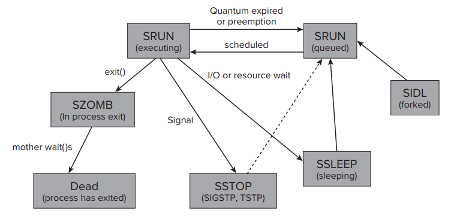
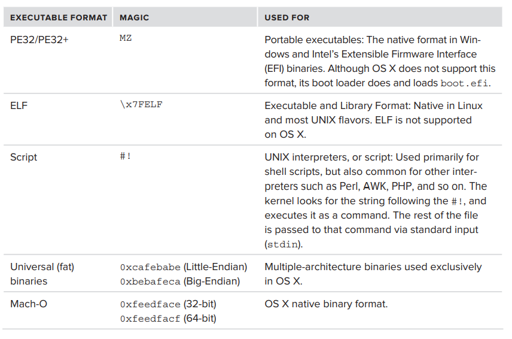
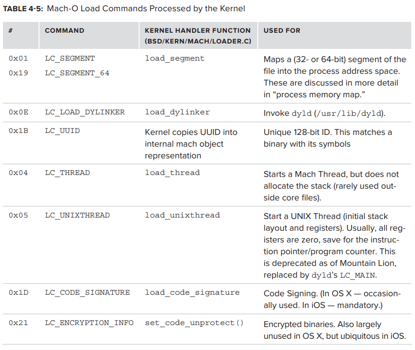
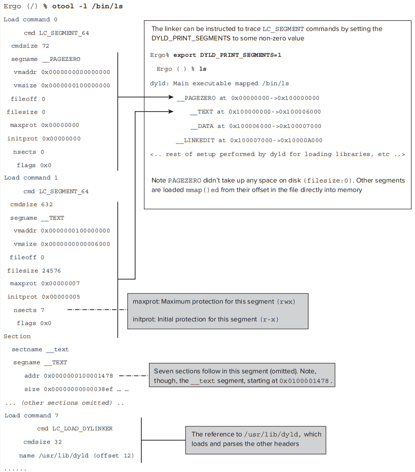
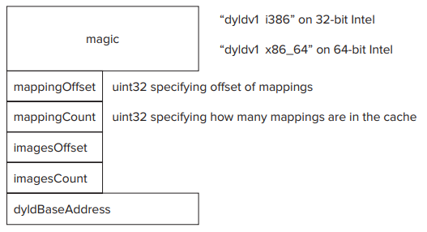

# CH.4 Parts of the Process

os는 application을 실행할 수 있는 platform으로 설계된다. 실행 중인 application의 각 instance는 process를 구성한다. 

이 장에서는 process에 대해 그들의 executable format 에서부터 memory에 load하는 과정, 그리고 그 결과인 memory image 까지 user mode 관점에서 설명한다.  
마지막으로 memory utilization 및 swapping에 관하여 system-wide 관점에서 virtual memory에 관한 논의하며 끝을 맺는다.

## A NOMENCLATURE REFRESHER

process의 implementation 방법에 대해 내부적으로 공부하기 이전에 UNIX에서의 process와 signal 기본 용어를 복습해본다.

### Processes and Treads

다른 pre-emptive multi-tasking system과 마찬가지로 UNIX에서 process는 executing program의 instance이다. 이러한 instance는 **Process ID\(PID\)** 에 의해 고유하게 정의되며, 동일 executable에 의해 multiple instance가 시작될 수 있지만 각각 다른 **PID** 를 가진다. 

  
process는 **setpgrp** 를 call하여 process group에 참여할 수 있는데, 이러한 group은 주로 user가 group에 signal을 send하여 하나 이상의 process를 control 할 수 있도록 하는데 사용된다. 

process는 **Parent Process Identifier\(PPID\)** 를 보존하여 parent process와의 kinship을 유지하는데, 이는 UNIX 에서 parent가 children보다 오래 사는 것이 표준이기 때문이다.   
process는 parent process에 의해 collect될 value를 return 한다는 뚜렷하고 명확한 삶의 의미를 지닌다. 이 return value는 process가 exit sytem call\(또는 main\(\) 함수의 return value\) 에게 전달하는 값이다.

modern os는 process를 operation의 basic unit으로 취급하지 않고 thread와 함께 작동한다. thread는 고유한 register state로, process에 여러개 존재할 수 있다. 모든 thread는 virtual memory space, descriptor, handle을 공유한다.

### The Process Lifecycle

* **SIDL** 은 _일시적으로 idle 상태인 process_ 를 나타내며, parent에 의해 fork된 직후의 process가 속한다. 이 상태에서 process는 _"initializing"_ 상태로, memory layout이 set up 되고 필요한 dependency가 load될 때 까지 어떤 signal에도 respond 하지 않고 아무런 action도 하지 않는다. 준비가 완료되고 **SIDL** 상태를 벗어나면 이후 다시 **SIDL** 상태가 될 수 없다.
* **SRUN** 은 _runnable_ 혹은 _running process_를 의미한다. cpu의 register가 process의 thread 중 하나에 속하는 것으로 load 되었을 때만 _running_ 상태이고, 이 외에는 running 가능하지만 cpu가 다른process를 처리하는 동안 실행 대기중인 _runnable_ 상태이다. running process는 time slice가 expire 되거나 higer priority process에게 밀려날 때 "kicked out" 되어 다시 queue로 돌아올 수 있다.  process는 I/O 등 resource를 기다리지 않는 한 최대한 긴 시간을 **SRUN** 상태에서 보낸다. resource를 기다리게 되면 해당 resource를 사용할 수 있을 때 까지 **SSLEEP** 상태가 된다.
* **SLEEP** 필요로 하는 resource를 사용할 수 있게 될 때 까지 _"put a sleep"_ 하여 대기한다. sleep 상태에서 signal에 의해 깨어날 수도 있다.
* **SSTOP** _TSTOP_, _TOSTOP_ 등의 특수 signal을 받아  process가 _"freeze"_ \(모든 스레드가 동시에 일시 중단\)되어 _"deep sleep"_ 에 빠진 상태이다.   이 상태에서는 _CONT_ 신호로만 재개할 수 있다.
* **SZOMB** process가 main\(\)에서 return 되거나 exit를 호출하면 memory에서 지워지고 종료되는데 이 작업을 수행하기 전 잠시 해당하는 상태
* **Dead** process가 memory에서 지워지고 종료된 상태

#### **The Zombie State**

process의 삶의 의미는 value를 parent에게 return하는 것이다. 따라서 process를 종료시킨다고 바로 종료되지 않고, wait\(\) call family\(wait\(\), waitpid\(\), wait3\(\), wait4\(\)\)에 의해 return 값이 parent에게 전달될 때 까지 **zombie state**로 남는다. 이 때 resource는 모두 반환하고 자신의 status만 유지한다.   
만약 parent가 먼저 끝날 경우 child는 **orphan process**가 되고, 이럴 경우 init process\(PID 1\)가 **orphan process**의 parent가 되어 관리한다.

#### **pid\_suspend and pid\_resume**

**pid\_suspend** 와 **pid\_resume** 이 Snow Leopard 부터 추가되었다.

* **pid\_suspend**: process를 "freeze" 시켜 **SSLEEP** 상태로 만든다.
* **pid\_resume**: process를 "thaw" 시켜 깨운다.

_STOP_/_CONT_ signal을 보내는 것과 유사해 보이지만 다르다.   
우선 pid\_suspend는 **SSTOP** 이 아니라 **SSLEEP** 상태로 만든다. 이 때 일반적인 "sleep" 처럼 보이지만 실제로는 더 깊은 상태이다\(mach task level에서 수행되기 때문에\).  
둘째, **pid\_suspend**를 반복 호출하여 일시 중단 횟수를 증가시킬 수 있다. 즉 **pid\_suspend**를 여러번 call하면 이후 process를 재개하기 위해 **pid\_resume**를 같은 횟수 만큼 call해야 한다.

### UNIX Signals

모든 UNIX system과 마찬가지로 OS X는 signal\(data를 포함하지 않거나 단일 bit의 data를 포함하는 asynchronous notification\)을 지원한다.  
OS X에는 31개 정도의 signal이 define되어 있으며 &lt;sys/signal.h&gt;에서 확인할 수 있다. signal number는 다른 UNIX system과 거의 유사하다.

#### **Process Basic Security**

UNIX는 security와 isolation을 모두 제공하기 위해  각 process별로 두 가지 primary credential을 유지한다: creator **user identifier\(UID\)**와 primary **group identifier\(GID\).  
real UID/GID, effective UID/GID** 도 UNIX와 마찬가지로 존재한다. 다만 _setfsuid_ /_setfsgid_는 지원하지 않는다.  
또한 Linux와 달리 OS X는 **Capability** 를 지원하지 않는다. 열성적으로 **Capability** mechanism을 채택한 Linux와 달리 POSIX는 도입했다 다시 제거한 관계로 OS X에서는 **Capability** 에 대한 지원이 의무화 되지 않았기 때문이다.  
**Capability** 대신 OS X는 sandbox compartmentalization mechanism에 사용되는 **entitlement** 를 지원한다. 

> **Capability?**  전통적인 super user\(root\) 기반의 system management privilege 를  좀 더 세분화 하여 보안 위협에 대처하고자 만들어진 보안 model 이다.   
> 특정한 관리 작업을 수행할 때 root가 가지고 있는 모든 privilege를 부여하는 것이 아니라 해당 작업에 필요한 privilege만 부여하면 설사 악의적인 user에게 control privilege를 넘겨주었다 하더라도 system의 피해를 최소화 할 수 있다.

## EXECUTABLES

특수하게 craft된 file을 memory에 load하면 process가 생성된다. 이 때 이 file은 os에서 이해하는 format이어야 하며, os는 file을 parse 하여 require 되는 dependency\(i.e libraries\) 를 설정하고, runtime environment를 initialize 하고 execution할 수 있다.   
이러한 특수한 file을 **executable** 이라고 부른다. file을 실행 시킬 때 kernel은 file을 memory로 ~~~~읽어들이고 정확한 executable format를 결정할 수 있도록 header signature\(**magic** 이라고 불림\)를 찾는다. magic은 binary format에 대한 hint를 제공하며, 해당 format을 지원할 경우 적절한 loader function이 invoke 된다.

> **magic?** header signature로 사용되는 predefine 된 임의의 상수 값.

위 표에 나와있는 다양한 executable format 중 OS X는 현재 아래 세 개의 format_\(interpreters/script, universal binaries, Mach-O\)_을 지원한다.  
interpreter는 실제로 _"진짜 binary"_를  pointing 하는 script일 뿐이므로 이 세가지 format중 _universal binaries, Mach-O_ 두 가지만 논의한다.

## UNIVERSAL BINARIES

원래 PowerPC 기반으로 만들어졌던 OS X를 intel architecture로 이식하면서 두 platform 모두에서 사용할 수 있는 program을 만들기 위한 방법으로 등장하였다.   
두 개의 상이한 architecture를 가진 platform을 하나의 binary로 지원하기 위해서 각각의 architecture를 위한 code가 분리되어 들어가있다. os에서 load시에 해당 architecture에 맞는 code\(Mach-O format\)를 찾아 실행한다.   
emulating 방식과는 다르게 성능 저하가 전혀 없지만, 두 platform을 위한 code가 모두 들어가므로 binary file의 용량이 더 커진다\(이 때문에 fat binary 라고 불리기도 \). 다만 두 code 중에서  architecture에 맞는 것 만을 실행시키므로 추가적인 ram 공간을 차지하지는 않는다.

> **lipo** : universal binary에서 특정 architecture를 지원하는 code만 뽑아낼 수  universal binary tool. architecture를 extracting, removing, 또는 replacing 하여 _"thin down"_ 시킬 수 있다.  
> 또한 fat header detail을 표시하는데에도 사용할 수 있다.

image는 page의 boundary에 맞게 optimize 되어있으므로 kernel은 header를 load하기 위해 binary의 첫 page만 read하면 된다. 첫 page를 읽어들여 header를 확인하면 다음으로 어떤 image를 load할지 결정할 수 있다.  
system은 processor와 가장 일치하는 **cputype** 및 **cpusubtype**\(위 그림의 fat\_arch 부분 참조\)으로 image를 선택한다\(**arch** command로 overridden 가능\). binary를 architecture에 matching 시키는 것은 _&lt;mach-o/arch.h&gt;_ 안의 function에 의해 수행된다.   
architecture는 **cputype, cpusubtype, byteordering** 을 hold 하고있는 **NXArchInfo** struct에 store 된다. **NXGetLocalArchInfo\(\)** 는 host의 architecture를 얻기 위하여 사용되며, **NXFindBestFatArch\(\)** 는 가장 일치하는 architecture\(일치하지 않을 경우 NULL\) return 한다.

### Mach-O Binaries

**ELF\(Executable and Library Format\)** 을 standard로 사용하는 UN\*X와 달리 OS X에서는 NeXTSTEP에서 유래된 자체 binary format인 **Mach-Object\(Mach-O\)** 를 유지한다.  
**Mach-O** format은 다음과 같은 fixed header로 시작한다. 

header는 32-bit 또는 64-bit architecture 용으로 신속하게 loader를 결정할 수 있는 **magic** 값으로 시작한다.  
**magic** 값 다음에는 **universal binary** header에서와 동일한 function을 제공하는 **cputype** 및 **cpusubtype** field가 있으며 binary가 해당 architecture 에서 execute 하기 적합하다는 것을 보장한다.   
그 외에는 32-bit와 64-bit architecture 사이의 header structure 에는 실질적인 차이가 없다.

여러 object type\(executable, library, core file, kernel extension\)에 동일한 binary format이 사용되므로 **filetype** field는 int로 되어있다.\(p.103, table 4-3\)

header는 또한 &lt;mach-o/loader.h&gt;에 define된 중요한 flag를 포함하고 있다. \(p.104, table 4-4\)

> execution과 관련된 두 flag **MH\_ALLOW\_STACK\_EXECUTION,  MH\_NO\_HEAP\_EXECUTION** 이 있는데, 이 두 flag는 모두 **NX\(Non-eXecutable\)** 이라는 data execution 방지와 관련되어있다.  
> data와 관련된 page들을 non-executable로 만들면 hacker는 data segment에서 code를 execute 시킬 수 없으므로 code injection을 할 수 없다.

code injection의 일반적인 technique은 stack\(또는 automatic\) variable에 의한 것이기 때문에 stack은 default로 non-executable 이고, heap은 stack에 비해 code를 inject 하기 더 힘들다고 간주되기 때문에 executable이 default로 되어있다.  
**vm.allow\_stack\_exec, vm.allow\_heap\_exec** variable을 **sysctl** 을 사용하여 system-wide 하게 두 설정을 모두 setting 할 수 있다.

Mach-O header의 main funcionality는 load command 이다. 이들은 header 바로 다음에 지정되며 두 개의 field\(**ncmds, sizeofncmds**\)가 parsing에 사용된다.

### Load Comands

Mach-O header에는 binary가 invoke될 때 binary를 set up 하고 load 하는 아주 detail한 instruction이 포함되어 있다.  
이 instructions, 또는 _"load commans"_는 basic mach\_header 바로 다음에 위치한다.  
각 command 자체는 type-length-value 이다: 32-bit **cmd** value는 type, 32-bit value **cmdsize** \(32-bit는 4의 배수, 64-bit는 8의 배수\) 및 command \(**cmdsize** 에 저장된 임의의 **len**\)은 다음과 같다.  
이러한 command 중 일부는 kernel loader\(_bsd/kern/mach\_loader.c_\)에 의해 직접 load 되고, 나머지는 dynamic linker에 의해 handle된다.

loading process의 kernel 부분은 virtual memory allocate, main thread create, potential code signing/encryption 이다.   
그러나 dynamically link된 대부분의 executable의 경우 **LC\_LOAD\_DYLINKER** command에 의해 실제 library load 및 symbol resolve가 user mode 상에서 handle 된다. control은 linker로 transfer 되어 header의 다른 load command를 추가적으로 처리한다.

#### **LC\_SEGMENT and the Process Virtual Memory Setup**

main load command는 **LC\_SEGMENT/LC\_SEGMENT64** commands로, kernel에 새로 실행된 process의 memory space를 set up 하는 방법을 지시한다. 이 _"segments"_는 Mach-O binary에서 memory로 직접 load되며, segment layout에 필요한 detail을 모두 제한다.

따라서 process의 virtual memory를 설정하면 **LC\_SEGMENT** command를 따르는 간단한 operation이 된다. 각 segment에 대해 memory는 file로부터 load한다: offset **fileoff** 에서 **filesize** bytes로, **vmsize** byte에서 **vmaddr** address로.  
각 segment의 page는 **initprot**에 따라 초기화 되며, read/write/execute bits로 initial page protection을 지정한다. 이는 dynamically change될 수 있지만, **maxprot** 에 지정된 값을 초과할 수 없다.  
**LC\_SEGMENT** 는 **\_\_PAGEZERO** \(NULL pointer trap\), **\_\_TEXT** \(program code\), **\_\_DATA** \(program data\) 및 **\_\_LINKEDIT** \(linker에서 사용되는 symbol 및 기타 table\)에 제공된다.   
segment는 optional 하게 section으로 더 분할될 수 있다.\(p.108, table 4-7\)

segment에는 &lt;mach/loader.h&gt;에 define된 특정 flag가 set 되어있을 수 있는데, 이러한 flag중 하나는 \***SG\_PROTECTED\_VERSION\_1** 이며 segment page가 "protected" \(즉, encrypted\)되어 있음을 나타낸다. Apple은 이 기술을 사용하여 binary를 encrypt 한다.  
이 code encryption을 가능하게 하기 위해서 XNU는 **Apple protect** 라는 특정 \(external\) virtual memory manager를 포함한다. 

#### **LC\_UNIXTHREAD**

모든 library가 load되면 **dyld** 의 job이 완료되며, **LC\_UNIXTHREAD** command 는 binary의 main thread를 시작하는 책임이 있다. \(따라서 executable에는 있지만 library 같은 다른 binary에는 없음\)  

#### **LC\_THREAD**

**LC\_UNIXTHREAD** 와 유사하게 **LC\_THREAD** 는 core file에 사용된다. Mach-O core file은 process의 memory image를 설정하는 **LC\_SEGMENT/LC\_SEGMENT\_64** command collection과 final **LC\_THREAD** 이다.   
**LC\_THREAD** 에는 각 machine state\(thread, float, exception 등\)에 대한 여러 "flavor"가 포함된다.

#### **LC\_MAIN**

Mountain Lion에서 **LC\_MAIN** 은 새로운 load command로 **LC\_UNIXTHREAD** command를 대체한다. program의 main thread의 entry point 및 stack size 설정에 사용되며, program counter에 대해 저장된 모든 register가 0으로 설정되므로 **LC\_UNIXTHREAD** 를 사용하는 것 보다 더 의미 있다.

#### **LC\_CODE\_SIGNATURE**

Mach-O binary는 digital sign이 가능하다.   
**codesign** utility를 사용하여 code sign을 manipulate하고 display 할 수 있다. **LC\_CODE\_SIGNATURE** 에는 Mach-O binary의 code sign이 포함되어 있으며 code와 mismatch될 경우 **SIGKILL** 을 사용하여 kernel에 의해 즉시 종료된다.  
OS X와 iOS에는 code sign operation을 위한 특수 system call인 **csops** 가 포함되어 있다.

## DYNAMIC LIBRARIES

거의 모든 executable은 standalone이 아니다. 정적으로 link된 극소수의 file을 제외하고 대부분의 executable은 os의 일부로서, 또는 third parties에 의해 제공되는 pre-existing libraries에 의존하여 dynamical하게 link 된다.

이번 section에서는 library loading process\(application이 launch 될 때나 runtime 중\)에 대해 논의한다. 

### Launch-Time Loading of Libraries

이전 section에서는 kernel loader_\(bsd/kern/machine\_loader.c\)_가 segment 및 기타 directive에 따라 process address space를 initialize 하기 위해 수행한 setup을 다루었다.   
그러나 이것은 매우 적은 수의 process에게만 충분한데, 왜냐하면 사실상 모든 OS X의 program이 dynamical하게 link되어있기 때문이다.   
이 말인 즉 Mach-O image가 program이 launch될 때 resolve 되는 _"hole"_\(external libraries 및 symbols\)로 가득 차 있다는 의미이다.   
이것은 dynamic linker를 위한 일로, 이 과정을 symbol _"binding"_ 이라고도 한다.   
dynamic linker는 **LC\_DYLINKER** load command를 실행한 후 kernel에 의해 시작되는데, 이 command에 대한 argument로 어떤 program이던 사용 가능하지만 일반적으로 _/usr/lib/dyld_를 지정한다.   
kernel이 process의 entry point를 linker의 entry point로 setting하기 때문에, linker는 새로 시작된 process를 control 한다고 가정한다.  
linker의 job은 _"hole을 메우는 것"_ 으로,  어떤 symbol이나 library dependency를 찾아내어 resolve 하는것인데, library가 또 다른 library에 대해 dependency하고 있는 경우가 많으므로 recursive하게 행해져야 한다.

> **dyld** 는 kernel의 일부가 아니라 그냥 user mode process이다.   
> 따라서 **dyld** 는 pluggable component로, third party linker로 대체될 수 있다.  
> user mode에 있긴 하지만 link editor는 process를 load 하는데에 매우 중요한 역할을 한다. library를 kernel mode에서 load 하는 것은 user mode에서 하는 경우보다 훨씬 어려울 것인데, 왜냐하면 user mode 에서 볼 수 있는 file이 kernel mode에 존재하지 않기 때문이다.

linker는 관심 있는 특정 load command \(아래 표 참조\) 에 대해 Mach-O header를 scan한다.

외부에서 define된 function 및 symbol을 사용하는 binary text segment에 undefined symbols를 위한 placeholder가 있는 section\(\_stubs\)가 있다. code는 symbol stub section에 대한 call과 함께 generate 되며, runtime 동안 linker에  resolve 된다.   
linker는 call address에 **JMP** instruction 을 배치하여 resolve 한다. **JMP** 는 control을 real function의 body로 옮기지만 stack을 modify 하지 않으므로 real function은 마치 direct로 call 된 것 처럼 정상적으로 return될 수 있다.  
**LC\_LOAD\_DYLIB** command는 symbol을 찾을 수 있는 위치를 linker에게 지시한다. 지정된 각 library가 load 되고 matching되는 symbol이 search 된다. link될 library는 symbol name과 address를 link되어 있는 **symbol table**을 가지고 있다.  
**LC\_SYMTAB** load command로 지정된 **symoff** 의 Mach-O object 에서 address를 찾을 수 있다. 해당 symbol name은 **stroff** 에 있으며, 총 **nsyms** 만큼 있다.   

_다른 모든 UN\*X와 마찬가지로 Mach-O library 들은 /usr/lib 에 위치해있다. 그러나 UN\*X와 OS X간에는 두가지 주요 차이점이 존재한다:_

* Library가 **"shared objects"\(.so\)** 가 아니다.OS X는 ELF 와 호환되지 않으며,이러한 concept가 Mach-O 에는 없기 때문에 OS X에서는 _.dylib extension_을 가진 **"dynamic library"** file 이다. 
* **libc**가 없다. _/usr/lib/libc.dylib_는 **libSystem.B.dylib** 에 대한 symbolic link로만 존재하고, **libSystem** 이 **LibC**의 기능과 추가 기능\(UN\*X 에서는 별도의 library들에서 제공하는 것들\) 을 제공한다.

**libSystem** 은 system, C, C++, Objective-C 등의 모든 binary에 대한 전제 조건이다. 왜냐하면 **libSystem** 은 lower-level system call들과 kernel service들에 대한 interface 역할을 하여, 이것 없이는 아무것도 할 수 없기 때문이다. 실제로 _/usr/lib/system_의 다양한 library에 대한 umbrella library 역할을 하며, **LC\_REEXPORT\_LIB** load command를 이용하여 re-export 한다.

#### **Shared Library Caches**

**dyld** 가 지원하는 또다른 mechanism은 **shared library cache** 이다. 이 것들은 pre-link 되어 disk 상의 한 file에 저장된 library 이다. OS X의 경우 **dyld** shared cache는 _/private/var/db/dyld_ 에 있다. 또한 OS X에서는 iOS와 다르게 .map file도 제공된다.

shared cache는 매우 커질 수 있다. OS X의 경우 200개가 넘는 file이 있다. 

### Runtime Loading of Libraries

일반적으로 developer는 다양한 header를 \#include 할 때 사용할 library와 symbol을 declare 하고, 선택적으로 -l을 사용하여 linker에 additional library를 지정한다. 이러한 방식으로 build한 executable은 dependency가 resolve 될 때 까지 load 되지 않는다.   
대안은, **&lt;dlfcn.h&gt;**  에서 제공하는 function을 사용하여 runtime 중 library를 load하는 것 이다. 이 방식을 이용하면 유연성이 향상되는데, compile time에는 library 이름을 commit 하거나 알리면 된다. 이렇게 하 developer는  여러개의 library를 준비하고 runtime 동안의 특징이나 requirement에 따라 가장 적절한 library를 load할 수 있다. 또한 load 실패시 error code를 return하여 program에서 이를 처리할 수 있다.

OS X에서 runtime dynamic library loading을 위한 API는 POSIX에서의 API와 유사해 보이지만, 구현 면에 있어서는 완전히 다른 방식이다.

* **dlopen\(const char \***_**path**_**\)** 은 _path_로 지정된 library 또는 bundle을 찾아 load하는데 사용된다. 
* **dlopen\_preflight\(const char \*path\)** 는 **dlopen\(\)** 의 loading process를 simulate 하지만 실제로는 아무것도 load하지 않는다. 
* **dlsym\(void \*handle, char \*sym\)** 은 **dlopen\(\)** 에 의해 이전에 열린 handle에서 symbol을 찾을 때 이용한다. 
* **dladdr\(char \*addr, Dl\_info \*info\)** 는 주소  addr에 있는 bundle 또는 library의 name으로 **DL\_Info** structure를 채운다. - _GNU extension과 동일_ 
* **dlerror\(\)** 는 다른 function에 의해 error가 발생한 경우 error message를 제공하는 데 사용된다.

**cocoa**는 _dl\* function family_와 _Mach-O bundle file_을 load하는 데 사용할 수 있는 **CFBundle / NSBundle** object를 위한 higer-level wrapper를 제공한다.  
program 자체에서 load된 library 및 symbol을 확인하는 한 가지 방법은 &lt;mach-o/dyld.h&gt; 에 정의된 low-level dyld API를 사용하는 것이다. header는 또한 image load 및 removal 시 callback mechanism을 define한다.   
**dyld** API 는 dl\* API\(특히 **dladdr\(\)**\)와 함께 사용할 수 있다.

#### **Weakly Defined Symbols**

OS X의 흥미로운 기능은 symbol을 "weak"한 것으로 define할 수 있다는 것이다. 일반적으로 symbols은 strongly define 되므로, executable을 시작하기 전에 모두 resolve 되어야 하고 그러지 못할 경우 program execute에 실패하게 된다\(보통 debugger trap의 형태\). 

반대로 **\_\_attribute\_\_**\(weak\_import를 declaration에 지정하여 define할 수 있는\) **weak symbol**은 resolve 되지 않아도 program linkage에 실패하지 않으며 대신 dynamic linker 에서 이를 NULL로 setting하여 programmer가 recover 하고 condition을 handle할 수 있는 몇가지 alternative logic을 지정할 수 있게 한다. 이는 dynamic loading 에 사용되는 modus operndi와 유사하다\(**dlopen\(\)** 또는 **dlsym\(\)** 이 NULL을 return 하는 것과 같은 효과\). 

-m switch와 함께 nm을 사용하면 weak symbol을 _"weak"_ specifier와 함께 display할 수 있다.

### dyld Features

**dyld** 에서 제공하는 고유 기능 중 유용한 몇 가지를 알아본다.

#### **Two-Level Namespace**

기존 UN\*X **ld**와 달리 OS X **dyld** 는 two-level namespace를 사용할 수 있다\(symbol name에 library information도 포함됨\). 이 접근법은 두 개의 서로 다른 library가 동일한 symbol을 export 하도록 허용하므로 유용하다\(다른 UN\*X에서는 link error가 발생할 수 있음\).   
function hooking을 위해서 동일한 symbol name을 가진 다른 library를 inject 하려는 경우 처럼 flat namespace를 restrict 해야 할 경우, **DYLD\_FORCE\_FLAT\_NAMESPACE environment variable**을 non-zero로 설정하면 된다. executable은 header에 **MH\_FORCE\_FLAT** flag를 setting하여 모든 load된 library에 flat namespace를 강제할 수 있다.

#### **Function Interposing**

classic **ld** 에 없는 ****또 다른 기능은 **function interposing** 이다. macro **DYLD\_INTERPOSE** 를 사용하면 library가 다른 function 에 대한 function interpose\(switch\) 할 수 있다.

interposing은 단순히 **\_\_interpose** 라는 새로운 **\_\_DATA** section을 제공하는것으로 구성되며, 이 section에는 interposing 및 interposed가 연속적으로 list 되어있다. 나머지는 **dyld** 가 모두 처리한다.

> **GuardMalloc** library_\(/usr/lib/libgmalloc.dylib\)_ : 이 library는 **interposing** 을 사용하는 좋은 예시로, **libSystem.B.dylib** 의 **malloc\(\)** 관련 기능을 자체 구현으로 대체하여 강력한 debugging 및 memory error tracing 기능을 제공한다.  
> **DYLD\_INSERT\_LIBRARIES** variable을 setting하여 library를 우선적으로 application에 강제 inject 할 수 있다.

interpose mechanism은 매우 강력하다.   
예를들어, file system access의 monitoring 및 virtualization의 얇은 layer 제공을 위해 open\(\) 및 close\(\)와 같은 function을 intercept 하려고 function interpose를 쉽게 사용할 수 있다\(다른 모든 operation은 file descriptor를 사용하므로 open operation 중에 다른 file로 redirecting 함\).

#### **Environment Varibles**

OS X **dyld** 는 configuration이 매우 용이하며 environment variable을 사용하여 modify 할 수 있다.

* **DYLD\_FORCE\_FLAT\_NAMESPACE:** \(insert의 경우\) library의 two-level namespace를 disable. 그렇지 않으면 symbol name에도 library name이 포함. 
* **DYLD\_IGNORE\_PREBINDING:** performance test 를 위해 prebinding을 disable. 
* **DYLD\_IMAGE\_SUFFIX:** 이 suffix로 library를 search.  **libSystem** 대신에 _/usr/lib/libSystem.B\_debug.dylib_ 또는 _/usr/lib/libSystem.B\_profile_ 을 load 하려면 일반적으로 **\_debug** 또는 __**\_profile**로 setting. 
* **DYLD\_INSERT\_LIBRARIES:** program loading시 하나 이상의 library를 강제로 insertion\(UN\*X의 lD\_PRELOAD와 동일\). 
* **DYLD\_LIBRARY\_PATH:** UN\*X의 **LD\_LIBRARY\_PATH** 와 동일. 
* **DYLD\_FALLBACK\_LIBRARY\_PATH:** **DYLD\_LIBRARY\_PATH** 가 시래할 때 사용. 
* **DYLD\_FRAMEWORK\_PATH:** **DYLD\_LIBRARY\_PATH** 와 같지만 framework 용. 
* **DYLD\_FALLBACK\_FRAMEWORK\_PATH:** **DYLD\_FRAMEWORK\_PATH** 가 실패 할 때 사용.

**dyld** 의 debug printing control option은 다음과 같다.

* **DYLD\_PRINT\_APIS: dyld** API call dump**\(**i.e. **dlopen\).** 
* **DYLD\_PRINT\_BINDINGS:** dump symbol binding. 
* **DYlD\_PRINT\_ENV:** 초기 environment variable을 dump. 
* **DYLD\_PRINT\_INITIALIZERS:** dump library initialization\(entry point\) calls. 
* **DYLD\_PRINT\_LIBRARIES:** library가 load될 때 표시. 
* **DYLD\_PRINT\_LIBRARIES\_POST\_LAUNCH:** load 후, dynamical하게 load된 library를 표시. 
* **DYLD\_PRINT\_SEGMENTS:** dump segment mapping. 
* **DYLD\_PRINT\_STATISTICS:** runtime statistics를 표시. 

## PROCESS ADDRESS SPACE

user mode의 benefit 중 하나는 isolate된 virtual memory 이다. process는 4GB\(32-bit OS X의 경우\), 16 exabyte\(64-bit OS X\) 의 private address space를 사용할 수 있다.   
앞 section에서 논의한 바와 같이, 이 address space는 다양한 **LC\_SEGMENT** command 를 사용하여  executable과 다양한 libraries 들로 채워진다. 이번 section에서는 address space layout에 대해 detail하게 알아본다.

### The Process Entry Point

작성중...

