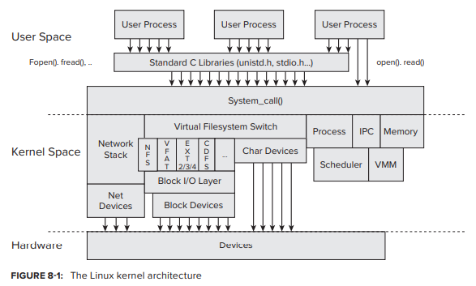
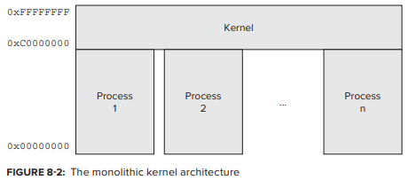
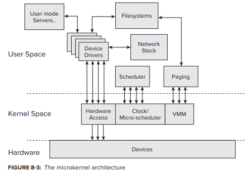
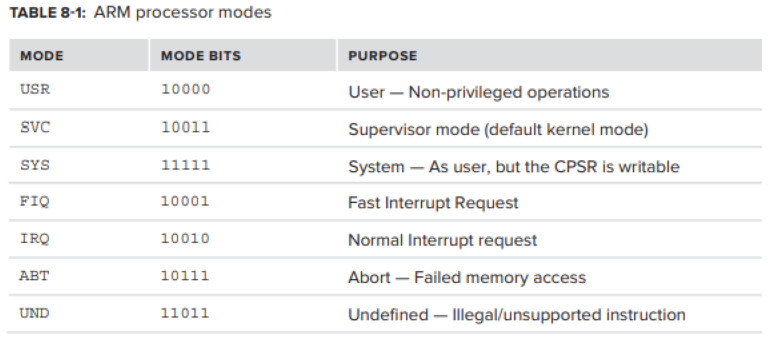

# CH.8 Some Assembly Required

kernel은 모든 운영 체제 에서 가장 중요한 부분이다. 따라서 CPU의 모든 기능을 활용하려면 고도로 최적화되어야 한다. 대부분의 경우 kernel은 code를 유지 관리 하면서 기계에 최대한 가깝게하기 위해 C로 작성된다. 그러나 어떤 경우에는 더 깊이 들어가 assembly를 사용하는 것 외에는 선택의 여지가 없다. 

따라서 이 장에서는 Intel과 ARM 의 assembly에 대해 각각 간략하게 살펴본다.

## KERNEL BASICS

모든 현 운영 체제는 설계에 kernel이라는 component를 통합한다. 이 것은 system의 가장 핵심으로, kernel은 운영 체제 그 자체라고 할 수 있다.   
high-level view에서 보면 word processor에서 game에 이르기까지 우리가 실행하는 모든 application은 모두 다양한 서비스나 system call을 kernel에게 제공받는 client이다. 

개발자가 매번 device 및 file access에 필요한 code를 처음부터 다시 구축해야 한다면 program 규모와 소요 시간이 너무 늘어날 것 이다. 따라서 개발자가 동일한 운영체제에서 다른 유형의 하드웨어들에 대해 모두 작동 가능한 code를 작성할 수 있는 어느 정도의 abstraction이 필요하다. 따라서 kernel은 virtualization level을 제공하며, 이는 abstract object\(특히 **virtual memory, network interface, generic device**\)를 다루는 API에 의해 이뤄진다.

kernel은 scheduler 역할도 한다. 모든 현 운영 체제는 **preemptive multitasking system** 이며, 여러 program 또는 task를 동시에 실행할 수 있는 multitasking을 의미한다. 그러나 실제로 program 수는 processor\(or core\) 수 보다 훨씬 많다. 따라서 kernel은 어떤 program\(process or thread\)이 어떤 processor / core 에서 실행될 수 있는지 결정해야 한다.

kernel은 arbiter로, program이 hard drive, display, 또는 network adapter와 같은 shared device에 access 하려고 할 때 access conflict나 bottleneck을 방지하기 위해 scheduling form이 있어야 한다.

kernel이 제공하는 또 다른 service set는 security service로, 사용자는 흔히 permission과 right로 인식하며 이것들은 system의 다양한 자원의 integrity, privacy 및 fair use를 보장하기 위한 mechanism 이다. arbitration에 추가된 layer로서 잠재적으로 민감한 operation\(그리고 실질적으로 모든 system resource에 대한 access\)은 먼저 security check를 통과해야 한다. kernel은 system administrator가 직접 실제 permission을 전환 및 조정할 수 있지만, kernel은 먼저 해당 checking을 수행하고 나서 다양한 permission을 적용해야 한다.

### Kernel Architectures

일반적으로 세 가지 유형의 kernel 있다.

#### **Monolithic Kernels**

**monolithic architecture** 는 "classic" kernel architecture 으로, 여전히 UNIX 및 LINUX 에서 대세이다.   
monolithic kernel은 모든 kernel function을 하나의 address space에 두는 방식을 따르낟. 이러한 방식으로 thread scheduling 및 memory management는 file system, security management, device drivers, security management 와 함께 압된다.  

모든 kernel 기능은 동일한 address space에서 구현된다. 더욱 최적화 하기 위해서 monolithic kernel은 모든 기능을 동일한 address space에 mapping할 뿐 아니라 해당 address space를 모든 process의 memory에 추가로 매핑한다.  
예를들어 linux의 경우 32-bit application에서 4GB의 addressable memory 중 kernel 이름으로 1GB가 소모된다. \(Windows는 2GB 소모\)사용자 모드에서 메모리에 엑세스 할 수 없으므로 0xC0000000\(Windows: 0x80000000\) 이상의 주소에 대한 포인터 설정 시도시 메모리 위반\(세그먼트 에러\) 발생한다.  

32-bit mode에서 전체 가용 용량의 1/4를 차지하는 메모리를 희생하면서도 kernel을 각 application의 address space에 올리는 것은 이것이 그만큼의 이점을 주기 때문이다. 실제로 monolithic architecture에서 user mode와 kernel mode 간 전환하는 것은 thread switch 만큼밖에 cost가 소모되지 않아 매우 효율적이다. 이는 kernel의 memory page가 모든 process에 상주하기 대문에 kernel/user hardware 강제 분리를 제외하고 두 가지 사이에 실제로 차이가 없기 때문이다. owner나 function에 관계없이 모든 process에는 shared library의 copy가 포함되어 있는 것 처럼 kernel memory의 copy가 포함되어 있다. 또한 이러한 copy는 모두 동일한 physical page set에 mapping이 된다. 이것은 RAM을 절약할 뿐 아니라 system call 수행과 관련된 상당한 비용\(pace fault 등\)이 발생하지 않음을 의미한다. 이것은 user code의 system call의 편재성을 고려할 때 특히 중요하다.

64-bit architecture에서는 top 40-48bit를 사용한다\(OS 구성에 따라 1-256TB의 virtual memory\). 그러나 32-bit의 경우와는 달리 굉장히 큰 virtual address space를 가지고, RAM 만으로는 이걸 전부 다룰 수도 없기 때문에 제한적이지 않다.

#### **Microkernels**

micro kernel은 최소한의 code  base 에서 core kernel 기능으로만 구성된다. 중요한 작업\(일반적으로 task scheduling과 memory management\)만 kernel에서 적절하게 수행되고 나머지 기능은 외부\(보통 user mode\) server로 내보내진다. 개별 server들 사이에는 완전한 격리가 이뤄지고, 이들 사이의 모든 communication은 message 전달에 의해 수행된다.  

microkernel의 첫번째 이점은 정확성이다. 작은 code base  이므로 모든 code path를 통과하여 올바른 기능을 확인할 수 있다.  
다음은 안정성과 견고성으로, microkernel에 가능한 실패 지점이 거의 없기 때문이다. 또한 모든 추가 기능이 외부 및 독립 server에 있기 때문에 문제 발생시 영향을 받는 서버 component만 다시 시작하면 된다.   
또 다른 장점은 유연성, 다양한 platform과 architecture에 대한 적응성이다. 기능이 잘 정의되어 있기 때문에 다른 architecture로 이식하는 것이 비교적 간단하다. 또한 이론적으로 이것은 message 전달이 단일 mode로 제한되어야 한다는 제약이 없기 때문에 remote component\(network based operating system\)으로 확장될 수 있다.

하지만 이 모든 장점을 능가하는 단점이 하나 있으니, 바로 성능이다. microkernel message 전달은 memory-copy operation과 여러 context-switch operation으로 번역되는데, 두 작업 모두 computational speed 면에서 저렴하지 않다.   
이러한 문제로 인해서 "pure" microkernel은 상업적으로 잘 사용되지 않으며 제 3의 접근 방식, hybridization을 필요로 한다.

#### **Hybrid Kernels**

hybrid kernel은 두 가지 장점을 종합하려고 시도한다.  
가장 낮은 수준의 scheduling, inter-process communication, virtual memory 를 지원하는 kernel의 가장 안쪽 core는 microkernel 처럼 독립적으로 존재한다. 다른 모든 service는 이 core 외부에서 구현되지만 kernel mode 로 core와 독일한 memory space에서 구현된다.   
kernel 안에 하나의 작은 자율적인 core가 존재한다고 볼 수도 있다.   
그러나 실제 microkernel design과 달리 message passing을 요구하지 않는다. "kernel-within"은 self-contained modular executable이므로 다른 component service 요청을 받을  있지만, call out을 하지는 않는다.  
그러나 hybrid kernel은 monolithic의 효율성을 대가로 하여 microkernel의 견고성을 잃었다.

> 기술적으로 XNU는 hybrid kernel이다. window도 hybrid로 분류할 수 있지만 그 둘 간의 차이가 너무나 커서 "hybrid"라는 용어를 사용하여 두 가지를 모두 설명하기는 어렵다. window 에는 core 같은 micro kernel이 들어 잇지만, executive인 **MTOSKRNL**\(도는 **NTKRNLPA**\) 자체는 monolithic kernel에 가깝다. kernel API는 Ke prefixed 함수\(kernel core\)와 나머지 모든 기능을 구별하지만, 전부 다 동일한 address space에 잇다. kernel space는 기본적으로 모든 process의 상위 2GB에 예약된다\(64-bit mode에서는 44또는 48 bit\). driver의 bug와 같은 kernel mode crash는 UNIX의 **kernel panic**과 마찬가지로 "Blue Screen Of Death\(**BSOD**\)"로 이어진다. 
>
> OS X의 XNU도 hybrid지만 window보다 microkernel에 더 근접해 있다. 핵심인 mach는 원래 진정한 microkernel 이었고, 원초적 요소들은 message passing 기반을 중심으로 만들어져있다. 그러나 이 message 들은 비싼 copy operation 필요 없이 포인터로 전다로딜 수 있다. 이는 현재 대부분의 server가 동일한 address space 에서 실행되고 있기 때문이다. 마찬가지로 Mach 위에 있는 BSD layer도 같은 address space에 존재한다.

## USER MODE VERSUS KERNEL MODE

kernel은 신뢰할 수 있는 system component 이다. 가장 중요한 기능을 제어하기 때문에 kernel 기능과 application 이 엄격하게 분리되어 있어야 한다. 그렇지 않으면 application의 불안정으로 인해 system 이 down될 수 있다. 또한 엄격한 분리를 시행할 때 software-based는 성능 측면에서 비용이 많이 들고 신뢰할 수 없기 때문에 hardware-based로 시행되어야 한다.

### Intel Architecture - Rings

Intel-based system은 요구되는 hardware based separation을 제공한다. Intel은 286을 시작으로 "protected mode"라는 개념을 도입했다. Intel x86은 여전히 "real mode"\(호환성을 위해\)로 booting 되지만, 모든 kernel은 startup 시 CPU를 protected mode로 전환한다. 이는 special-purpose Control Register **CR0** 를 setting하고 least-significant bit\(최하위 비트\)를 toggle하여 달성한다. 이 operation은 항상 assembly instruction으로 수행되며 C및 다른 언어에서는 control register에 access할 수 없다. XNU에서 그런 동작을 하는 code는 i386, x86\_64 모두 start.s에 있다.

> **real mode?** virtual memory 안쓰고 바로 physical memory로 mapping되는 mode

> **protected mode?** kernel mode/user mode 분리를 구현하고, memory protect 기능과 paging mechanism 등을 통해 virtual memory를 효율적으로 구현한다. interrupt나 예외 처리, task switching 등도 모두 protected mode에서 지원하는 기능을 활용한다.

> **CR0?** 운영 모드를 제어하는 register. real mode에서 protected mode로 전환하는 역할. cache, paging 기능 등을 enable.

protected mode에서는 4개의 "rings"을 적용한다. 이 ring들은 0~3사이의 숫자를 가지는 privilege level이다. 이것들은 concentric fashion\(동심원 방식\)으로 modeling 되며, 가장 바깥이 3, 가장 안쪽이 0이다. ring 0는 가장 민감하며, Supervisor mode라고 불린다. ring 0로 실행 되는 processor의 code는 가장 신뢰할 수 있으며, 사실상 전능하다. ring level이 증가할 수록 보안 제한도 커지고 권한은 줄어들어 ring 3의 code가 가장 신뢰성이 떨어지고 가장 제한적이다. ring 1,2는 운영체제 service 용으로 reserve 되어있지만 실제로는 사용되지 않는다. ring은 **CS** register의 2 bit와 **EFLAGS** register의 2 bit로 구현되어 thread 상태의 일부로 "user privilege level" 과 "current privilege level"을 설정한다. 따라서 kernel code에서 **CS** register와 0x3\(==0b11\) bitwise-AND 연산을 통해  kernel entry의 user/kernel mode를 check 하는 것은 드문 일이 아니다.

특정 assembly instruction은 ring 0 이외의 위치에서는 허용되지 않는다. 여기에는 hardware에 대한 direct access, control register manipulate, protected memory regions에 대한 access 및 기타 여러가지가 포함된다. program이 이런 operation을 execute하려고 하면 CPU가 general protection fault\(Interrupt \#13\)를 생성하고 해당 code의 추가 execution은 금지된다\(hardware level에서 protected mode가 수행되지 않으면 control register에 access 할 수 있는 모든 program이 ring 간에 switch 될 수 있다\). 하위 ring의 code는 쉽게 상위 ring으로 switch 할 수 있지만 call gate mechanism이 이전에 하위 ring에 의해 설정되지 않은 경우 상위에서 하위 ring으로 이동하는 것은 불가능하다. 

#### **ARM Architecture: CPSR**

ARM processor는 special register, **CPSR**\(current program status register\)를 사용하여 현재 모드를 정의한다. processor는 7가지의 고유한 operation mode를 갖지만 아래 표에서 알 수 있듯 명확한 이분법이 있다.  

**USR** 이 유일한 non-privileged mode 이다. 나머지 모드는 모두 privileged 이고, 그 중에서 kernel은 일반적으로 **SVC** 로 동작한다.   
모든 privileged mode에서 **CPSR**에 직접 access 할 수 있기 때문에, mode를 switching 하는 것은 mode bit를 setting 하는 것 만큼 간단하다. user mode를 위해서 user/kernel transition mechanism 중 하나를 사용해야 한다.   
**IRQ** 및 **FIQ** 의 다른 mode는 interrupt 처리에 사용된다.\(ARM은 normal interrupt와 fast interrupt를 구분한다. **IRQ** mode에서 normal interrupt는 masking 되지만 fast interrupt는 여전히 processor를 interrupt 할 수 있다. **FIQ** mode 에서는 두 interrupt가 모두 masking 된다.\)  
**ABT** 는 memory fault 에서만 사용되고, **UND** 는 illegal 하거나 unsupported 한 operation에 사용되므로 predefined handler가 hardware native로 support하지 않는 모든 instruction을 대신하여 emulate 할 수 있다.

## KERNEL/USER TRANSITION MECHANISMS

작성중...

