# CH.9 From the Cradle to the Grave

이번 chapter에서는 kernel source를 line by line으로 살펴보며 kernel이 system을 initializing할 때 취하는 step을 따라가본다.

또한 처리되지 않은 CPU trap, 또는 기타 예기치 않은 kernel code path 로 인해 "**panic**"이 발생하는 경우 일어나는 kernel의 premature demise에 대해 설명한다.


## THE XNU SOURCES

이 section에서는 XNU를 얻고 compile 하는 데 필요한 step에 대해서 설명한다. 


### Getting the Sources

Apple은 CMU의 Open Source Mach project를 합병한 이후 XNU open source를 _선택적으로_ 유지했다. 여기서 _'선택적'_ 으로 유지했다는 의미는 Apple이 OS X compile version만 발표하기 때문이다. iOS의 경우는 closed source로 유지하고 있다. 

여기서 제공되는 source code는 XNU 1699.26.8 에서 발췌한 것으로, [http://opensource.apple.com/tarballs/xnu/xnu-1699.26.8.tar.gz](http://opensource.apple.com/tarballs/xnu/xnu-1699.26.8.tar.gz) 에서 tarball로 다운로드 하고 unpack\(tar zxcf를 사용\) 할 수 있다. 

### 

### Making XNU

Apple의 developer tool이 install 되어 있다면, XNU를 compile 하는데서 겨우 한걸음 떨어져 있는 것이다. 이것은 꽤 간단하지만 긴 시간이 걸리고, 하지만 결국 그럴 만한 가치가 있는 일이다. compile을 하면 booting process의 각각, 그리고 전체 stage를 직접 볼 수 있다. debugging 및 logging message 뿐만 아니라 선택적으로 comment나 \#ifdef 부분을 삽입할 수 있다. XNU에는 이미 code에 포함된 수 많은 debugging information이 있으며, compile 할 때 간단히 \#define DBG\(또는 -DDBG\)을 덧붙여서 드러낼 수 있다. 

developer tool을 사용하여 Intel 32-bit 또는 64-bit architecture용 XNU를 compile 할 수 있다.  
다음에 열거되는 전제 조건들이 충족될 경우 XNU를 쉽게 compile 할 수 있다.

* **Cxxfilt**
* **Dtrace:** CFTMerge에 필요하다.
* **Kext-tools**
* **bootstrap\_cmds:** **relpath** 및 기타 command에 필요하다.

**Cxxfilt** 및 bootstrap commands 를 build 하려면 일반적으로 간단한 **make** 로 가능하다. **RC\_OS** 를 **macos** 로, **RC\_ARCHS** 를 **i386**, **x86\_64** 또는 둘 다로 define 하면 된다.

**DTrace** 및 **Kext-tools** 는 XCode의 command line **xcodebuild** 를 사용하여 build 한다.

요약하면 command line은 다음에 나오는 Listing 9-1과 유사하다.  

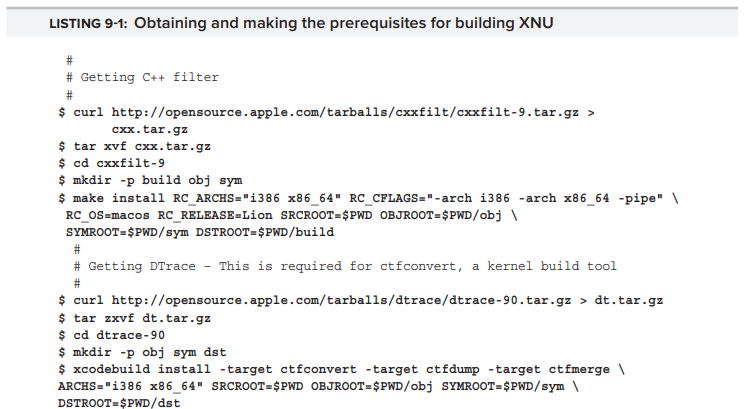

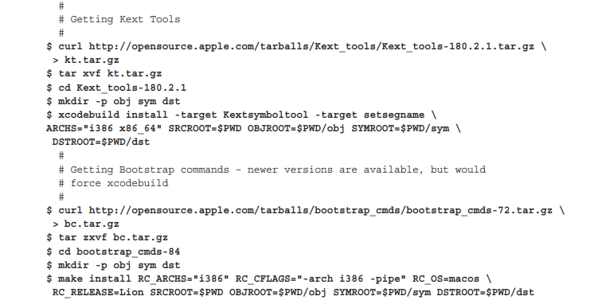


#### Making the Kernel

이전 section 에서 언급한 모든 전제 조건이 만족되면 Listing 9-2와 같이 kernel 을 간단하게 만들 수 있다.  

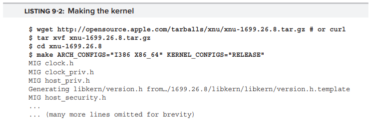

build는 각 directory를 progressing 하는 데에 시간이 좀 걸린다. 각 file에 대해 build에는 Table 9-1에 표시된 다음 action 중 하나 이상이 필요하다.  

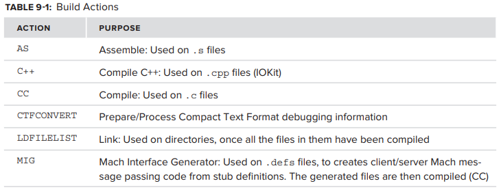

성공적으로 진행되면 build된 kernel은 _BUILD/obj/RELEASE\_I386**,** BUILLD/obj/RELEASE\_X86\_64_ 또는 둘 다에서 찾을 수 있다. **lipo** tool을 사용하면 두 architecture를 모두 포함하도록 하나의 **fat binary** 를 구성할 수 있지만, 필수는 아니다. 


### One Kernel, Multiple Architectures

Apple은 XNU를 PowerPC, i386, x86\_64 및 iOS의 ARM 까지 4 개의 architecture 에서 실행되도록 adapt 했다. 그렇게 함으로써 설계 상의 모든 architecture에 flexible하게 적용되는 core인 Mach를 그렸다.

Linux와 Mach kernel은 모두 비슷한 design을 따른다. 특정 architecture 용으로 compile 될 수 있는 Linux kernel 처럼 Mach에서도 특정 architecture에 대해 compile 할 수 있다. kernel의 대부분은 architecture에 구애받지 않으며\(architecture-agnostic\), architecture-idiosyncratic한 부분은 각각 상응하는 directory에 구현된다.

Linux에서 이것은 function을 macro로 정의하고,   
basic implementation을 source tree의 _arch/_ subdirectory에 있는 architecture optimized 된 것으로  override 하여 달성한다. 이러한 방식으로 kernel entry point, low-level thread, 그리고 memory management 가 고도로 특수화된 assembly\(.s file\)에 의해 coding되고 나머지는 C++로 coding된다. 

Mach에서도 거의 같은 원리를 따른다. Mach source가 있는 _osfmk/_ directory에는 architecture 별 subdirectory가 있다. open-source XNU\(OS X 용으로 compile 된 XNU\) 에서는 _i386/_ 및 _x86\_64/_ 이다.  예전 version의 XNU 에는 _ppc/_ subdirectory도 포함되어 있었다. iOS kernel 에는 _arm/_ subdirectory가 있으며, 이 곳은 closed source 이다.

또한 XNU는 specialized directory인 **pexpert** \(Platform Expert\)를 사용한다. 이 directory는 작지만 매우 중요한 directory로, 각 architecture에 대한 specialized function이 포함되어 있다. open source version에서 유일하게 지원되는 architecture는 i386/x64\(둘 다 i386 하위에 있다\) 이고, iOS 에는 이와 유사한 ARM **pexpert** 가 들어있다. 

i386 Platform Expert는 한쪽 끝에서 **EFI**\(configuration parameters를 얻는 곳\), 반대편 끝에서는 **IOKit**\(service를 제공하는 곳\)과 긴밀하게 통합되어 있다. ARM Platform Expert는 비슷하게 **iBoot** 와 통합된다.  
Table 9-2는 OS X의 **pexpert** subdirectory만 보여준다.  

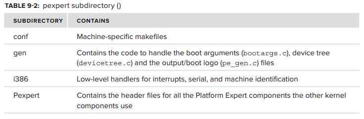

XNU driver framework인 **IOKit** 은 Platform Expert를 광범위하게 사용한다. kernel core 조차도 종종 PE call에 의존한다. Platform Expert의 가장 일반적으로 호출되는 feature는 **\_PE\_state** 이며, 이는 boot loader가 설정한 system 의 initial state를 나타내는 platform dependent singleton structure 이다.   
Intel platform 에서는 다음과 같다.

```c
typdef struct PE_state {
    boolean_t    initialized;
    PE_Video     video;
    void         *deviceTreeHead;
    void         *bootArgs;
} PE_state_t;

PE_state_t PE_state;
```

**PE\_Video** 는 다음과 같이 graphics console information 이다.

```c
struct PE_Video {
    unsigned long    v_baseAddr;        // Base address of video memory
    unsigned long    v_rowBytes;        // Number of Bytes per pixel row
    unsigned long    v_width;           // Width
    unsigned long    v_height;          // Height
    unsigned long    v_depth;           // Pixel Depth                           
    unsigned long    v_display;         // Text or Graphics
    char             v_pixelFormat[64];
    unsigned long    v_offset;          // offset into video memory to start at
    unsigned long    v_length;          // length of video memory (0 for h * w)
    unsigned long    v_rotate;          // rotation: 0: 0, 1: 90, 2: 180, 3: 270
    unsigned long    v_scale;           // Scale Factor for both X & Y
    char             reserved1[2];
#ifdef __LP64__
    long             reserved2;
#else
    long             v_baseAddrHigh;
#endif
};
```

**PE\_init\_platform** _\(pexpert/i386/pe\_init.c\)_ 에 대한 호출은 **PE\_state** 를 설정하고, 가장 중요한 **bootArgs** pointer 도 설정한다. 그러면 다양한 kernel component는 다음을 이용하여 argument에 accesss 할 수 있다.

```c
boolean_t PE_parse_boot_argn(
        const char   *arg_string,
        void         *arg_ptr,
        int          max_arg);
```

이 function을 호출하면 caller가 **arg\_string** 및 최대 **max\_arg** byte의 buffer인 **arg\_ptr** 을 지정할 수 있다. 이 argument는 kernel command line에서 argument가 제공된 경우 function 에 의해 채워진다\(true를 반환\).

Platform Expert에서 일반적으로 사용되는 또 다른 기능은 device tree 이다. 이것은 Solaris의 _/devices_ 또는 Linux의 _/sys/devices_ 와 같이 system 의 모든 device를 hierarchical tree structure로 rendering 한 것이다. device tree는 boot loader\(OS X: **EFI**, iOS: **iBoot**\)에 의해 initialized 되며 kernel이 connect 된 device를 query할 수 있도록 허락한다. 

> **device tree?: device tree**는 system의 hardware를 기술한다. 이는 기초 CPU의 이름, memory 구성, device\(내부 및 외부\) 를 포함한다. hardware 구성을 node들의 계층으로 표현하며, 각 node는 속성과 하위 node를 포함할 수 있다. 속성의 이름은 byte의 배열로서, 문자열, 숫자, 임의의 byte sequence 등의 조합이다. node는 file system과 닮은꼴로, node는 directory에, 속성은 file에 해당한다.  
> **device tree** 는 보통 **device tree source** \(DTS\) 로 불리는 text format으로 작성된다.

Platform Expert는 CPU, virtual memory 및 기타 hardware의 low-level handling 에도 사용된다. 이것이 **IOKit** 이 자주 사용하는 이유이다. user mode 관점에서 보면 system call\(또는 Mach trap\)의 flow는 architecture와 무관한 BSD/Mach call로 시작하며, kernel layer를 통과할수록 점점 더 구체적이 된다. 또한 **IOKit** 은 specialized class **IOPlatformExpert** 를 생성하는데, 이 class는 singleton **glOPlatform** 을 instant화 하는데 사용된다. **glOPlatform** 은 machine-related information을 참조한다. **IOPlatformExpert** 는 architecture 간에 유사한 method를 가지고 있지만, architecture-specific 하게 define 된다\(ch.19 에서 더 자세히 기술\).


#### Configuration Options

XNU 에는 kernel을 compile 하기 전에 toggle 할 수 있는 몇 가지 configuration option이 있다. 이들은 \#defines로 , 다양한 buffer value를 설정하거나, code의 일부분을 enable 하고, preprocessor level에서 다른 것들을 숨겨서 resulting object를 최대한 slim 하게 한다. 항상 그런 것은 아니지만 대부분은 CONFIG prefix를 가진다.   
일부 흥미로운 option이 아래 Table 9-3에 나와있다.  

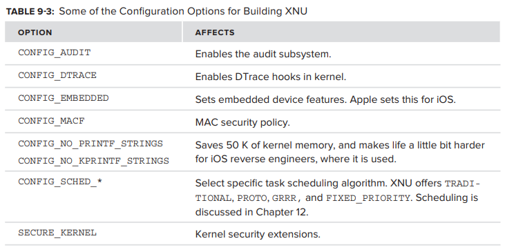

subsystem에 해당하는 kernel source tree의 모든 subdirectory에는 subsystem의 option을 control 하는 _conf/_ subdirectory가 있다. option 은 MASTER files에 documented 되어있다.


### The XNU Source Tree

XNU의 source tree는 fully extract 했을 때 50 MB로, Linux의 source tree 보다는 작지만 여전히 source에서 길을 잃기 쉽다.

source를 탐색하는 보다 쉬운 방법은 **FXR** tool\([http://fxr/watson/org/](http://fxr.watson.org/)\)을 이용하는 것이다. 이 tool\(Linux Cross Reference tool인 **LXR** 에서 파생\) 은 FreeBSD 의 source tree와 XNU를 포함한 다른 code bases를 탐색한다. 

> source file에서 특정 function name, variable, 또는 기타 symbol을 찾고 있다면 **grep** 이 큰 도움이 될 것이다. **grep** 을 사용하여 regular expression 을 입력하여 .h 또는 .c file에서 찾을 수 있으며, **xargs** 를 사용하여 command를 확장하여 search가 directory의 모든 file을 cover하도록 할 수 있다.   
> 예를 들어, _vstart_ 를 찾는 경우 XNU source root directory로 cd하고 다음을 입력하면 된다.

```bash
morpheus@Ergo(../xnu-1699.26.8)$ find . -name "*.c" -print | xargs grep vstart
./bsd/dev/i386/fbt_x86.c: "vstart"                       
./osfmk/i386/i386_init.c: * vstart() is called in the natural mode (64bit for
./osfmk/i386/i386_init.c:vstart(vm_offset_t boot_args_start) 
./osfmk/i386/i386_init.c: DBG("vstart() NX/XD enabled\n"); 
./osfmk/ppc/pmap.c: * kern_return_t pmap_nest(grand, subord, vstart, size) 
... (Other results omitted for brevity) ..
```

> 이 접근 방식은 search string의 모든 instance가 return 되므로 기껏해야 brute force 이다. string이 common substring 인 경우, 수많은 result를 얻게 될 것이다.

XNU에 구현되어 있는 거의 모든 function들은 그들이 implemented 되어있는 line 을 그들의 name으로 시작한다. 따라서 line의 시작 부분에 예약된 caret \(^\) sign과 함께 grep을 사용하여 원하는 result를 정확하게 얻을 수 있다.

```bash
morpheus@Ergo (../xnu-1699.26.8)$ find . -name ".c" | xargs grep ^vstart
./osfmk/i386/i386_init.c:vstart(vm_offset_t boot_args_start)
```

XNU의 source tree는 크지만 여러 subtree로 상당히 잘 구성되어 있다. 이 subtree에는 Table 9-4 에 표시된 것 처럼 다양한 kernel subsystem의 구현이 포함된다.  

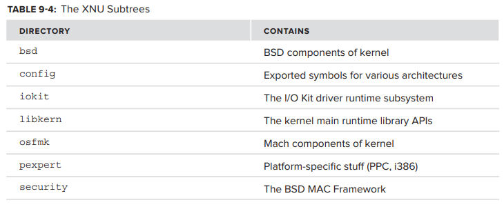

Table 9-5 에서 볼 수 있듯 BSD layer는 subcomponents로 세분화 된다.  

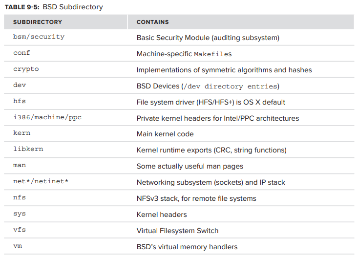

마찬가지로 _/osfmk_ \(Open Software Foundation Mach Kernel\) subdirectory의 Mach에는 Table 9-6에 표시된 subdirectory가 있다.  

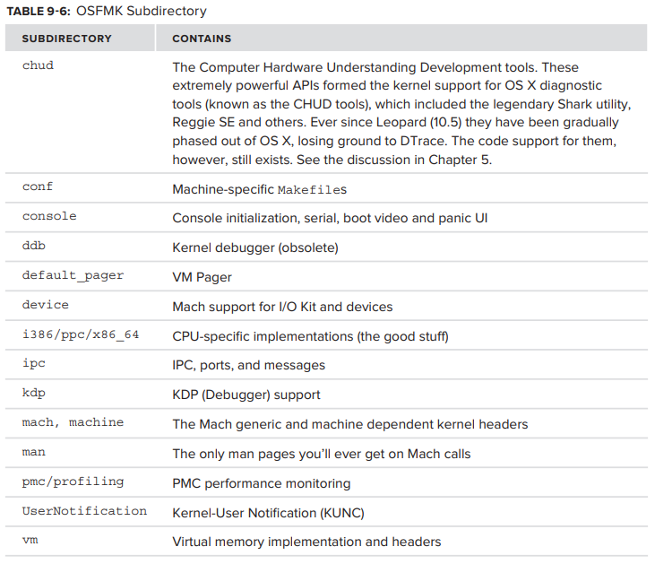


## Booting XNU

XNU는 Mach-O object 이다. boot loader에는 Mach-O parsing code가 포함되어 있으며, **LC\_UNIXTHREAD** command로 entry point를 추론할 수 있다. **otool** 을 사용해서도 할 수 있다. 

serial output을 capture 하려면 OS X를 Virtual Machine 에서 실행하고, text file로 redirection된 serial port를 define 하는 것이 좋다. 

> **entry point?:** control이 OS 에서 program 으로 이동하는 것을 하며, processor는 program이나 code에 진입해서 실행을 시작한다.


### The Bird's Eye View

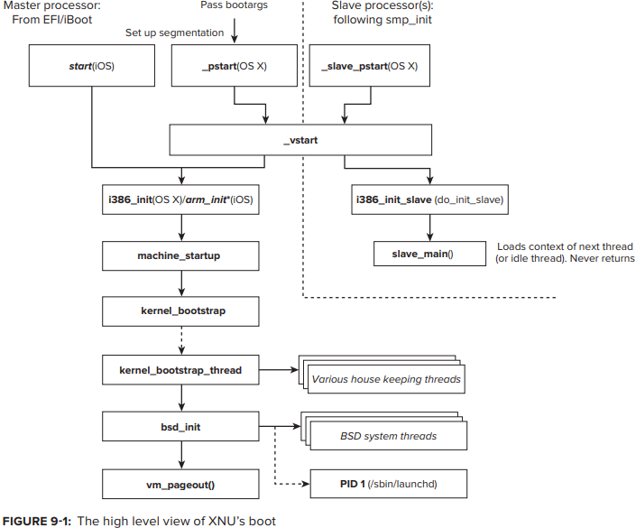


### OS X: vstart

**vstart** _\(osfmk/i386/i386\_init.c\)_ 는 i386/x64의 "official" kernel initialization function 으로, assembly code에서 C로의 transition을 담당한다. 또한 machine에 있는 모든 slave CPU\(또는 core\) 뿐만 아니라 primary \(boot\) CPU 에서도 execute 된다는 점에서 special한 function 이다. 

다음 list는 OS X에서 **vstart** 의 flow를 나타낸다.

* **On Boot\(master\) CPU:** **vstart** 는 optional하게 \(\#if DBG\) **pa\_serial\_init\(\)** 을 호출하여 serial line을 initialize 한다. 
* **Enable NX/XD:** x64 platform에서, **NX** \(No Execute\) bit는 code injection을 방지하기 위한 processor feature다. data로 mark된 page\(일반적으로 stack 및 heap\)는 instruction pointer로 access 하면 page fault를 trigger 한다. 이것은 hardware enforced mechanism으로, code injection technique의 상당 부분을 무효화 한다. 하지만 pre-existing library code로 execution을 diverting 하는 return-oriented programming은 여전히 작동한다. **cpuid\_extfeatures** _\(osfmk/i386/cpuid.c\)_ 가 이 feature가 있다고 report 하면 \(**CPUID\_EXTFEATURE\_XD**\) processor 당 master와 slave 모두 **NX/XD** bit가 설정된다.  
* **cpu\_desc\_init** _**\(osfmk/i386/mp\_desc.c\):**_ master cpu의 **GDT** 및 **LDT**를 initialize 한다. 그런 다음 **cpu\_desc\_load** 를 호출하면 master 및 slave 모두에서 사용할 kernel **LDT**가 load 된다. 
* **cpu\_mode\_init\(\) \(osfmk/i386/mp\_desc.c\):** CPU의 **MSR** \(**SYSENTER/SYSCALL** 에 사용**\)**  과 physical page map\(**pmap**\) 을 initialize 한다. 
* **i386\_init/i386\_init\_slave:** master 또는 slave CPU 에서 호출된다.

> **master/slave CPU?:** asymmetric multiprocessing 에서는 **SMP** 와는 다르게 **master** CPU 를 하나 두어 **master** CPU 가 **slave** CPU 들에게 작업을 할당한다.

> **NX/XD** bit?: 실행 방지 비트. processor command나 code, 또는 data 저장을 위한 memory 영역을 따로 분리하는 CPU의 기술이다.   
> NX 특성으로 지정된 모든 memory 구역은 data 저장을 위해서만 사용되며, processor command가 그 곳아 상주하지 않음으로써 실행되지 않도록 만들어준다.   
> 구체적으로 말해, NX 비트는 page table 안에 있는 64-bit entry 의 bit 숫자 63을 일컫는다. 이 bit가 0으로 설정된 경우, code는 그 page에서 실행될 수 있고, 1로 설정된 경우 어떠한 것도 그 page에 상주할 수 없으며 실행되지 못한다.  
> NX와 XD는 이름만 다르고 서로 같은 기능을 수행한다.

> **GDT?: Global Descriptor Table** 의 약자로**,** real mode에서 protected mode로 변화되면서 추가된 table로, 64-bit 크기의 segment descriptor를 가지고 있다. 여기에는 해당 segment의 base address와 segment 제한 길이 등의 정보가 들어있다. 제한 길이가 들어있기 때문에 보호 기능이 제공되며, base address를 제공하기 때문에 16-bit 에서 24~31-bit 까지의 base address를 확장시킬 수 있다. 그럼으로써 1gb에서 4gb 까지 자유롭게 설정이 가능하게 된다. 또한 이 table에 권한 설정까지 적어넣을 수 있기 때문에 memory에 대한 권한까지 부여할 수 있게 된다.  
> **GDTR** register가 **GDT**의  32-bit의 base register 와 16-bit의 table limit을 포함하고 있다.  
> kernel mode에서 사용하는 table로, kernel mode용으로 하나만 생성되며, 전체 내용을 가지고 있다.

> **LDT?:** **Local Descriptor Table**의 약자로, user mode에서 사용되는 table이며 각 process 별로 만들어진다.   
> **GDT** 처럼 **LDTR**이 **LDT**의 base register 정보를 가지고 있다.


### \[i386\|arm\]\_init

OS X의 platform initialization function인 **i386\_init\(\)** 은 사용할 master CPU를 initialize 하고 kernel boot를 준비한다. 유사한 function인 **i386\_init\_slave\(\)** 는 slave CPU 에 대해 동일한 기능을 수행한다. 이 함수는 아무것도 반환하지 않는다.

init function은 길지만 잘 짜여져 있다. boot process와 관련된 나머지 function들과 마찬가지로 subroutine을 호출하여 각 subsystem 또는 component를 initializing 하는 작업을 수행한다.  
Figure 9-2가 이 flow에 대해 나타내고 있다.  

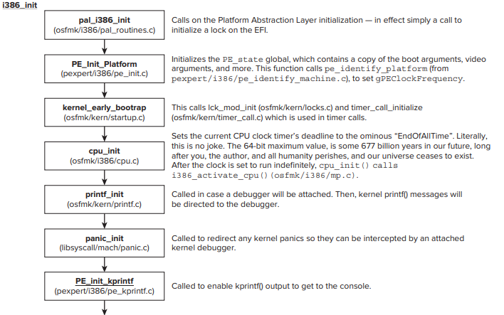

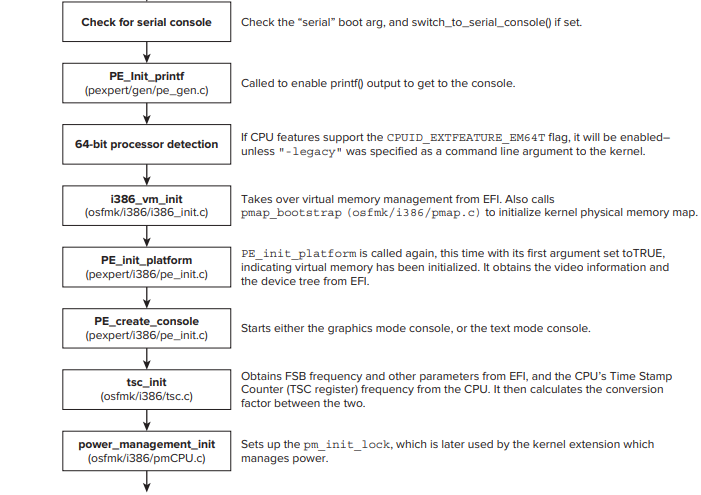

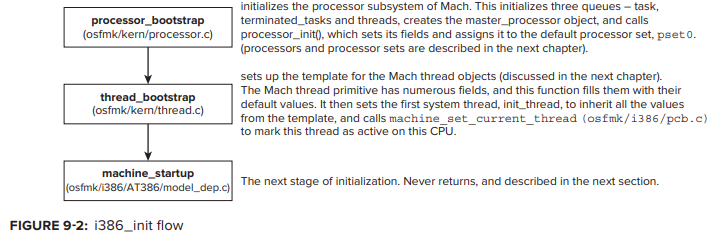

**&lt;platform&gt;\_init** function 에는 console device의 존재를 checking하여 initializing 하고, kernel의 **printf\(\)** 및 **kprintf\(\)**를 그 쪽\(console device\)으로 redirection 하기 위한 작업이 상당히 많이 있다. OS X device의 console은 일반적으로 keyboard와 screen이며, -v\(verbose\) boot argument를 사용하면 자세한 boot를 볼 수 있다 \(reboot 시 Alt+V 눌러서도 가능\).

serial boot argument를 지정하면 kernel이 console을 serial port로 redirect 할 수 있다.


### i386\_init\_slave\(\)

slave processor의 real-mode entry point는 **smp\_init** 에 의해 나중에 **slave\_pstart** 로 설정된다. 이 function은 **start\_common**과 merge 되지만 kernel bootargs structure pointer를 NULL로 둔다. common code는 **vstart** 를 호출하는데, NULL argument로 인해 slave processor를 master와 구분할 수 있다.

**vstart\(\)** 는 master porcessor의 경우 slave의 경우와 약간 다르게 작동하여 master가 실행중인 것을 감지하면 one-time kernel initialization 을 수행한다. 그 다음 master processor는 **i386\_init\(\)** 을 수행하고, slave는 대신 **i386\_init\_slave\(\)** 로 바뀐다. 이 function은 **do\_init\_slave\(FALSE\)** 에 대한 호출이다.


#### do\_init\_slave\(\)

**do\_init\_slave** function은 slave processor가 처음으로 wake up 했을 때, 또는 hibernation/sleep 에서 awake 할 때 호출된다. 먼저 function은 **pmCPUHalt** _\(osfmk/i386/pmCPU.c\)_ 의 호출임을 나타내주는 **fast\_restart** argument를 check한다. fast restart 는 단순히 CPU를 깨우는 반면, slow나 full start는 initialize 한 다음 CPU를 시작한다.  
이것은 차례로 다음을 포함한다.

* **CR0**의 **NW** 및 **CD** flag가 off 되어 있는지 확인하여 caching 및 write-through 설정 
* local interrupt controller **lapic\_configure\(\)** _\(osfmk/i386/lapic\_native.c\)_ 를 configure  
* **machine\_init\(\)** 과 같은 방식으로 **FPU** \(**init\_fpu\(\)**, ****_osfmk/i386/fpu.c_\)를 **initialize**

fast 또는 slow startup 에서 다음 단계는 main 에 대해 **i386\_init\(\)** 에 의해 수행되는 CPU initialize 호출\(**cpu\_init\(\)**, ****_osfmk/kern/cpu.c_\)이다. 그런 다음 _osfmk/kern/startup.c_ 에서  **slave\_main** 을 호출한다. 이 function은 **current\_processor\(\)** 의 **next\_thread** field에서 실행 가능한 다음 thread를 가져온다. 실행 가능한 thread가 없으면 idle thread\(**kernel\_boot\_strap\_thread** 에 의해 생성\) 가 대신 사용된다. thread context가 processor에 load 될 때 이 function은 return 하지 않는 것이 좋다\( 그렇지 않으면 kernel panic이 발생할 것이다\).

> **NW flag?:** CR0 register의 29번 bit. Not-Write through 의 약자로,  전역적으로 write through를 활성화/비활성화 한다.

> **CD flag?:** CR0 register의 30번 bit. Cache Disable의 약자로, 전역적으로 memory cache를 활성화/비활성화 한다.

> **FPU?:** Floating Point Unit. CPU의 일부로서 부동 소수점 연산을 효율적으로 처리하기 위한 하드웨어 논리회로 모듈이다.


### machine\_startup

**&lt;platform&gt;\_init** 의 마지막 단계에서 호출된 **machine\_startup** _\(osfmk/i386/AT386/model\_dep.c\)_ function은 이름과 위치만 보면 마치 hardware와 model dependency  를 내포할 것처럼 보이지만 실제로는 OS X와 iOS에서 동일한 구현을 하고 있다.

이 function은 주로 boot-time debugging을 control 하기 위해 대체로 debug **boot-arg** 의 flag인 여러가지 command line argument를 parsing 한다 \(Platform Expert의 **PE\_parse\_boot\_argn** 사용\). **MACH\_KDB** 가 define 된 경우, **ddb\_init**\(_osfmk/ddb/db\_sym.c_\)의 호출은 Mach 의 low-level kernel debugger를 initialize 하고, 이 단계에서 kernel boot를 중지하므로 debugger를 attach 시킬  수 있다. 그렇지 않으면 quanta 및 preemption scheduling을 처리하는 몇 가지 command line argument가 parsing된 다음 **machine\_conf\(\)** 를 호출하여 **machine\_info** structure의 **memory\_size** field가 설정된다. 

**ml\_thrm\_init\(\)** 을 호출하면 PPC의 XNU가 그랬던 것 처럼 Intel processor에 대한 CPU의 thermal reporting을 initialize 할 계획을 암시하지만 아직 OX X와 iOS 모두에서 \#ifdef 되어있다. 따라서 마지막 단계는 **kernel\_bootstrap\(\)** 으로 넘어가는 것인데, 이 또한 return 하지 않으며 대부분의 low level Mach initialization을 수행한다.


### kernel\_bootstrap

**kernel\_bootstrap** \(osfmk/kern/startup.c\) function은 Mach kernel 의 core subsytem을 계속 setup 하고 initialize 하여 BSD를 overlay 하는데 필요한 foundation을 세운다. 

**kernel\_bootstrap** 은 virtual memory 외에 다음과 같은 Mach의 key abstraction도 initialize 한다.

* **IPC:** Mach는 message passing을 기반으로 하며 **memory**, **synchronization objects**, **MIG**\(Mach Interface Generator\)와 같은 중요한 resource가 필요하다. ****
* **Clock: clock** abstraction은 ****alarms\(system clock\) 및 time-telling\("calendar"\) 를 enable 한다. 
* **Ledgers: ledger** 는 accounting을 가능하게 하는 Mach system의 일부이다.  
* **Tasks:** **task** 는 BSD의 process와 유사한 Mach의 container 이다 \(실제로 둘 사이에는 1:1 mapping이 존재한다\). 
* **Threads:** **thread** 는 실제 execution의 unit이다. **task** 는 단지 resource container일 뿐이고, schedule 및 execute 되는 것은 thread 이다.

**kernel\_bootstrap** function은 return 하지 않는다. 대신 system의 첫번째 active thread인 **kernel\_bootstrap\_thread** 를 가정한다. 이 thread는 complexity를 증가시키는 subsystem을 처리하면서 initialize를 수행한다.   
**kernel\_bootstrap** 의 flow는 다음과 같다.

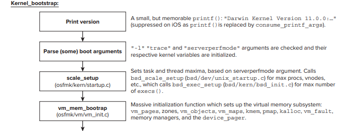


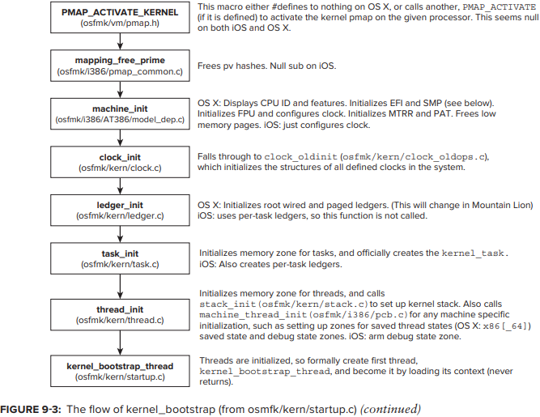


#### machine\_init

Mach primitive가 initialize 되기 직전에, **kernel\_bootstrap** 은 machine specific aspect를 위해 **machine\_init**_\(osfmk/i386/AT386/model\_dep.c\)_ ****을 호출한다. OS X의 경우 이 호출은 **SMP\(Symmetric Multiprocessing\)**에서 가장 중요하다.  
flow는 Figure 9-4에 나와있다.

**SMP** intialization을 담당하는 function은 **smp\_init** 이다. 이 function은 다음 두 가지 main task를 담당한다.

* **LAPIC initialze:** **SMP** architecture에서 각 processor\(또는 core\) 에는 Local Advanced Programmable Interrupt Controller가 있다. 이는 hardware level에서 core 로의 interrupt delivery를 담당한다. 
* **slave CPU의 entry point를 설정:** Intel CPU 와 core는 paging이 disable 된 상태로 wake up하기 때문에 이 task는 **install\_Real\_mode\_bootstrap\(\)** 을 통한 physical memory copy를 사용하여 수행된다. entry point는 앞서 나온대로 **slave\_pstart\(\)** 로 설정된다.


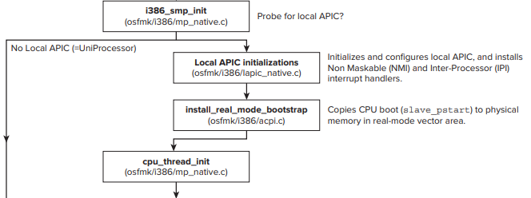

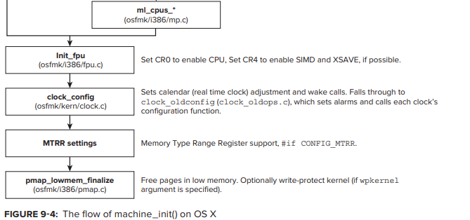

> **SMP?:** Symmetric Multiprocessing. 두개 또는 그 이상의 processor가 한 개의 공유된 memory를 사용하는 multi processor computer architecture 이다.   
> SMP system은 작업을 위한 data가 memory의 어느 위치에 있던지 상관 없이 작업할 수 있도록 processor에게 허용한다. SMP system은 부하의 효율적 분배를 위해 processor 간 작업 scheduling을 쉽게 조절할 수 있다. 그러나 memory는 processor 보다 느리므로, 단일 processor라도 memory로 부터 읽는 작업에 상당한 시간이 소비된다. SMP의 경우엔 한 번에 한 개의 processor 많이 동일한 memory에 접근 가능하기 때문에 나머지 processor 들은 대기하게 되므로 이러한 문제가 더욱 악화된다.  
> SMP는 운영체제와 memory를 공유하는 여러 processor가 program을 수행하는 것을 말한다. SMP에서는 processor가 memory와 I/O bus 및 data path를 공유하며, 하나의 운영체제가 모든 processor를 관리한다.


### kernel\_bootstrap\_thread

**kernel\_bootstrap\_thread** 의 main thread는 마지막 stage에서 기초가 마련된 다양한 subsystem들을 initializing 하는 task를 계속한다.

이제 thread support가 enable 되었으므로 **kern\_bootstrap\_thread** 는 **kernel\_create\_thread\(\)** 를 호출하여 helper thread를 생성할 수 있다. 이 thread가 idle thread로 생성된 첫 번째 thread 이다. 이 thread는 다른 모든 thread가 blocking 될 때 system core 또는 CPU가 항상 execute할 무언가를 갖기 위해 필요하다.

> **idle thread?:** System Idle Process는 다른 실행 가능한 thread 들이 CPU 에 schedule 되지 않았을 때 실행되는 하나 이상의 kernel thread로 이루어진다. multiprocessor system에서는 각 CPU core에 관련된 하나의 idle thread가 존재한다. hyper threading이 활성화 된 system에서는 각 논리 processor를 위해 하나씩 존재한다.   
> idle process / thread의 주요한 목적은 scheduler에서 특별한 경우를 제거하는 것이다. idle thread가 없다면 아무 thread도 실행가능 상태로 존재하지 않을 수가 있다. 이런 경우를 제거하여 항상 어떤 thread 하나씩은 processor에 존재할 수 있도록 하기 위해서 idle thread를 사용한다.

idle thread 다음으로 시작되는 thread는 scheduler 이다. scheduler는 지정된 interval에 라 interrupt 후 다음에 execute할 thread를 결정하는 task 이다.

thread의 maintenance를 handle하기 위해 몇 개의 system thread를 생성한 후 OS X의 XNU는 **mapping\_replenish\(\)** thread를 시작한다. 

kernel이 **SERIAL\_KDP** 로 configure 되어있는 경우, **init\_kdp\(\)** 를 호출하면 debugger가 initialize 된다. 

다음으로 수행해야할 중요한 단계는 XNU의 device driver framework인 **IOKit** 을 initialize 하는 것이다. XNU는 가장 기본적인 disk, display 및 network 등의 device에도 access할 수 있는 code가 없어서 **IOKit** 없이는 device에 access 할 수 없기 때문에 이 작업은 매우 중요하다.

**IOKit** 이 initialize 되면 interrupt가 enable 될 수 있다. 이것은 **spllo\(\)** 에 대한 호출에 의해 수행되며, **ml\_enable\_interrupts\(\)** 에 의해 \#define 된다. 이 function은 기본 interrupt mechanism\(Intel의 **IF EFLAG** 또는 CPSRT의 **ARM** interrupt bit\)에 적용된다.

다음으로 초기화 할 module은 shared library를 load할 때, **dyld** 와 같은 client와 **commpage** 라고 하는 kernel 자체에서 사용하는 shared region module 이다. **commpage** 는 모든 process로 직접 mapping 되는 single page 이며, 다양한 exported data와 function을 포함한다. 이 page는 항상 같은 address 에 있으며 모든 process에 access 할 수 있다.

kernel이 Mandatory Access Control\(**CONFIG\_MACF**\)로 compile 된 경우 **mac\_policy\_initmach\(\)** 가 호출되어 policy module이 가능한 빨리 작업을 시작할 수 있다. 다양한 race condition으로 인해 policy가 완전히 적용되기 이전에 attacker가 operation을 시도할 수 있으므로 system security를 유지하는데 중요하다.

MAC이 enable 되면 BSD subsystem을 initialize 할 수 있다. 이것은 자체의 section에 걸맞는 거대한 하나의 function인 **bsd\_init\(\)** 에 의해 수행된다. 이 function은 결국 모든 user mode process의 ancestor인 _sbin/launchd_ 를 실행하는 init task를 생성한다.

BSD를 initialize 한 후 kernel이 serial boot argument로 configure된 경우 전용 console listener를 생성하여 serial console을 사용할 수 있다. 이 시점까지 user mode process\(BSD subsystem이 initialization을 완료한 후 생성됨\)는 **tty** 를 열어 console에 access 할 수 있다.

> **tty?:** TeleTypeWriter. console이나 terminal을 의미한다.

**SMP** system에서 두 번째 단계는 각 CPU에 대해 local page queue를 enable 하는 것이다. uniprocessor에서는 skip한다.   
마지막으로 main thread는 system에 대한 swapping을 관리할 **vm\_pageout\(\)** 의 새로운 성격을 가정한다.


### bsd\_init

XNU의 전체 setup은 _bsd/kern/bsd\_init.c_ 에 있는 **bsd\_init\(\)** 이라는 single function에 의해 수행된다. 이 function call은 **\#ifdef MACH\_BSD** 로 쌓여있는데, 이는 XNU의 Mach 부분이 BSD에서 어떻게 분리될 수 있었는지 보여준다. 


### bsdinit\_task

**bsd\_init\(\)** 은 실행이 끝날 무렵 **bsd\_utaskbootstrap\(\)** 을 호출한다. 이 function은 PID 1의 시작을 간접적으로 담당한다. PID 1은 user mode에서 처음으로 나타나는 task 이다. 이를 위해 먼저 **cloneproc\(\)** 를 호출하여 새로운 Mach task를 만든다. 

```c
thread_t
cloneproc(task_t parent_task, coalition_t parent_coalition, proc_t parent_proc, 
		int inherit_memory, int memstat_internal)
{
#if !CONFIG_MEMORYSTATUS
#pragma unused(memstat_internal)
#endif
	task_t child_task;
	proc_t child_proc;
	thread_t child_thread = NULL;

	if ((child_proc = forkproc(parent_proc)) == NULL) {
		/* Failed to allocate new process */
		goto bad;
	}

	child_thread = fork_create_child(parent_task, parent_coalition, 
				child_proc, inherit_memory, 
				(parent_task == TASK_NULL) ? FALSE : (parent_proc->p_flag & P_LP64));

	if (child_thread == NULL) {
		/*
		 * Failed to create thread; now we must deconstruct the new
		 * process previously obtained from forkproc().
		 */
		forkproc_free(child_proc);
		goto bad;
	}

	child_task = get_threadtask(child_thread);
	if (parent_proc->p_flag & P_LP64) {
		task_set_64bit(child_task, TRUE);
		OSBitOrAtomic(P_LP64, (UInt32 *)&child_proc->p_flag);
	} else {
		task_set_64bit(child_task, FALSE);
		OSBitAndAtomic(~((uint32_t)P_LP64), (UInt32 *)&child_proc->p_flag);
	}

#if CONFIG_MEMORYSTATUS
	if (memstat_internal) {
		proc_list_lock();
		child_proc->p_memstat_state |= P_MEMSTAT_INTERNAL;
		proc_list_unlock();
	}
#endif

	/* make child visible */
	pinsertchild(parent_proc, child_proc);

	/*
	 * Make child runnable, set start time.
	 */
	child_proc->p_stat = SRUN;
bad:
	return(child_thread);
}
```

**utaskbootstrap\(\)** 은 새 task를 spin off 하기 위해 새로 작성된 thread에서 **act\_set\_astbsd\(\)** 를 호출하여 asynchronous system trap\(**AST**\) 을 생성한다. 호출 후 **thread\_resume\(\)** 을 호출하고, **utaskbootstrap\(\)** 은 **bsd\_init\(\)** 으로 return된다. **AST** 가 처리될 때 Mach AST handler는 **bsd\_ast\(\)** _\(bsd/kern/kern\_sig.c\)_ 를 호출하여 이 특수한 경우를 구체적으로 처리한다.

**bsdinit\_task\(\)** 는 initial process의 이름을 UNIX origins에 맞게 **init** 으로 설정한다. 이것은 **proc\_t** 의 **comm** field에 대한 단순한 **memcpy** 에 지나지 않는다. 다음으로 **ux\_handler\_init\(\)** 을 호출한다. 이렇게 하면 **ux\_handler** 라는 별도의 kernel thread가 생성되어 UNIX exception을 처리한다. 다음은 init thread의 exception port를 등록하여 이 global port를 자체로 등록하는 것이다. 이는 모든 UNIX process가 이 thread에 의해 처리됨을 보장한다. 마지막으로 **load\_init\_program\(\)** 을 호출한다.

**load\_init\_program\(\)** 은 PID 1을 well-known **launchd** 로 변환하는 책임을 진다. 이를 위해 먼저 user memory에 argv\[\]를 수동으로 설정한다. argv\[0\]는 _/sbin/launchd_ 에 하드코딩 된 128 byte array인 **init\_program\_name** 으로 설정된다. 선택적으로, kernel이 -s로 booting 된 경우\(**boothowto** global variable을 **RB\_SINGLE** 로 flagging\) 동일한 -s가 **launchd**로 전파된다.

> **boothowto?:** **boothowto** variable에는 boot loader 또는 reboot system call 에 의해 kernel에 전달된 flag가 포함된다.   
> 이 값은 RB\_\*, AB\_\* symbol로 정의된 bit와 함께 bit mask로 해석된다.

argv\[\] 가 설정되면 **execve\(\)** 에 대한 standard call로 **launchd** 가 시작된다. 성공적으로 실행된 경우에 이 호출은 절대 return 되지 않을 것이므로, return 될 경우 **exec** 가 실패한 것이다. 따라서 이 경우 그 뒤를 잇는 code는 kernel panic 이다.


### Sleeping and Waking Up

OS X에서 XNU의 sleep 및 hibernation code 부분은 open source 이지만 Kext의 부분은 그렇지 않다. kernel은 Kext의 **acpi\_sleep\_kernel\(\)** 호출에 의해 sleep 될 수 있다. **AppleACPIPlatform.Kext** 는 이 호출을 사용한다.   
다음과 같이 진행된다.

* 현재 CPU를 제외한 모든 CPU가 중지된다. dispatch table에서 해당 function의 wrapper인 **pmCPUExitHaltToOff\(\)** 를 호출하면 된다. kernel은 이를 구현하지 않으며, 특수 Kext\(**AppleIntelCPUPowerMAnagement.Kext**\)를 사용하여 dispatch table \(_osfmk/i386/pmCPU.h_ 에서 **pmDispatch\_t**로 define\) 을 사용하여 **pmKextRegister** 를 호춣한다. 
* sleep의 준비를 위해 local **APIC** 가 shut down 된다.  
* **kdebug** message가 출력된다. 
* **CR3** 는 x86\_64에 저장된다. 
* _ospik/x86\_64/start.s_ 에서 **acpi\_sleep\_cpu** 를 호출하면 CPU 가 sleep 상태가 된다. 이렇게 하면 모든 register가 save 되고 caller 제공 callback function\(호출한 Kext 로부터\)를 호출하여 CPU를 sleep 상태로 만든다. hibernation의 경우 **acpi\_hibernate** 가 대신 호출되어 먼저 memory image를 disk에 쓴다. 
* control은 firmware로 다시 passed back 된다.

**AppleACPIPlatform.Kext** 는 wake handler의 install을 request 할 수도 있다. 이는 **install\_real\_mode\_handler** 를 사용하는 **acpi\_install\_wake\_handler** _\(osfmk/i386/acpi.c\)_ 에 대한 호출로 수행된다. wake handler는 _osfmk/x86\_64/start.s_ 의 assembly function인 **acpi\_wake\_prot** 이다.  
**acpi\_wake\_prot** 은 다음 action들을 수행한다.

* 64 bit mode로 switch back
* kernel **GDT**, **CR0**, **LDT**, **IDT** 및 task register를 restore
* 저장된 모든 register를 restore\(**acpi\_sleep\_cpu\(\)** 에 의해\)

function이 return 되면 **acpi\_sleep\_cpu\(\)** 호출 직후 **sleep\_kernel\(\)** 로 return 된다. **sleep\_kernel\(\)** 의 나머지는 기본적으로 모든 sleep step을 undo 한다. 마지막으로 **install\_real\_mode\_bootstrap\(\)** 을 호출하여  ****slave CPU의 activation function으로 **slave\_pstart\(\)** 를 다시 설정한다.


## BOOT ARGUMENTS

XNU 에는 boot argument가 상당히 많지만 Apple은 문서화에 신경을 쓰지 않는다. 특정한 명명 규칙도 없으며 일부는 하이픈을 쓰고, 나머지는 사용하지 않는 등 매우 엉망이다.  
일반적으로 argument를 kernel에 pass 하는 방법은 두 가지가 있다.

* **boot-args** argument를 사용하여 **NVRAM** 을 통하여\(**nvram** command를 사용하여 설정할 수 있다\) 
* _/Library/Preferences/SystemConfiguration/com.apple.Boot.plist_ 를 통하여. 이것은 standard Property List file로, **kernel\_flags** element에 argument를 지정할 수 있다.

아래 Table 9-7에 유용한 kernel booting argument가 정리되어 있다.

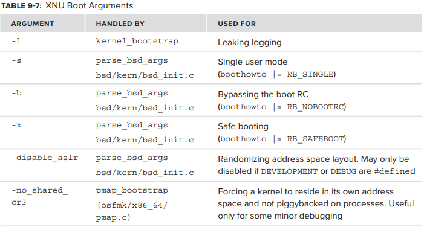

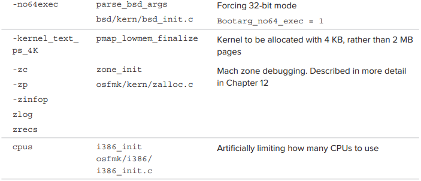

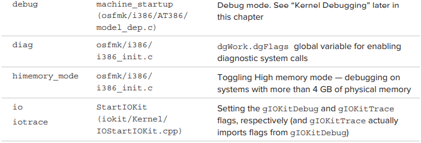

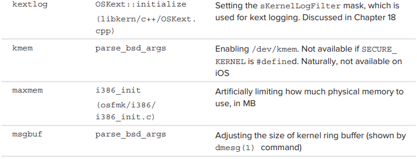

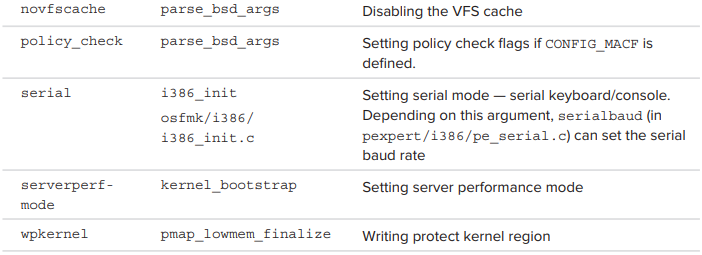

**KDP** \(Kernel Debugger Protocol\) 및 ch.12 에 나오는 virtual memory zone allocator _\(osfmk/kern/zalloc.c\)_ 와 같은 kext subsystem으로 추가 argument를 정의할 수 있다. Kexts는 마찬가지로 private argument를 얻기 위해 **PE\_parse\_boot\_argn** 을 호출하여 argument string을 parsing 할 수 있다.


## KERNEL DEBUGGING

kernel은 **KDP** protocol을 사용한 remote debugging을 허용한다. XNU에서 debugging 및/또는 core dump 생성을 위해 사용하는 UDP port 를 통해 전달되는 간단한 protocol 이다. client는 debugging되는 system 이고, server는 다른 더 안정적인 system 이다.   
Table 9-8은 **KDP** 에서 사용되는 boot argument들을 보여준다.

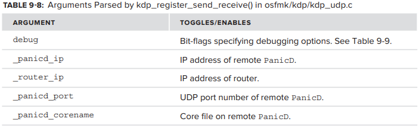

위 Table의 argument 들은 **kdp\_match\_name** \(**serial**, **en0**, **en1** 등으로 설정 가능\) 과 함께 사용되어 kernel debug protocol을 설정한다.

kernel extensions\(kext\) 및 debug/log message 를 trace 하기 위해 **Kextlog** boot-arg를 사용할 수 있다. 이것은 Windows의 **DebugPrintFilter** 가 **DbgPrint** 에 대해 하는 것과 마찬가지로 kernel의 내장 filtering mechanism을 control 하는 bit mask argument 이다. argument는 runtime에 **sysctl** 을 통해 **debug.Kextlog**  변경할 수 있다. 이에 대한 자세한 설명은 ch.18에서 설명한다.

full kernel debugging을 enable 하려면 system을 debug로 booting 해야한다. kernel debug flag는 Table 9-9와 같이 **TN2118** \("Kernel Core Dumps"\) 및 Kernel Programming Guide에 지정되어다.

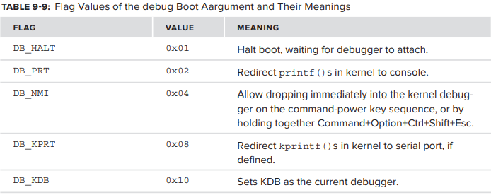

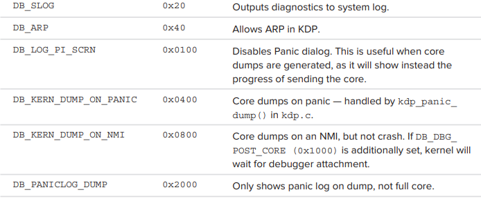

Heisenberg의 불확실성 원리는 동일한 machine에서의 live kernel debugging을 불가능하게 한다. 따라서 debugger는 debuggee와 다른 system이므로, 일반적으로 serial port나 ethernet, 또는 FireWire connection이 필요하다. OS X에서 **fwkpfv** command는 FireWire를 통해 **kprintf\(\)** 를 지시하는데 사용될 수 있다. 다른 tool인 **fwkdp** 를 사용하여 **KDP over FireWire** 를 활성화 할 수 있다.

VMWare는 debuggee가 virtual machine에 있게 함으로써 debugging을 훨씬 더 쉽게 만들어준다. host debugger는 kernel debug kit의 **kgmacros** 에서 **kdp-reattach** macro를 사용하여 연결할 수 있다. 이를 위해서는 debuggee의 IP에 static ARP 항목을 설정해야 한다. VM이 **DB\_HALT** \(nvram boot-args="debug=0x01"\)로 booting 되면 debugger가 연결될 때까지 중지된다. VMWare에는 자체 지원 기능이 있으며 이를 사용하는 process 또는 **KDP**는 documented 되어있다.


### "Don't Panic"

kernel mode의 불안정성으로 인해 운영체제 자체가 예기치 않게 중단될 수 있다. Linux는 간단히 모든것을 흑백으로 console에 덤프시키고, Window는 EGA blue를, Mac은 gray alpha-blending을 선호한다. 이 "Gray Screen of Death" 는 kernel이 내부 **panic\(\)** routine을 호출 하여 발생하는 결과이다. 예기치 않은 shutdown message를 표시하고 CPU 를 정지시키는 이 routine은 매우 드물게 수행되며, 최악의 경우 심각한 data corruption 보다는 system 정지가 낫다.   
이것은 일반적으로 다음과 같은 두 가지 경우에 발생한다.

* kernel code path는 알려진 모든 condition을 처리하는 switch\(\) 문의 default: 절과 같이 예기치 않은 위치에 도달한 경우이다. 예를 들어 HFS+ code\(bsd/hfs\) 는 가능한  모든 file system structure와의 불일치에 대한 **panic\(\)** 호출을 포함한다.  
* unhandled exception 또는 trap kernel mode에서 발생하여 kernel  mode thread에 대해 kernel trap handler _\(osfmk/i386/trap.c\)_ 가 호출되어 처리되지 않은 code path에 도달한 경우이다. kernel trap handler는 다른 option이 없으면 **panic\_trap\(\)** 을 호출한다. 이 함는 **kprintf\(\)** message 이며, _kern/debug.c_ 에서 **panic\(\)** 을 호출한다. 그런 다음 **Debugger\(\)** \(i386/AT386/model\_dep.c\) 를 호출하면 다시 **draw\_panic\_dialog\(\)** 가 호출되어 익숙한 대화상자를 그린다.

panic은 일어나지 않아야 한다. 전체 운영 체제의 기본 토대인 kernel은 견고하고 안정적이어야 한다. panic이 발생하면 일반적으로 결함이 있는 드라이버\(즉, kext\) 를 추적할 수 있다. 그러나 아주 드물게 kernel 자체의 bug로 인해 발생하는 경우도 있는데, 이러한 bug는 kernel의 향후 버전 출시시 수정될 것으로 예상할 수 있다.


#### Manually triggering panic

test 혹은 debugging 목적으로 panic을 수동으로 trigger 하는 몇 가지 option이 있다. 

* **DTrace를 사용하여 panic trigger:**  `dtrace - w -n "BEGIN {panic();}"` panic은 파괴적인 것으로 간주되기 때문에 **DTrace** 의 "-w" switch\(destructive probe\) 가 필요하다. 
* **TN2118** 의 일부로 다운로드 할 수 있는 kernel extension, "**Kernel Core Dumps**". panic을 자동으로 trigger 할 수 있다. 
* **sysctl** 을 호출하여 "fake" panic

panic simulation을 위한 가장 안전한 option은 세번째 이다. 그저 **sysctl** 을 통해 panic UI를 test 해볼 수 있다.


### Implementation of Panic

panic을 생성하는 kernel code는 Mach core의 _osfmk/console_ 에 있다.   
Table 9-10에 panic을 다루는 file들이 나와있다.  

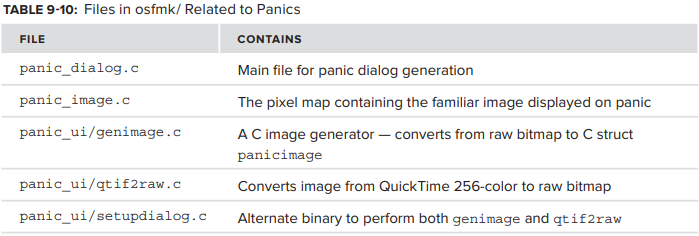

이러한 file들의 functions는 분명한 이유로 user mode로 export 되지는 않지만 panic을 simulation 할 수 있는 방법이 있다. 


#### Experiment: Viewing the Panic UI

_bsd/kern/kern\_panicinfo.c_ 의 code는 다음과 같이 정의된다.

```c
#define KERN_PANICINFO_TEST    (KERN_PANICINFO_IMAGE+2)
/* Allow the panic UI to be tested by root without causing a panic */

static int sysctl_dopanicinfo SYSCTL_HANDLER_ARGS
{
 ...
 case KERN_PANICINFO_TEST:
                panic_dialog_test();
                break;
}                    
```

**panic\_dialog\_test\(\)** 은 Listing 9-7 처럼 _osfmk/console/panic\_dialg.c_ 에서 구현된다.

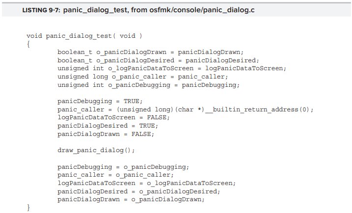

panic dialog test를 표시하려면 Listing 9-8에 표시된 간단한 code snippet을 다음과 같이 수행\(root 권한으로 해야됨\) 하면 된다.

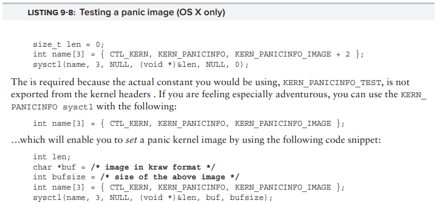


### Panic Reports

panic이 발생하면 강제로 중단하고 data를 저장하여 사후에 원인을 확인하는것 외에는 더이상 할 일이 없다. 중단하게 되면 cold reboot 되므로 RAM에만 data를 저장할 경우 data가 손실될 수 있다. filesystem의 logic이 일관되지 않은 상태일 수 있으며, 이것이 panic의 원인일 수도 있다. 따라서 machine의 **NVRAM** 을 마지막 수단으로 남겨둔다.

> **cold reboot?:** 전원 switch 나 reset 단추를 눌러서 컴퓨터를 다시 켜는 것. ram을 차갑게 만들어 그 안에 기록된 내용을 완전히 지운다고 하여 cold booting 이라고 부른다.

> NVRAM?: non-volatile Memory. 전원이 공급되지 않아도 저장된 정보를 계속 유지하는 memory.   
> Mac의 경우 device의 설정값, 사용자 설정값 등을 빠르게 가져와서 부팅 속도를 올릴 수 있도록 하기 위해 NVRAM을 따로 사용한다. 스피커 음량, 화면 해상도, 시동 디스크 선택, 최근 kernel panic 정보 등을 저장한다.

**Platform Expert** \(구체적으로는 **PESavePanicInfo\(\)**\) 는 **NVRAM** handler를 호출하여 **NVRAM** variable \(appl, panic-info. _iokit/IOKit/IOKitKeys.h_ 에서 **kIODTNVRAMPanicInfoKey** 로 define\)에 data를 쓴다. log는 압축된 format으로 저장되며 \(_osfmk/kern/debug.c_ 의 간단한 algorithm인 **packA\(\)** 사용\) log의 7-bit ASCII character를 8-bit bytes로 연속해서 쓴다. 그러나 이는 URI escape와 유사하게 전체 8-bit value를 %XX로 escape 해야한다. 이는 packing의 목적을 다소 상실하게 한다.

다음에 system이 booting 되면 _/System/Library/LaunchDaemons/com.apple.DumpPanic.plist_ 에서 시작하여 특수한 **launchDaemon** 인 _/System/Library/CoreServices/DumpPanic_ 이 호출된다. 이 daemon 은 **NVRAM** variable에서 panic data를 확인하고 data를 압축 해제 한 후 _/Library/Logs/DiagnosticReports_ 로 이동한다. 그런 다음 log는 다음과 같은 naming convention에 따라 저장된다.  
`Kernel_YYYY-M-DD-HHDDSS_computer_name.panic`

실제 report는 **CrashReporterSupport** 라는 private framework 를 사용하여 생성된다. Lion 에서는 daemon이 **libDiagnosticMessagesClient.dylib** library에도 depend한다.

Apple의 **TN2063** 은 **gdb** 및 Kernel Debug Kit를 사용하여 panic log를 해석하는 방법을 자세히 설명한다. 또는 **otool** 을 사용하여 아래와 같은 예시를 따를 수 있다. 이 방법은 추가 다운로드 없이 모든 system에 적용할 수 있지만 symbol이 없는 kernel extension\(kext\) 로 생성된 panic에는 작동하지 않는다.


#### Example: 32-Bit Crash Log of an Unhandled Trap

Crash는 눈송이들과 같이 정확히 같은 두 개가 없다. Crash 당시 kernel의 internal state는 여러 가지 요인에 의존하기 때문이다. load 및 unload 된 kernel extension과 enable 된 thread에 따라 crash dump의 결과가 크게 달라질 수 있다. 

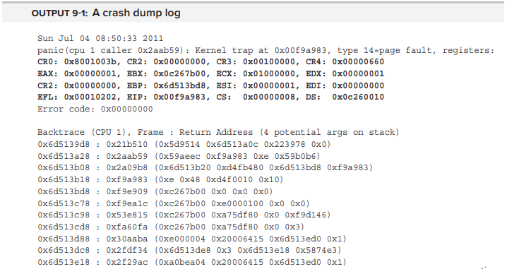

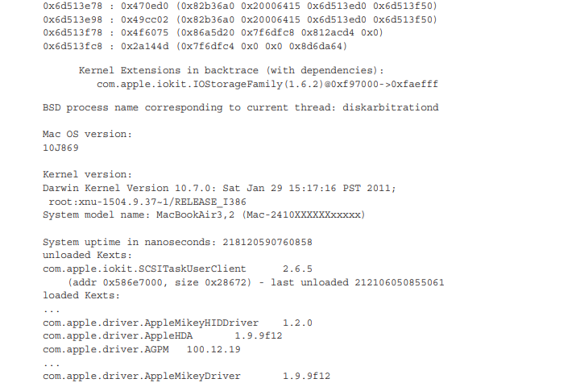

어떻게 panic log에 접근할 수 있을까? 위 예시의 경우 panic이 unhandled trap에서 발생하기 때문에 첫 번째 line에 trap number가 포함되어 있다.  
`panic(cpu 1 caller 0x2aab59) : Kernel trap at 0x00f9a983, type 14=page fault,...`

0x00f9a983의 code에서 page fault가 발생했다. panic code는 범인을 표시한다: address 0xf97000 부터 0xfaefff 까지 load 된 **com.apple.iokit.IOStorageFamily** kext, version 1.6.2 가 panic을 일으켰다. 이것은 문제가 있는 부분을 자동적으로 선택한다.

```text
..
0x6d513b18 : 0xf9a983 (0xe 0x48 0xd4f0010 0x10)
0x6d513bd8 : 0xf9e909 (0xc267b00 0x0 0x0 0x0)
0x6d513c78 : 0xf9ea1c (0xc267b00 0xe0000100 0x0 0x0)
0x6d513c98 : 0x53e815 (0xc267b00 0xa75df80 0x0 0xf9d146)
0x6d513cd8 : 0xfa60fa (0xc267b00 0xa75df80 0x0 0x3)
..
```

앞 출력에서 0x53e815를 참고하라. 이 address는 kext가 아닌 kernel에 있다. address는 32-bit 이며 kernel version line은 해당 address를 i386 kernel로 식별한다. **otool**  -tV 를 사용하여 kernel을 disassemble 하고 그 다음 호출로 이어진 line을 찾을 수 있다. 이 address는 return address 이므로 그 이전 instruction은 call instruction 이어야 한다.   
**grep** -B 1 을 용하면 다음과 같은 결과가 나타난다.

```bash
morpheus@Ergo $ otool -tV -arch i386 /mach_kernel | grep -B 1 53e815
0053e80f call *0x000002e4(%eax)
0053e815 movl 0x28(%esi),%ebx
```

이 address와 가장 가까운 symbol은 **\_\_ZN9IOService5closeEPS\_m** 이다. I/O Kit runtime과 다양한 driver는 C가 아닌 C++로 만들어졌기 때문에 이름이 mangle 되어있다. 이 경우, demangling 하면 **IOService::close\(IOService\*, unsigned long\)** 이 나온다.   
Output 9-2 와 같이 각 address에 **grep** -B 1 을 사용하여  모든 symbol을 찾을 수 있는 shell script를 작성할 수 있다.

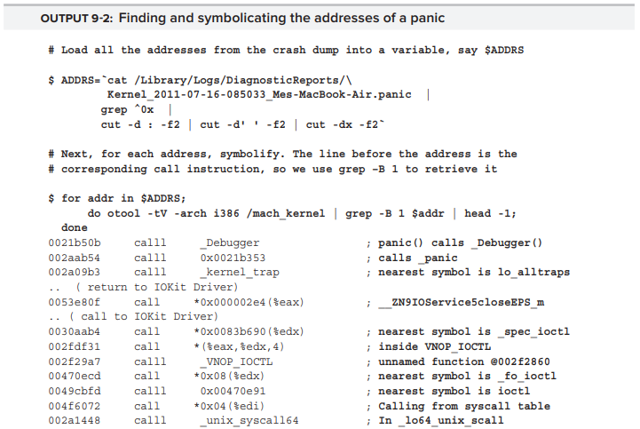

IOKit Driver에 대해서는 어떻게 해야하는가? dump는 이 file을 **com.apple.iokit.IOStorageFamily** kext로 식별했다. binary는 _/System/Library/Extensions \(IOStorageFamily.Kext/Contents/MacOS/IOStorageFamily\)_ 에 있다.   
올바른 version이 있는지 확인하려면 Output 9-3 처럼 **Info.plis**t file에서 **grep** 을 사용하면 된다.

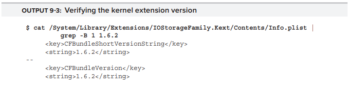

이 경우엔 예상했던 대로 1.6.2 이다. 이제 다음으로 **otool** 을 사용해 볼 수 있다. 그러나 **kext** 는 relocatable file 이므로 **otool** 에 의해 표시되는 address는 0x00000000을 기준으로 되어있기 때문에 잘못된 것이다. panic log로 다시 돌아가서 address 범위 0xf97000에서 0xfa60fa까지 기록한다. 그런 다음 이제 symbol을 찾는 것은 간단하다. 예를 들어, 0xfa60fa를 찾으려면 oxfa60fa와 0xf97000의 차 \(0xfa60fa - 0xf97000 = 0xf0fa\) 를 찾으면 된다.

Output 9-4 에서와 같이 event의 chain 을 재구성할 수 있다. 

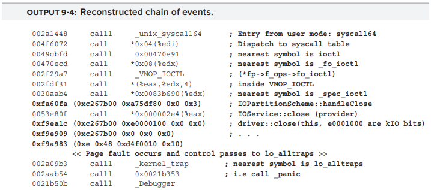

이것은 32-bit kernel이기 때문에 argument는 모두 stack에 있다. panic log는 stack frame 에서 return address 옆에 있는 4 개의 position, 즉 4 개의 argument를 특정해 주기 때문에 더 심층적으로 dive 할 수 있다. 64-bit 의 경우에는 4-6개의 argument 사용하는 드문 경우에만 stack을 사용하여 argument를 pass 하기 위해 register를 사용한다. 이러한 architecture에서 function argument를 재구성 하는 것은 불가능하다. 

